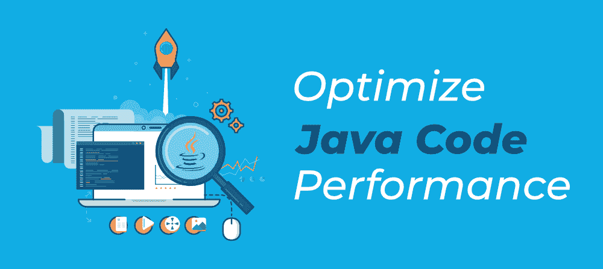

# 优化 Java 代码性能的 12 个技巧

> 原文:[https://www . geesforgeks . org/12-tips-to-optimize-Java-code-performance/](https://www.geeksforgeeks.org/12-tips-to-optimize-java-code-performance/)

在处理任何 Java 应用程序时，我们都会遇到优化的概念。我们正在编写的代码不仅要干净，没有缺陷，而且要优化，也就是说，代码执行所需的时间应该在预期的范围内。为了实现这一点，我们需要参考 Java 编码标准，并检查我们的代码，以确保它是否符合标准。



但是有时由于截止日期的限制，我们没有时间去真正地检查代码。在这种情况下，我们提供了一些技巧，开发人员在编写任何需求的代码时可以记住这些技巧，以便他/她在测试阶段或将其转移到生产之前，只需要对代码进行最小的更改来修复性能。

### 1.避免写长方法

这些方法不应该太长，并且应该专门用于执行单一功能。这对于维护和性能都更好，因为在类加载和方法调用期间，方法加载在堆栈内存中。如果方法太大，处理量太大，那么执行起来会消耗内存和 CPU 周期。试着在适当的逻辑点把这些方法分解成更小的方法。

### **2。**避免多个 If-else 语句

我们在代码中使用条件语句进行决策。不应过度使用条件语句。如果我们使用太多的条件 if-else 语句，将会影响性能，因为[**【JVM】**](https://www.geeksforgeeks.org/jvm-works-jvm-architecture/)将不得不比较条件。如果在 for、while 等循环语句中使用相同的语句，情况会变得更糟。如果您的业务逻辑中有太多的条件，请尝试将条件分组并获得布尔结果，然后在 If 语句中使用它。此外，如果可能的话，我们可以考虑使用 switch 语句来代替多个 if-else。[开关声明](https://www.geeksforgeeks.org/switch-statement-in-java/)比 if–else 具有性能优势。下面提供的示例是一个示例，应避免如下情况:

插图:

```
if (condition1) {

    if (condition2) {

        if (condition3 || condition4) { execute ..}

        else { execute..}
```

> **注意:**应避免上述样品，并按如下方式使用:
> 
> 布尔结果=(条件 1 &&条件 2) &&(条件 3 ||条件 4)

### **3。**避免获取循环中集合的大小

在迭代任何集合时，事先获取集合的大小，并且在迭代过程中永远不要获取它。下面提供的示例是一个示例，应避免如下情况:

插图:

```
List<String> objList = getData();
for (int i = 0; i < objList.size(); i++) { execute code ..}
```

> **注意:**应避免上述样品，并按如下方式使用:
> 
> ```
> List<String> objList = getData();
> int size = objList.size();
> for (int i = 0; i < size; i++) { execute code ..} 
> ```

### 4.避免使用字符串对象进行连接

字符串是一个不可变的类，用字符串创建的对象不能被重用。因此，如果我们需要在 SQL 查询等情况下创建一个大字符串，那么使用“+”操作符来连接字符串对象是一个糟糕的做法。这将导致创建多个字符串对象，从而导致更多地使用堆内存。在这种情况下，我们可以使用 StringBuilder 或 StringBuffer，前者优于后者，因为它由于非同步方法而具有性能优势。下面提供的示例是一个示例，应避免如下情况:

插图:

```
 String query = String1+String2+String3;
```

> **注意:**应避免上述样品，并按如下方式使用:
> 
> StringBuilder strBuilder = new StringBuilder(" ")；
> 
> strBuilder.append(String1)。追加(String2)。追加(String3)；
> 
> 字符串查询= Strbuilder . ToString()；

### 5.尽可能使用基本类型

对对象使用基元类型是有益的，因为基元类型数据存储在堆栈内存中，而对象存储在堆内存中。如果可能的话，我们可以使用基元类型而不是对象，因为从堆栈内存访问数据比堆内存更快。所以在整数上使用 int 或者在 double 上使用 Double 总是有好处的。

### 6.避免使用大十进制类

我们知道 BigDecimal 类为十进制值提供了精确的精度。这个对象的过度使用严重影响了性能，特别是当它被用于计算循环中的某些值时。BigDecimal 在长时间或双倍时间使用大量内存来执行计算。如果精度不是约束条件，或者如果我们确定计算值的范围不会超过 long 或 double，我们可以避免使用 BigDecimal，而是使用 long 或 double 并进行适当的转换。

### 7.避免经常创建大对象

有一些类在应用程序中充当数据持有者。这些物体很重，应该多次避免它们的产生。这种对象的一个例子是用户登录后的数据库连接对象或系统配置对象或会话对象。这些对象在创建时使用了大量资源。我们应该重用这些对象，而不是创建对象，因为创建对象会由于更多的内存使用而严重影响应用程序的性能。我们应该尽可能使用 Singleton 模式来创建对象的单个实例，并在任何需要的地方重用它，或者克隆对象而不是创建一个新的对象。

### **8。**使用存储过程代替查询

最好编写存储过程，而不是复杂而长的查询，并在处理时调用它们。存储过程作为对象存储在数据库中并进行预编译。与具有相同业务逻辑的查询相比，存储过程的执行时间更短，因为每次通过应用程序调用查询时，都会编译并执行查询。此外，存储过程在数据传输和网络流量方面也有优势，因为我们不会每次都将复杂的查询传输到数据库服务器上执行。

### 9.使用[准备报表](https://www.geeksforgeeks.org/difference-between-statement-and-preparedstatement/)代替报表

当通过应用程序执行 SQL 查询时，我们使用 JDBC 应用编程接口和类。在参数化查询执行方面，preparedstatement 比语句更有优势，因为 PreparedStatement 对象被编译一次并执行多次。另一方面，语句对象在每次被调用时都会被编译和执行。另外**、** preparedstatement 对象是安全的，可以避免网络应用安全的 SQL 注入攻击。

### 10.使用不必要的日志语句和不正确的日志级别

日志记录是任何应用程序不可或缺的一部分，需要高效地实现，以避免由于不正确的日志记录和日志级别而影响性能。我们应该避免将大对象记录到代码中。日志记录应该限于我们需要监控的特定参数，而不是整个对象。同样**、**记录级别应该保持在更高的级别，如 DEBUG、ERROR，而不是 INFO。下面提供的示例是一个示例，应避免如下情况:

插图:

```
Logger.debug("User info : " + user.toString());
Logger.info("Method called for setting user data:" + user.getData());
```

> **注意:**应避免上述样品，并按如下方式使用:
> 
> Logger.debug（"User info ： " + user.getName（） + " ： login ID ： " + user.getLoginId（））;
> 
> Logger.info("为设置用户数据而调用的方法")；

### **11 时。**选择查询中的必需列

从数据库中获取数据时，我们使用选择查询来获取数据。避免选择不需要进一步处理的列。只选择那些我们需要进一步处理或显示在前端的列。选择太多列会导致数据库端的查询执行延迟。此外，它增加了从数据库到应用程序的网络流量，这是应该避免的。下面提供的示例是一个示例，应避免如下情况:

插图:

```
select * from users where user_id = 100;
```

> **注意:**应避免上述样品，并按如下方式使用:
> 
> 从 user_id = 100 的用户中选择 user_name、user_age、user _ 性别、user _ 职业、user _ address

### **12 时。**使用连接获取数据

从多个表中获取数据时，有必要在表上正确使用联接。如果连接没有正确使用或者表没有规范化，将导致查询执行延迟，从而影响应用程序的性能。避免使用子查询而不是联接，因为子查询比联接需要更多的执行时间。在经常用于提高查询执行性能和减少应用程序延迟的表列上创建索引。