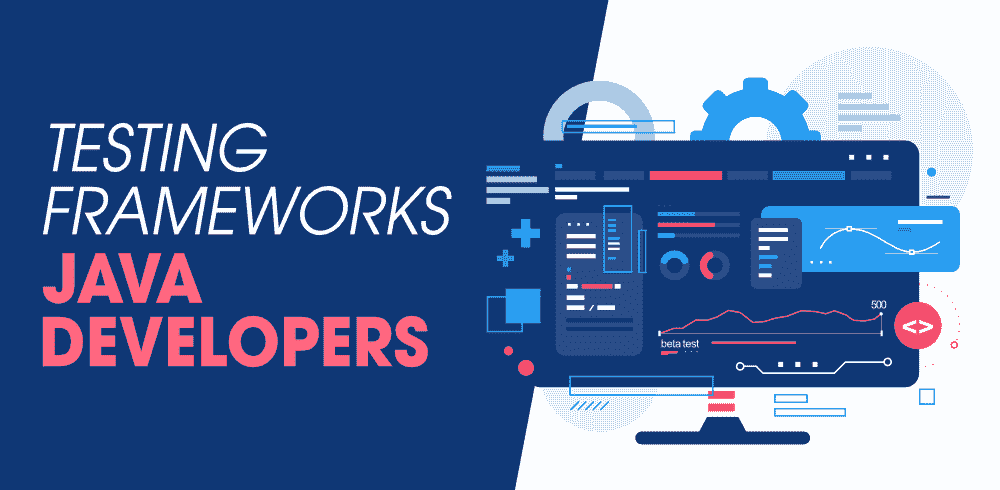

# 【Java 开发人员的 7 个最佳测试框架

> 原文:[https://www . geeksforgeeks . org/7-面向 java 开发人员的最佳测试框架/](https://www.geeksforgeeks.org/7-best-testing-frameworks-for-java-developers/)

Java 是最受欢迎的编程和开发语言之一，许多应用程序都是用这种语言开发的。当一个人选择从事 Java 职业时，他需要获得测试框架的知识，以开发安全高效的应用程序或软件。使用这些测试框架背后的主要动机是减少任何一种出错的可能性，提高速度，降低成本。在本文中，我们将介绍用于 Java 测试的最重要的框架。

下面列出了几个相关的 Java 测试框架:

### 1.硒

Selenium 是一个免费的开源测试框架，主要用于测试基于各种平台的 web 应用。它的首要任务是对网络应用程序进行自动化测试。硒不仅是一种工具，而且是一套完整的工具来补充组织的测试需求。硒被如此广泛接受的主要原因是因为它是免费使用和开源的。此外，它是独立于平台的，可以在各种操作系统上使用。此外，Selenium 可以与 Java 中的其他工具(如 docker 和 maven)结合运行。

**优点:**

*   多浏览器支持
*   多语言和框架支持
*   易于实施
*   更好的集成和可重用性
*   频繁更新

cons:t1]

*   创建测试用例花费的时间相对较多
*   缺少内置的报告工具
*   仅适用于网络应用程序

### 2.宁静

Serenity 还提供了一个开源平台，主要用于行为驱动的测试，早些时候被称为修昔底德。宁静帮助您为测试自动化项目编写干净和结构化的验收标准。此外，这个框架能够增强 WebDriver 和 JUnit 的功能，它还允许您方便地创建描述性测试报告。

**优点:**

*   支持多种自动化验收测试解决方案
*   测试后文档创建速度非常快
*   可以很容易地与各种其他框架集成

cons:t1]

*   创建要素文件需要更长的时间
*   项目参与者之间必须经常沟通

### 3.JUnit

这个特定的框架旨在执行单元测试，代码片段可以通过函数或方法在路径中传递。当遵循测试驱动方法时，建议在编写任何真实代码之前预先编写单元测试代码。开发人员编写任何代码后，需要先执行测试用例，然后才能运行代码片段。每次添加新代码时，都会再次运行测试用例，以确保所有测试场景都通过，并且代码中没有问题。这个框架与其他框架不同，因为它比其他类似的框架相对更快、更有效。

**优点:**

*   JUnit 为测试断言提供支持
*   测试报告更快
*   部署自动化测试场景的简化框架
*   有能力编写自我验证的测试用例

cons:t1]

*   在使用相对较大的测试套件时，总是失败
*   测试后没有生成 HTML 报告的功能
*   不支持依赖测试

### 4.测试

TestNG 是一个开源的测试框架，它的灵感来自于另外两个著名的框架——JUnit 和 NUnit 以及一些新的附加功能。源于它的名字，ng 代表下一代，这个框架在测试中证明了它的实力。这里的测试过程也不是很复杂，我们可以通过框架请求测试数据库或者前端来测试场景。还可以提取一个 HTML 报告，这对正在执行的测试非常有用。

**优点:**

*   支持并行测试
*   支持日志生成
*   能够创建测试后的 HTML 报告
*   底层测试用例可以组合在一起
*   可以设置测试用例执行的优先级

cons:t1]

*   设置测试需要更多时间
*   如果您不需要确定测试用例的优先级，则不推荐使用。

### 5.黄瓜

黄瓜是一个用 Ruby 编写的测试框架，在测试人员中很受欢迎，因为它整合了文档和规范，并提供了一个单一的报告文档。此外，规范会自动更新。

**优点:**

*   可读性更好
*   支持步骤可重用性，减少了反复编写相同代码的需要
*   可以使用一些示例表来自动化测试

cons:t1]

*   黄瓜和小黄瓜的组合增加了复杂性
*   测试人员/开发人员更专注于编写在简单的通用代码就能完成工作的场景中可重用的代码。

### 6.JBehave

这是一个基于 Java 的测试框架，主要与 selenium 驱动程序结合使用，并支持行为驱动开发(BDD)。它提供了一个报告功能，这意味着报告可以以 XML、HTML 或文本格式生成。

**优点:**

*   用优秀的文档帮助用户
*   支持测试后 HTML 报告
*   高效且易于使用
*   开箱即用的 JUnit 支持

cons:t1]

*   不支持这些功能，只支持故事。

### 7.莫基托

Mockito 是一个开源的基于 Java 的行为驱动测试框架。这个框架的主要功能是模拟对象是自动创建的，不需要显式创建它们。

**优点:**

*   支持例外
*   可以使用注释创建模型
*   对返回值的底层支持
*   模拟对象不需要手动编写

cons:t1]

*   不支持局部变量的嘲讽
*   不支持私有和静态方法
*   对于我们编写的任何子类，都无法控制私有字段。