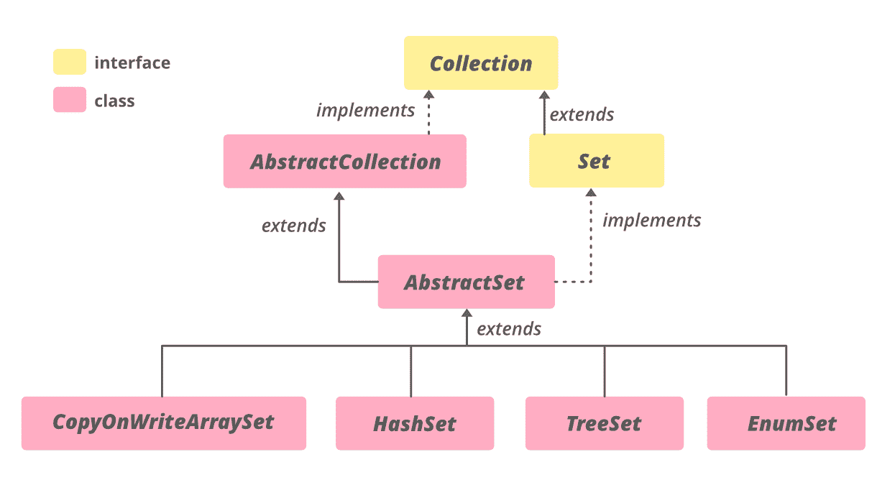

# 用示例在 Java 中抽象设置类

> 原文:[https://www . geesforgeks . org/abstract set-class-in-Java-with-examples/](https://www.geeksforgeeks.org/abstractset-class-in-java-with-examples/)

Java 中的**抽象集合**类是 [Java 集合框架](https://www.geeksforgeeks.org/collections-in-java-2/)的一部分，该框架实现了*集合接口*并扩展了*抽象集合类*。它提供了 Set 接口的框架实现。这个类没有覆盖抽象集合类的任何实现，只是添加了 equals()和 hashCode()方法的实现。

通过扩展此类实现集合的过程与通过扩展抽象集合实现集合的过程相同，只是此类子类中的所有方法和构造函数必须遵守集合接口施加的附加约束(例如，add 方法不得允许向集合中添加对象的多个实例)。

**等级等级:**



**申报:**

```java
public abstract class AbstractSet<E>
  extends AbstractCollection<E>
     implements Set<E>

Where E is the type of elements maintained by this Set.

```

实现**可迭代<E>T1、**集合<E>T3、[集合<E>T5】接口。直接子类为](https://www.geeksforgeeks.org/set-in-java/) [ConcurrentSkipListSet](https://www.geeksforgeeks.org/concurrentskiplistset-in-java-with-examples/) 、[copy onwriterarrayset](https://www.geeksforgeeks.org/copyonwritearrayset-in-java/)、 [EnumSet](https://www.geeksforgeeks.org/enumset-class-java/#:~:text=Few%20important%20features%20of%20EnumSet,implementation%2C%20much%20faster%20than%20HashSet.) 、 [HashSet](https://www.geeksforgeeks.org/hashset-in-java/) 、 [TreeSet](https://www.geeksforgeeks.org/treeset-in-java-with-examples/) 。****

**构造函数:** *受保护的 AbstractSet()–*默认构造函数，但受保护，不允许创建 abstract set 对象。

> 抽象设置<e>为=新树设置<e>()；</e></e>

**示例 1:** AbstractSet 是一个抽象类，因此应该为其分配一个子类的实例，如 [TreeSet](https://www.geeksforgeeks.org/treeset-in-java-with-examples/) 、 [HashSet](https://www.geeksforgeeks.org/hashset-in-java/) 或 [EnumSet](https://www.geeksforgeeks.org/enumset-class-java/#:~:text=Few%20important%20features%20of%20EnumSet,implementation%2C%20much%20faster%20than%20HashSet.) 。

## Java 语言(一种计算机语言，尤用于创建网站)

```java
// Java code to illustrate AbstractSet
import java.util.*;

public class GFG1 {
    public static void main(String[] args) throws Exception
    {

        try {

            // Creating object of AbstractSet<Integer>
            AbstractSet<Integer>
                abs_set = new TreeSet<Integer>();

            // Populating abs_set
            abs_set.add(1);
            abs_set.add(2);
            abs_set.add(3);
            abs_set.add(4);
            abs_set.add(5);

            // print abs_set
            System.out.println("AbstractSet: "
                               + abs_set);
        }
        catch (Exception e) {
            System.out.println(e);
        }
    }
}
```

**输出:**

```java
AbstractSet: [1, 2, 3, 4, 5]
```

**例 2:**

## Java 语言(一种计算机语言，尤用于创建网站)

```java
// Java code to illustrate
// methods of AbstractSet
import java.util.*;

public class GFG1 {

    public static void main(String[] args) throws Exception
    {

        try {

            // Creating object of AbstractSet<Integer>
            AbstractSet<Integer> abs_set = new TreeSet<Integer>();

            // Populating abs_set
            abs_set.add(1);
            abs_set.add(2);
            abs_set.add(3);
            abs_set.add(4);
            abs_set.add(5);

            // print abs_set
            System.out.println("AbstractSet before "
                               + "removeAll() operation : "
                               + abs_set);

            // Creating another object of ArrayList<Integer>
            Collection<Integer> arrlist2 = new ArrayList<Integer>();
            arrlist2.add(1);
            arrlist2.add(2);
            arrlist2.add(3);

            // print arrlist2
            System.out.println("Collection Elements"
                               + " to be removed : "
                               + arrlist2);

            // Removing elements from AbstractSet
            // specified in arrlist2
            // using removeAll() method
            abs_set.removeAll(arrlist2);

            // print arrlist1
            System.out.println("AbstractSet after "
                               + "removeAll() operation : "
                               + abs_set);
        }

        catch (NullPointerException e) {
            System.out.println("Exception thrown : " + e);
        }
    }
}
```

**输出:**

```java
AbstractSet before removeAll() operation : [1, 2, 3, 4, 5]
Collection Elements to be removed : [1, 2, 3]
AbstractSet after removeAll() operation : [4, 5]
```

### 抽象集合的方法

<figure class="table">

| 

方法

 | 

描述

 |
| --- | --- |
| [等于(对象 o)](https://www.geeksforgeeks.org/abstractset-equals-method-in-java-with-examples/) | 将指定的对象与此相等集进行比较。 |
| [hashCode()](https://www.geeksforgeeks.org/abstractset-hashcode-method-in-java-with-examples/) | 返回该集合的哈希代码值。 |
| [移除所有(集合<？> c)](https://www.geeksforgeeks.org/abstractset-removeall-method-in-java-with-examples/) | 从此集合中移除指定集合中包含的所有元素(可选操作)。 |

</figure>

### java.util.AbstractCollection 类中声明的方法

<figure class="table">

| 

方法

 | 

描述

 |
| --- | --- |
| [加(E e)](https://www.geeksforgeeks.org/abstractcollection-add-method-in-java-with-examples/#:~:text=The%20add()%20method%20in,already%20present%20in%20the%20Collection.) | 确保此集合包含指定的元素(可选操作)。 |
| [addAll(收藏<？延伸 E > c)](https://www.geeksforgeeks.org/abstractcollection-addall-method-in-java-with-examples/) | 将指定集合中的所有元素添加到此集合中(可选操作)。 |
| [晴()](https://www.geeksforgeeks.org/abstractcollection-clear-method-in-java-with-examples/) | 从此集合中移除所有元素(可选操作)。 |
| [包含(对象 o)](https://www.geeksforgeeks.org/abstractcollection-contains-method-in-java-with-examples/) | 如果此集合包含指定的元素，则返回 true。 |
| [包含所有(收藏<？> c)](https://www.geeksforgeeks.org/abstractcollection-containsall-method-in-java-with-examples/) | 如果此集合包含指定集合中的所有元素，则返回 true。 |
| [【isempty()](https://www.geeksforgeeks.org/abstractcollection-isempty-method-in-java-with-examples/) | 如果此集合不包含元素，则返回 true。 |
| [迭代器()](https://www.geeksforgeeks.org/absractcollection-iterator-method-in-java-with-examples/) | 返回此集合中包含的元素的迭代器。 |
| [移除(物体 o)](https://www.geeksforgeeks.org/abstractcollection-remove-method-in-java-with-examples/#:~:text=The%20remove(Object%20O)%20method,particular%20element%20from%20a%20Collection.&text=Parameters%3A%20The%20parameter%20O%20is,be%20removed%20from%20the%20collection.) | 从该集合中移除指定元素的单个实例(如果存在)(可选操作)。 |
| [零售(收藏<？> c)](https://www.geeksforgeeks.org/abstractcollection-retainall-method-in-java-with-examples/) | 仅保留此集合中包含在指定集合中的元素(可选操作)。 |
| [toaarray()](https://www.geeksforgeeks.org/abstractcollection-toarray-method-in-java-with-examples/) | 返回包含此集合中所有元素的数组。 |
| [toaarray(t[]a)](https://www.geeksforgeeks.org/abstractcollection-toarray-method-in-java-with-examples/) | 返回包含此集合中所有元素的数组；返回数组的运行时类型是指定数组的运行时类型。 |
| [toString()](https://www.geeksforgeeks.org/abstractcollection-tostring-method-in-java-with-examples/) | 返回此集合的字符串表示形式。 |

</figure>

### 接口 java.util.Collection 中声明的方法

<figure class="table">

| 

方法

 | 

描述

 |
| --- | --- |
| 并行流() | 以此集合为源返回一个可能并行的流。 |
| 移除 If(谓词 super E>过滤器) | 移除此集合中满足给定谓词的所有元素。 |
| 流() | 返回以此集合为源的顺序流。 |
| toArray (IntFunction <t>生成器)</t> | 使用提供的生成器函数分配返回的数组，返回包含此集合中所有元素的数组。 |

</figure>

### 在接口 java.lang.Iterable 中声明的方法

<figure class="table">

| 

方法

 | 

描述

 |
| --- | --- |
| [forEach(消费者<？超 T >动作)](https://www.geeksforgeeks.org/iterable-foreach-method-in-java-with-examples/) | 对 Iterable 的每个元素执行给定的操作，直到所有元素都被处理完或者该操作引发异常。 |

</figure>

### 接口 java.util.Set 中声明的方法

<figure class="table">

| 

方法

 | 

描述

 |
| --- | --- |
| [加(E e)](https://www.geeksforgeeks.org/set-add-method-in-java-with-examples/#:~:text=The%20add()%20method%20of,already%20present%20in%20the%20Set.) | 如果指定元素尚不存在，则将指定元素添加到该集合中(可选操作)。 |
| [addAll(收藏<？延伸 E > c)](https://www.geeksforgeeks.org/set-addall-method-in-java-with-examples/#:~:text=addAll(Collection%20C)%20method%20is,without%20following%20any%20specific%20order.&text=Parameters%3A%20The%20parameter%20C%20is,be%20added%20to%20the%20set.) | 如果指定集合中的所有元素尚不存在，则将它们添加到该集合中(可选操作)。 |
| [晴()](https://www.geeksforgeeks.org/set-clear-method-in-java-with-examples/) | 从此集合中移除所有元素(可选操作)。 |
| [包含(对象 o)](https://www.geeksforgeeks.org/set-contains-method-in-java-with-examples/#:~:text=contains()%20method%20is%20used,Set%20contains%20any%20particular%20element.&text=Parameters%3A%20The%20parameter%20element%20is,in%20the%20set%20or%20not.) | 如果此集合包含指定的元素，则返回 true。 |
| [包含所有(收藏<？> c)](https://www.geeksforgeeks.org/set-containsall-method-in-java-with-examples/#:~:text=The%20containsAll()%20method%20of,present%20in%20the%20other%20set.) | 如果此集合包含指定集合的所有元素，则返回 true。 |
| [【isempty()](https://www.geeksforgeeks.org/set-isempty-method-in-java-with-examples/#:~:text=isEmpty()%20method%20is%20used,empty%20otherwise%20it%20returns%20False.&text=Return%20Value%3A%20The%20method%20returns,is%20empty%20else%20returns%20False.) | 如果此集合不包含元素，则返回 true。 |
| [迭代器()](https://www.geeksforgeeks.org/set-iterator-method-in-java-with-examples/) | 返回该集合中元素的迭代器。 |
| [移除(物体 o)](https://www.geeksforgeeks.org/set-remove-method-in-java-with-examples/) | 如果存在指定的元素，则从该集中移除该元素(可选操作)。 |
| [零售(收藏<？> c)](https://www.geeksforgeeks.org/set-retainall-method-in-java-with-example/#:~:text=The%20retainAll()%20method%20of,contained%20in%20the%20specified%20collection.) | 仅保留该集合中包含在指定集合中的元素(可选操作)。 |
| [尺寸()](https://www.geeksforgeeks.org/set-size-method-in-java-with-example/#:~:text=Set.,elements%20present%20in%20the%20Set.&text=Parameters%3A%20This%20method%20does%20not,elements%20present%20in%20the%20Set.) | 返回该集合中的元素数量(其基数)。 |
| 拆分器() | 在该集合中的元素上创建一个拆分器。 |
| [toaarray()](https://www.geeksforgeeks.org/set-toarray-method-in-java-with-example/#:~:text=The%20toArray()%20method%20of,Set%20to%20a%20new%20array.&text=Parameters%3A%20The%20method%20does%20not,elements%20similar%20to%20the%20Set.) | 返回包含该集合中所有元素的数组。 |
| [toaarray(t[]a)](https://www.geeksforgeeks.org/set-toarray-method-in-java-with-example/#:~:text=The%20toArray()%20method%20of,Set%20to%20a%20new%20array.&text=Parameters%3A%20The%20method%20does%20not,elements%20similar%20to%20the%20Set.) | 返回包含该集合中所有元素的数组；返回数组的运行时类型是指定数组的运行时类型。 |

</figure>

**参考**:[https://docs . Oracle . com/en/Java/javase/11/docs/API/Java . base/Java/util/abstractset . html](https://docs.oracle.com/en/java/javase/11/docs/api/java.base/java/util/AbstractSet.html)