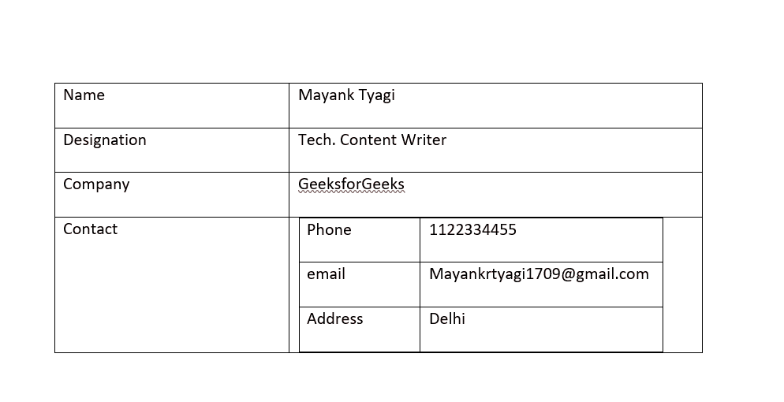

# 使用 Java 向 PDF 添加嵌套表格

> 原文:[https://www . geesforgeks . org/add-nested-tables-to-a-pdf-using-Java/](https://www.geeksforgeeks.org/adding-nested-tables-to-a-pdf-using-java/)

我们可以通过安装**文档类将嵌套表格添加到 PDF 中。**在实例化这个类时，您希望将一个 PdfDocument 对象作为参数传递给它的构造函数。然后，要在文档中添加一个表，需要实例化 table 类，并使用 add()方法将该对象添加到文档中。

要向该表中添加表，需要创建另一个表(嵌套表)，并使用 cell 类的 add()方法将其传递给 Cell 对象。

以下是使用 java 将嵌套表格添加到 PDF 的步骤:

**1。创建一个 PDF 编写器对象**

这里的 PdfWriter 类代表了一个 PDF 的 DocWriter。这个班属于 com.itextpdf.kernel.pdf 包。此类的构造函数接受一个字符串，该字符串表示要创建 PDF 的文件的路径。

通过向构造函数传递一个字符串值(表示您想要生成 PDF 的路径)来创建 PdfWriter 类。

**2。创建一个 PdF 文档对象**

PdfDocument 类是在 iText 中表示 PDF 文档的类。这个班属于 com.itextpdf.kernel.pdf 包。要创建这个类(在编写模式下)，您需要将一个类别为 PdfWriter 的对象传递给它的构造函数。

通过将上面创建的 PdfWriter 对象传递给其构造函数来创建 PdfDocument 类。

**3。创建文档对象**

包 com.itextpdf.layout 的 Document 类是创建自给自足的 pdf 时的根元素。这个类的一个构造函数接受一个类别为 PdfDocument 的对象。

通过传递在前面的步骤中创建的类别文档来创建文档类。

**4。创建表格对象**

Table 类表示一个二维网格，其中塞满了按行和列排序的单元格。它属于包 com.itextpdf.layout.element。

**5。创建单元格**

通过创建包 com.itextpdf.layout 的 cell 类来创建单元格对象。

**6。创建嵌套表**

创建单元格后，创建一个嵌套表，并填充其单元格。

**7。** **向单元格添加嵌套表**

使用 cell 类的 Add()方法，将上一步创建的嵌套表添加到容器表的单元格中。使用 table 类的 addCell()方法将此单元格添加到 containertable 中

**8。** **将表格添加到文档**

使用 Document 类的 Add()方法添加上一步创建的表对象

**9。** **关闭文件**

使用 document 类的 Close()方法关闭文档

现在，让我们看一些如何应用这些步骤的例子

## Java 语言(一种计算机语言，尤用于创建网站)

```
// Java Program to add Nested Tables to a PDF

import com.itextpdf.kernel.pdf.PdfDocument;
import com.itextpdf.kernel.pdf.PdfWriter;

import com.itextpdf.layout.Document;
import com.itextpdf.layout.element.Cell;
import com.itextpdf.layout.element.Table;

public class nestedTablesPdf {
    public static void main(String args[]) throws Exception
    {
        // Creating a PdfWriter object
        String destination
            = "C:/itextExamples/addingNestedTable.pdf";
        PdfWriter writer = new PdfWriter(destination);

        // Creating a PdfDocument object
        PdfDocument pdfDoc = new PdfDocument(writer);

        // Creating a Document object
        Document doc = new Document(pdfDoc);

        // Creating a table
        float[] pointColumnWidths1 = { 130f, 130f };
        Table table = new Table(pointColumnWidths1);

        // Populating row 1 and adding it to the table
        Cell cell1 = new Cell();
        cell1.add("Name");
        table.addCell(cell1);

        Cell cell2 = new Cell();
        cell2.add("Mayank Tyagi");
        table.addCell(cell2);

        // Populating row 2 and adding it to the table
        Cell cell3 = new Cell();
        cell3.add("Designation");
        table.addCell(cell3);

        Cell cell4 = new Cell();
        cell4.add("Tech. Content Writer");
        table.addCell(cell4);

        // Populating row 3 and adding it to the table
        Cell cell5 = new Cell();
        cell5.add("Company");
        table.addCell(cell5);

        Cell cell6 = new Cell();
        cell6.add("GeeksforGeeks");
        table.addCell(cell6);

        // Creating nested table for contact
        float[] pointColumnWidths2 = { 130f, 130f };
        Table nestedTable = new Table(pointColumnWidths2);

        // Populating row 1 and adding it to the nested
        // table
        Cell nested1 = new Cell();
        nested1.add("Phone");
        nestedTable.addCell(nested1);

        Cell nested2 = new Cell();
        nested2.add("1122334455");
        nestedTable.addCell(nested2);

        // Populating row 2 and adding it to the nested
        // table
        Cell nested3 = new Cell();
        nested3.add("email");
        nestedTable.addCell(nested3);

        Cell nested4 = new Cell();
        nested4.add("Mayanktyagi1709@gmail.com");
        nestedTable.addCell(nested4);

        // Populating row 3 and adding it to the nested
        // table
        Cell nested5 = new Cell();
        nested5.add("Address");
        nestedTable.addCell(nested5);

        Cell nested6 = new Cell();
        nested6.add("Delhi");
        nestedTable.addCell(nested6);

        // Adding table to the cell
        Cell cell7 = new Cell();
        cell7.add("Contact");
        table.addCell(cell7);

        Cell cell8 = new Cell();
        cell8.add(nestedTable);
        table.addCell(cell8);

        // Adding table to the document
        doc.add(table);

        // Closing the document
        doc.close();
        System.out.println("Table successfully added");
    }
}
```

**输出**

