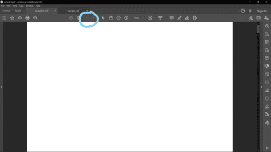

# 使用 Java 向 PDF 文档添加页面

> 原文:[https://www . geesforgeks . org/add-pages-to-a-pdf-document-use-Java/](https://www.geeksforgeeks.org/adding-pages-to-a-pdf-document-using-java/)

**PDDocument** 类的“*org . Apache . pdfbox . PD model”*包，该包扩展了“ *java.lang.Object* ”。被使用。

**申报:**

```java
public class PDDocument
extends Object
implements Pageable, Closeable
```

**先决条件:**构造函数

1.  **PDF document():**此构造函数用于构造零页的新 PDF 文档。
2.  **PDF document(*****COSDocument doc*****):**这个构造函数使用已经存在的 PDF 文档，然后我们可以添加或删除页面。
3.  **PDDocument(COSDocument*****doc，base parser used parser*****):**这个构造函数和上面的类似，但是里面有一个解析器。

**方法使用:** [*addPage()*](https://www.geeksforgeeks.org/adding-images-to-a-table-in-pdf-using-java/) 方法

**PDDocument** 类中有很多方法，但是标准的也是最常用的向 PDF 中添加任何内容的方法，无论是图像还是页面，要求只针对 addPage()方法。[*添加页面()*](https://www.geeksforgeeks.org/adding-images-to-a-table-in-pdf-using-java/) 方法用于在 PDF 文档中添加页面。下面的代码在 PDF 文档中添加一页。

**语法:**声明 *addPage()* 方法

```java
public void addPage(PDPage page) ;
```

这将向文档中添加一页。这是最简单的方法，将页面添加到层次结构的根，并将页面的父级设置为根。因此，到目前为止，要添加到文档中的页面已经明确定义。

**程序:**

1.  创建文档。
2.  创建一个空白页。
3.  将此页面添加到文档中。
4.  保存文档。
5.  关闭文档。

**步骤 1:** 创建文档

需要在 PDDocument 类中创建一个对象，这样可以创建一个空的 PDF 文档。目前，它不包含任何页面。

**语法:**

```java
PDDocument doc = new PDDocument(); 
```

**步骤 2:** 创建空白页

**PDPage** 也是一个类的类型，和 PDDocument 属于同一个包，也就是“*org . Apache . Pdfbox . Pdmodel*”。

**语法:**

```java
PDPage page = new PDPage();
```

**步骤 3:** 向文档添加页面

这里，PDDocument 类的 *addPage()* 方法用于将空白添加到文档中，该文档只不过是 PDDocument 的一个对象。

**语法:**

```java
PDPage page = new PDPage();
```

**步骤 4:** 保存文档

向文档添加页面后，您必须将该文件保存在所需的位置，为此，我们使用 save()方法，该方法将一个字符串作为包含路径地址的参数。

**语法:**

```java
doc.save("path");
```

**第五步:**关闭单据

最后，我们必须使用 close()方法关闭文档。如果我们不关闭它，那么如果另一个程序想要访问该 PDF，那么它将得到一个错误。

**语法:**

```java
doc.close();
```

**实施:**

**实施例 1(A)**

## Java 语言(一种计算机语言，尤用于创建网站)

```java
// Java Program to add page to a PDF document

// Here a page will be created in PDF and saved only
// carried forward to next example

// Importing required packages
import java.io.IOException;
// Importing Apache POI modules
import org.apache.pdfbox.pdmodel.*;

// Class
public class GFG {

    // Main driver method
    public static void main(String[] args)
        throws IOException
    {
        // Creating PDF document object
        PDDocument doc = new PDDocument();

        // Creating a blankpage
        PDPage page = new PDPage();

        // Adding the blankpage to the document
        doc.addPage(page);

        // Saving the document from the
        // local directory on the system

        // Custom directory window path here
        doc.save("F:/sample.pdf");

        // Closing the document
        doc.close();
    }
}
```

**输出:**


> 注意:到目前为止，PDF 文档中只有 1 页，如上面输出图像中的标记[1/1]所示。

**实施例 1(B)**

## Java 语言(一种计算机语言，尤用于创建网站)

```java
// Java Program to add pages to PDF
// using addPage() method

// Carried forward from above example 

// Importing input output classes
import java.io.IOException;
// Importing Apache POI modules
import org.apache.pdfbox.pdmodel.PDDocument;

// Class
public class GFG {

    // Main driver method
    public static void main(String[] args)
        throws IOException
    {
        // Step 1: Creating PDF document object
        PDDocument doc = new PDDocument();

        // Traversing via for loop responsible
        // for addition of blank pages

        // Customly adding pages say
        // number be it 7
        for (int i = 0; i < 7; i++) {

            // Step 2: Creating a blankpage
            // using PDPage() method
            PDPage page = new PDPage();

            // Step 3: Adding the blankpage to the
            // document using addPage() method
            doc.addPage(page);
        }

        // Step 4: Saving the document
        doc.save("F:/sample1.pdf");

        // Step 5: Closing the document
        doc.close();
    }
}
```

**输出:**



> **注意:**到目前为止，上面的图像页面已经添加了一个页面，这在上面输出图像的标记[1/2]中可以明显看到。