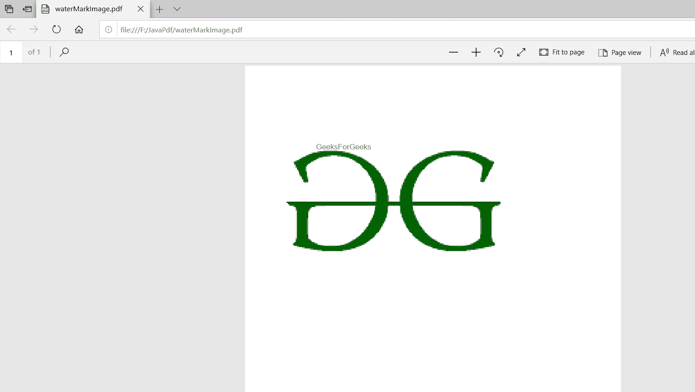

# 使用 Java 为 PDF 中的图像添加水印

> 原文:[https://www . geesforgeks . org/add-water-mark-to-images-in-a-pdf-using-Java/](https://www.geeksforgeeks.org/adding-water-marks-to-the-images-in-a-pdf-using-java/)

在本文中，我们将学习如何使用 Java 向 PDF 文档中的图像添加水印。给 PDF 中的图像添加水印，我们将使用 **iText** 库。这些是使用 java 向 PDF 中的图像添加水印时应该遵循的步骤。

**1。创建 PdfWriter 对象**

PdfWriter 类表示 PDF 的文档编写器。这个类的构造函数接受一个字符串，即创建 PDF 的文件的路径。

```
// importing the PdfWriter class. 
import com.itextpdf.kernel.pdf.PdfWriter; 

// path where the pdf is to be created. 
String path = "F:/JavaPdf/waterMarkImage.pdf"; 
PdfWriter pdfwriter = new PdfWriter(path);
```

**2。创建 PdF 文档对象**

PdfDocument 类是 iText 中表示 PDF Document 的类，要以写模式实例化这个类，需要将类 pdfwriter 的一个对象(即上面代码中的 PdfWriter)传递给它的构造函数。

```
// Creating a PdfDocument object. 
// passing PdfWriter object constructor of pdfDocument. 
PdfDocument pdfdocument = new PdfDocument(pdfwriter);
```

**3。创建文档对象**

文档类是创建自给自足的 PDF 时的根元素。这个类的一个构造函数接受一个类 PdfDocument(即 pdfdocument)的对象。

```
// Creating a Document and passing pdfDocument object 
Document document = new Document(pdfdocument);
```

**4。创建图像对象**

我们需要图像对象来管理图像。为了创建一个图像对象，我们需要创建一个图像数据对象。我们可以通过将表示图像路径的字符串参数传递给 ImageDataFactory 类的 create()方法来创建它。现在，我们可以通过将 imageData 对象作为参数传递给 Image 类的构造函数来创建一个 Image 对象。

```
// Create an ImageData object 
String imageFile = "F:/JavaPdf/image.png"; 
ImageData data = ImageDataFactory.create(imageFile); 

// Creating an Image object 
Image image = new Image(data);
```

**5。创建模板**

模板是 PdfFormXObject 的一个对象，稍后我们在这个模板中添加一个图像和水印。PdfFormXObject 的构造函数以一个矩形为参数，然后将 Template 和 pdfDocument 的实例传递给 Canvas 对象。将图像添加到画布对象。

现在我们将图像添加到画布对象并设置水印。

```
//Creating template             
PdfFormXObject template = new PdfFormXObject(new Rectangle(
image.getImageScaledWidth(), image.getImageScaledHeight()));
Canvas canvas = new Canvas(template, pdfdocument).add(image); 
String watermark = "GeeksForGeeks"; 
canvas.setFontColor(DeviceGray.GRAY).showTextAligned(watermark, 120, 300, TextAlignment.CENTER);
```

**6。向文档添加模板并关闭文档**

现在，我们使用 add()方法将模板添加到文档中，并使用 close()关闭文档。

```
//adding template to document
Image imagew = new Image(template);          
document.add(imagew); 

//closing the document 
document.close();  
System.out.println("Applied the Water Mark successfully");
```

**执行以下程序的依赖关系:**

```
kernel-7.1.13.jar
layout-7.1.13.jar
io-7.1.13.jar
```

**代码片段:**

## Java 语言(一种计算机语言，尤用于创建网站)

```
// Java program to Add Water Marks to the Images in a PDF

import com.itextpdf.kernel.colors.DeviceGray;
import com.itextpdf.kernel.geom.Rectangle;
import com.itextpdf.kernel.pdf.PdfDocument;
import com.itextpdf.kernel.pdf.PdfWriter;
import com.itextpdf.kernel.pdf.xobject.PdfFormXObject;

import com.itextpdf.io.image.ImageData;
import com.itextpdf.io.image.ImageDataFactory;

import com.itextpdf.layout.Canvas;
import com.itextpdf.layout.Document;
import com.itextpdf.layout.element.Image;
import com.itextpdf.layout.property.TextAlignment;

public class AddingToImagesInPDF {

    public static void main(String args[]) throws Exception
    {
        String path = "F:/JavaPdf/waterMarkImage.pdf";
        PdfWriter pdfwriter = new PdfWriter(path);

        // Creating a PdfDocument object.
        // passing PdfWriter object constructor of
        // pdfDocument.
        PdfDocument pdfdocument
            = new PdfDocument(pdfwriter);

        // Creating a Document and passing pdfDocument
        // object
        Document document = new Document(pdfdocument);

        // Create an ImageData object
        String imageFile = "F:/JavaPdf/image.png";
        ImageData data = ImageDataFactory.create(imageFile);

        // Creating an Image object
        Image image = new Image(data);
        image.scaleToFit(400, 700);

        // Creating template
        PdfFormXObject template = new PdfFormXObject(
            new Rectangle(image.getImageScaledWidth(),
                          image.getImageScaledHeight()));
        Canvas canvas
            = new Canvas(template, pdfdocument).add(image);
        String watermark = "GeeksForGeeks";
        canvas.setFontColor(DeviceGray.GRAY)
            .showTextAligned(watermark, 120, 300,
                             TextAlignment.CENTER);

        // adding template to document
        Image imagew = new Image(template);
        document.add(imagew);

        // closing the document
        document.close();
        System.out.println(
            "Applied the Water Mark successfully");
    }
}
```

**输出**

```
Applied the Water Mark successfully
```

**PDF**

