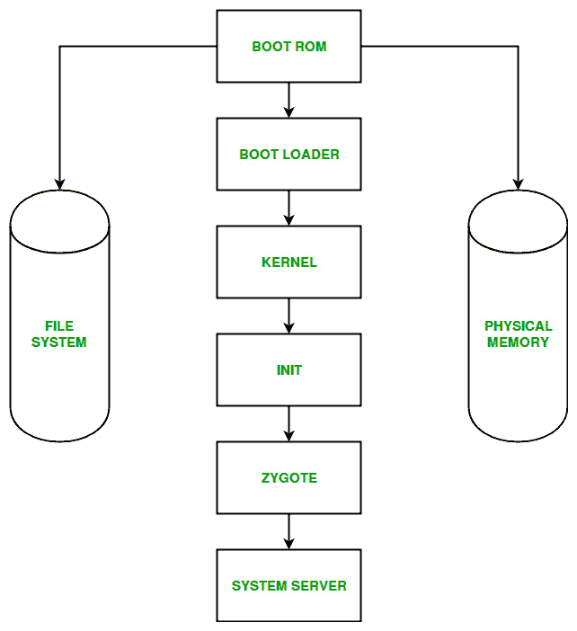

# 安卓开机流程

> 原文:[https://www.geeksforgeeks.org/android-boot-process/](https://www.geeksforgeeks.org/android-boot-process/)

**启动过程**

在计算中，[引导](https://en.wikipedia.org/wiki/Booting)是启动计算机或计算机设备，直到它可以使用。它可以由硬件启动，如按钮按下，或由软件命令。接通电源后，电脑就相对哑了，只能读取其存储的一部分称为只读存储器。那里存储着一个叫做固件的小程序。它进行开机自检，最重要的是，它允许访问其他类型的内存，如硬盘和主内存。固件将更大的程序加载到计算机的主内存中并运行它。在通用计算机中，以及在智能手机、平板电脑中，可选地运行引导管理器。

**安卓开机流程**

安卓启动过程包括以下六个步骤:

1.  **引导 ROM:** 这一步称为开机和系统启动。这意味着每当我们按下电源按钮时，引导只读存储器代码就从预定义的位置开始执行，该位置是硬连线在只读存储器中的。引导只读存储器将引导加载程序加载到内存中并开始执行。
2.  **BootLoader:** Bootloaders is a low-level code contains the instructions that tell a device how to start up and find the system kernel. A Bootloader is a place where manufacturers put their locks and restrictions.

    引导加载程序是在任何操作系统开始运行之前执行的代码。引导加载程序分两个阶段执行:
    **(a)**在第一阶段，它检测外部内存并加载程序，这在第二阶段有所帮助。
    **b)** 在第二阶段，引导加载程序设置运行内核所需的网络、内存等。

3.  **内核:**内核启动后，启动设置缓存、保护内存、调度、加载驱动、启动内核守护进程、挂载根文件系统、初始化 Input/Output、启动中断、初始化进程表。内核是与我们设备中的硬件接口的最低级的易替换软件。当内核完成系统设置后，它首先会在系统文件中查找“init”，并启动根进程或系统的第一个进程。
4.  **Init:** Init is the very first process or we can say that it is the grandfather of all the processes.

    初始化过程有两个职责:

    *   挂载目录，如/sys、/dev 或/proc
    *   运行/init.rc 脚本。init.rc 负责系统的初始设置。

    初始化过程将设置所有本地服务，这类似于常规的 Linux 系统引导。

5.  **Zygote and Dalvik VM:** The Zygote is a VM process that starts as the system boots. When app_process launces Zygote, it first creates the Dalvik VM and then calls Zygote’s main() method. Zygote receives a request to launch an App through/dev/socket/zygote. Once it happens, it triggers a fork() call.

    当一个进程是一个分叉时，它会为自己创建一个克隆。它在另一个内存空间复制自己。这是非常有效的。当这种情况发生在合子身上时，它会创建一个精确而干净的新 Dalvik VM 作为线程，预加载任何应用程序都需要的所有必要的类和资源。这使得创建虚拟机和加载资源的过程非常高效。

    它支持跨 Dalvik 虚拟机的代码共享，这有助于实现最短的启动时间。

6.  **System Servers:** After zygote preloads all necessary Java Classes and resources, it starts System Server. The System server is the core of the Android system. The first thing that happens is that the server will load a native library called android_servers that provides interfaces to native functionalities.

    然后调用本机 *init* 方法来设置本机服务。设置本机服务后，它会创建服务器线程。该线程将根据必要的启动顺序启动系统中剩余的服务。

    每个服务都在系统服务器的一个单独的 Dalvik 线程中运行。

    一旦系统服务启动并在内存中运行，安卓就完成了引导过程，此时“ACTION_BOOT_COMPLETED”标准广播动作将会启动。