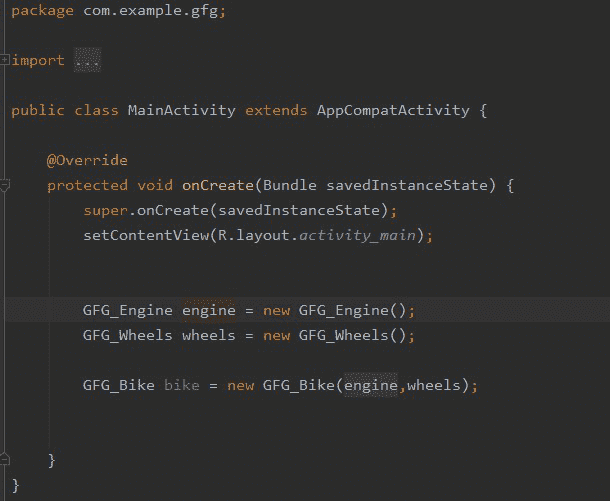
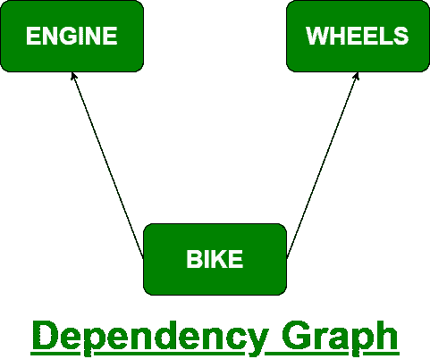

# 安卓–匕首中的组件

> 原文:[https://www.geeksforgeeks.org/android-component-in-dagger/](https://www.geeksforgeeks.org/android-component-in-dagger/)

为了充分理解匕首中组件的概念，我们必须先简单介绍一下匕首本身。根据文献记载，匕首的定义如下:

> 安卓应用程序中的手动依赖注入或服务定位器可能会有问题，具体取决于项目的大小。通过使用 Dagger 来管理依赖项，您可以在项目扩展时限制项目的复杂性。“Dagger 会自动生成代码，模仿你原本手写的代码，”

让我们分析一下上面的说法是什么意思。

想象一下下面的场景:让我们假设我们有一个类，自行车类，和两个函数，它需要另外两个类，即引擎和轮子。因此，我们说自行车类依赖于引擎和轮子，为了正确的功能，应该实现这些依赖。现在，为了实例化自行车类，我们还必须创建和初始化，或者准确地说，只在活动的样板代码中注入另外两个类。这描述如下:



实例化不带匕首的自行车类

现在，当项目规模扩大时，各种类之间通常会有很多依赖关系，而上述方法会导致一些严重的问题和性能瓶颈。这就是匕首发挥作用的地方，它自动处理所有的依赖和实例化。要详细了解匕首和依赖注入:[安卓](https://www.geeksforgeeks.org/dependency-injection-with-dagger-2-in-android/)中匕首 2 的依赖注入

### 匕首中的组件

现在，匕首中的组件通过创建项目中所有依赖关系的图表来工作，这样它就可以在需要的时候找到应该从哪里获取这些依赖关系。为了实现这一点，需要创建一个接口，并用@Component 进行注释。使用这个注释处理器，Dagger 创建了一个依赖图，它包含了不同类之间的关系。这允许 Dagger 创建一个容器，就像我们手动依赖注入一样。



函数也可以在@Component 接口中定义，该接口返回所需类(自行车类)的实例。@Component 通知 Dagger 生成一个包含所有必需依赖项的容器。这就是所谓的匕首中的组件。让我们在实现中看到上面的例子。

### **分步实施**

**第一步:创建新项目**

要在安卓工作室创建新项目，请参考[如何在安卓工作室创建/启动新项目](https://www.geeksforgeeks.org/android-how-to-create-start-a-new-project-in-android-studio/)。注意选择 **Java** 作为编程语言。

**步骤 2:添加所需的依赖关系**

为了在 dagger 的帮助下使用依赖注入，我们需要在 Gradle 文件中添加一些依赖。转到 Gradle 脚本–> build . Gradle(模块:应用程序)并添加以下依赖项。添加这两个依赖项后，您需要单击立即同步。

> 依赖项{
> 
> 实现' com.google .匕首:匕首:2.35.1 '
> 
> 注释处理器' com.google .匕首:匕首-编译器:2.35.1 '
> 
> }

现在让我们定制一些颜色属性来增强应用程序栏。转到**应用程序>RES>values>themes . XML**并自定义以下颜色属性。

## 可扩展标记语言

```java
<resources xmlns:tools="http://schemas.android.com/tools">
    <!-- Base application theme. -->
    <style name="Theme.GFG" parent="Theme.MaterialComponents.DayNight.DarkActionBar">
        <!-- Primary brand color. -->
        <item name="colorPrimary">#7DE324</item>
        <item name="colorPrimaryVariant">#6F9350</item>
       <!-- Status bar color. -->
       <item name="android:statusBarColor" tools:targetApi="l">?attr/colorPrimaryVariant</item>

      </style>
</resources>
```

**第三步:设置 activity_main.xml 文件**

在这一步中，我们将创建应用程序的布局。需要创建一个文本框和一个按钮，其中文本视图将显示一些默认文本，单击按钮后，将创建一个自行车实体，用户将在文本框中更新。下面是代码片段。

## 可扩展标记语言

```java
<?xml version="1.0" encoding="utf-8"?>
<androidx.constraintlayout.widget.ConstraintLayout 
    xmlns:android="http://schemas.android.com/apk/res/android"
    xmlns:app="http://schemas.android.com/apk/res-auto"
    xmlns:tools="http://schemas.android.com/tools"
    android:id="@+id/wheels"
    android:layout_width="match_parent"
    android:layout_height="match_parent"
    tools:context=".MainActivity">

    <!--Text box to update user -->
    <TextView
        android:id="@+id/bk"
        android:layout_width="wrap_content"
        android:layout_height="wrap_content"
        android:text="GFG BIKE"
        android:textSize="30sp"
        app:layout_constraintBottom_toBottomOf="parent"
        app:layout_constraintEnd_toEndOf="parent"
        app:layout_constraintStart_toStartOf="parent"
        app:layout_constraintTop_toTopOf="parent" />

    <!--Button to instantiate the bike entity -->
    <Button
        android:id="@+id/button"
        android:layout_width="wrap_content"
        android:layout_height="wrap_content"
        android:layout_marginTop="76dp"
        android:text="Assemble Bike"
        app:layout_constraintEnd_toEndOf="parent"
        app:layout_constraintStart_toStartOf="parent"
        app:layout_constraintTop_toBottomOf="@+id/bk" />

</androidx.constraintlayout.widget.ConstraintLayout>
```

**步骤 4:使用自行车组件界面**

在这一步中，我们将创建一个带有注释 *@Component* 的*界面*，它将负责实例化自行车实体，从而创建所有依赖关系的图形。你可以参考这篇文章在安卓工作室中[创建界面。](https://www.geeksforgeeks.org/how-to-create-interfaces-in-android-studio/)

## Java 语言(一种计算机语言，尤用于创建网站)

```java
import dagger.Component;

@Component
public interface BikeComponent {

    GFG_Bike getBike();
}
```

**步骤 5:创建自行车所需的所有必要类别(自行车、发动机和车轮)**

在这一步中，我们将使用注释 *@Inject* 注入所需的类，以创建自行车实体。下面是所有文件的代码片段。你可以参考这篇文章在安卓工作室中[创建班级。](https://www.geeksforgeeks.org/how-to-create-classes-in-android-studio/)

**GFG_Bike.java 类:**

## Java 语言(一种计算机语言，尤用于创建网站)

```java
import android.app.Activity;
import android.util.Log;

import javax.inject.Inject;

public class GFG_Bike extends Activity {

    GFG_Engine engine;
    GFG_Wheels wheels;

    // Injecting Bike Class
    @Inject
    public GFG_Bike(GFG_Engine engine, GFG_Wheels wheels) {
        this.engine = engine;
        this.wheels = wheels;
        Log.v("Bike_Create", "Assembling Bike");
    }

    // Function to confirm the proper instantiation of GFG_Bike
    public int ride() {

        Log.v("Bike_Ride", "Assembling Successful,Riding it now.");
        return 1;
    }
}
```

**GFG_Engine.java 类:**

## Java 语言(一种计算机语言，尤用于创建网站)

```java
import android.app.Activity;
import android.util.Log;

import javax.inject.Inject;

public class GFG_Engine extends Activity {

    // Injecting Engine
    @Inject
    public GFG_Engine() {
        Log.v("Engine", "Collecting engine");
    }
}
```

**GFG_Wheels.java 类:**

## Java 语言(一种计算机语言，尤用于创建网站)

```java
import android.app.Activity;
import android.util.Log;

import javax.inject.Inject;

public class GFG_Wheels extends Activity {

    // Injecting Wheels
    @Inject
    public GFG_Wheels() {
        Log.v("Wheels", "Collecting wheels");
    }
}
```

**第六步:使用****MainActivity.java 文件**

在这一步中，我们将实例化**GFG _ 自行车**。如果步骤成功，文本视图将被更新，否则将显示错误[吐司](https://www.geeksforgeeks.org/android-what-is-toast-and-how-to-use-it-with-examples/)。下面是代码片段。

## Java 语言(一种计算机语言，尤用于创建网站)

```java
import android.os.Bundle;
import android.view.View;
import android.widget.Button;
import android.widget.TextView;
import android.widget.Toast;

import androidx.appcompat.app.AppCompatActivity;

public class MainActivity extends AppCompatActivity {

    @Override
    protected void onCreate(Bundle savedInstanceState) {
        super.onCreate(savedInstanceState);
        setContentView(R.layout.activity_main);

        // Finding the button in the mainactivity layout file
        Button bt = findViewById(R.id.button);

        bt.setOnClickListener(new View.OnClickListener() {
            @Override
            public void onClick(View view) {

                // Creating the bikecomponent
                BikeComponent component = DaggerBikeComponent.create();

                GFG_Bike newBike = component.getBike();
                int x = newBike.ride();

                // If successful
                if (x == 1) {
                    TextView bk = findViewById(R.id.bk);
                    bk.setText("Riding Bike");
                }

                // If failed
                else
                    Toast.makeText(MainActivity.this, "Failed to Assemble Bike", Toast.LENGTH_SHORT).show();
            }
        });
    }
}
```

**输出:**

<video class="wp-video-shortcode" id="video-610241-1" width="640" height="360" preload="metadata" controls=""><source type="video/mp4" src="https://media.geeksforgeeks.org/wp-content/uploads/20210523150824/WhatsApp-Video-2021-05-23-at-3.06.57-PM.mp4?_=1">[https://media.geeksforgeeks.org/wp-content/uploads/20210523150824/WhatsApp-Video-2021-05-23-at-3.06.57-PM.mp4](https://media.geeksforgeeks.org/wp-content/uploads/20210523150824/WhatsApp-Video-2021-05-23-at-3.06.57-PM.mp4)</video>

**输出:在对数表上**


日志目录的快照