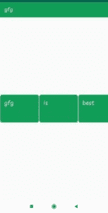
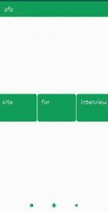

# 安卓|水平回收查看示例

> 原文:[https://www . geeksforgeeks . org/Android-horizontal-recycle view-with-examples/](https://www.geeksforgeeks.org/android-horizontal-recyclerview-with-examples/)

[recycle view](https://www.geeksforgeeks.org/android-recyclerview/)是作为 GridView 和 [ListView](https://www.geeksforgeeks.org/android-listview-in-kotlin/) 的继承者加入到[安卓工作室](https://www.geeksforgeeks.org/guide-to-install-and-set-up-android-studio/)的一个视图组。这是对两者的改进，可以在最新的 v-7 支持包中找到。它的创建是为了使任何具有 XML 布局的列表的构建成为可能，这些列表可以被极大地定制，同时提高[列表视图](https://www.geeksforgeeks.org/android-listview-in-kotlin/)和 GridViews 的效率。这种改进是通过回收用户不可见的视图来实现的。

**例如:**如果用户向下滚动到项目 4 和 5 可见的位置；项目 1、2 和 3 将从存储器中清除，以减少存储器消耗。

在本文中，我们将学习如何创建[回收器视图](https://www.geeksforgeeks.org/android-recyclerview/)，该视图可以在水平方向滚动。

以下是详细的步骤:

1.  **第一步:在项目中添加 Recycler 视图小部件的依赖关系**
    *   回收商视图的最新依赖项为:

        ```
        implementation 'com.android.support:recyclerview-v7:28.0.0'

        ```

    *   同时添加卡片视图的依赖项。卡片视图的最新依赖关系为:

        ```
        implementation 'com.android.support:cardview-v7:28.0.0'

        ```

2.  **Step 2: Setting up the activity_main.xml layout file**
    The activity_main.xml layout file consists of:
    *   包含回收器视图的相对布局
    *   recycler view widget

    下面是 activity_main.xml 的完整代码:

    ## activity_main.xml

    ```
    <?xml version="1.0" encoding="utf-8"?>

    <!--Relative Layout-->
    <RelativeLayout 
        xmlns:android="http://schemas.android.com/apk/res/android"
        xmlns:tools="http://schemas.android.com/tools"
        android:layout_width="match_parent"
        android:layout_height="match_parent"
        tools:context="com.geeksforgeeks.horizontalrecyclerview.MainActivity"
        android:id="@+id/relativelayout">

        <!--Recycler View widget-->
        <android.support.v7.widget.RecyclerView
            android:id="@+id/recyclerview"
            android:scrollbars="horizontal"
            android:layout_width="wrap_content"
            android:layout_height="wrap_content"
            android:layout_centerVertical="true"
            android:layout_centerHorizontal="true" />

    </RelativeLayout>
    ```

3.  **第三步:为回收商视图**设置 item.xml 布局文件
    item . XML 布局文件由回收商视图的一个项目的布局组成。项目布局包含一个带有文本视图的卡片视图，其中包含一些文本。
    以下是 item.xml 的完整代码:

    ## item . XML

    ```
    <?xml version="1.0" encoding="utf-8"?>

    <!--Card View widget-->
    <android.support.v7.widget.CardView
        xmlns:card_view="http://schemas.android.com/apk/res-auto"
        xmlns:android="http://schemas.android.com/apk/res/android"
        android:id="@+id/cardview"
        android:layout_width="100dp"
        android:layout_height="wrap_content"
        card_view:contentPadding="8dp"
        card_view:cardCornerRadius="8dp"
        card_view:cardElevation="8dp"
        card_view:cardBackgroundColor="#0F9D58"
        android:layout_margin="1dp"
        >

        <!--Text View over Card View-->
        <TextView
            android:id="@+id/textview"
            android:layout_gravity="center"'
            android:layout_marginTop="4dp"
            android:layout_marginBottom="4dp"
            android:textSize="22dp"
            android:layout_width="wrap_content"
            android:layout_height="wrap_content"
            android:textColor="#fff"/>

    </android.support.v7.widget.CardView>
    ```

4.  **Step 4: Setting up the code for Recycler View Adapter**
    The adapter is the main code responsible for [RecyclerView](https://www.geeksforgeeks.org/android-recyclerview/). It holds all the important methods dealing with the implementation of RecylcerView. The basic methods for a successful implementation are:
    *   oncreateviewholder，
    *   onindviewholder，
    *   getitem count

    适配器用于将数据从数据源设置为回收视图。

    下面是适配器的完整代码。

    ## Adapter.java

    ```
    package com.geeksforgeeks.horizontalrecyclerview;

    import android.support.v7.widget.RecyclerView;
    import android.view.View;
    import android.view.ViewGroup;
    import android.widget.TextView;
    import android.view.LayoutInflater;
    import java.util.List;

    // The adapter class which
    // extends RecyclerView Adapter
    public class Adapter
        extends RecyclerView.Adapter<Adapter.MyView> {

        // List with String type
        private List<String> list;

        // View Holder class which
        // extends RecyclerView.ViewHolder
        public class MyView
            extends RecyclerView.ViewHolder {

            // Text View
            TextView textView;

            // parameterised constructor for View Holder class
            // which takes the view as a parameter
            public MyView(View view)
            {
                super(view);

                // initialise TextView with id
                textView = (TextView)view
                               .findViewById(R.id.textview);
            }
        }

        // Constructor for adapter class
        // which takes a list of String type
        public Adapter(List<String> horizontalList)
        {
            this.list = horizontalList;
        }

        // Override onCreateViewHolder which deals
        // with the inflation of the card layout
        // as an item for the RecyclerView.
        @Override
        public MyView onCreateViewHolder(ViewGroup parent,
                                         int viewType)
        {

            // Inflate item.xml using LayoutInflator
            View itemView
                = LayoutInflater
                      .from(parent.getContext())
                      .inflate(R.layout.item,
                               parent,
                               false);

            // return itemView
            return new MyView(itemView);
        }

        // Override onBindViewHolder which deals
        // with the setting of different data
        // and methods related to clicks on
        // particular items of the RecyclerView.
        @Override
        public void onBindViewHolder(final MyView holder,
                                     final int position)
        {

            // Set the text of each item of
            // Recycler view with the list items
            holder.textView.setText(list.get(position));
        }

        // Override getItemCount which Returns
        // the length of the RecyclerView.
        @Override
        public int getItemCount()
        {
            return list.size();
        }
    }
    ```

5.  **第五步。为回收视图**
    设置 MainActivity 文件的代码主活动包含回收视图。使用 LinearLayoutManager 类在回收器视图上设置布局管理器。
    下面是 MainActivity.java 的完整代码:

    ## MainActivity.java

    ```
    package com.geeksforgeeks.horizontalrecyclerview;

    import android.support.v7.app.AppCompatActivity;
    import android.os.Bundle;
    import android.support.v7.widget.RecyclerView;
    import android.support.v7.widget.LinearLayoutManager;
    import android.view.View;
    import android.widget.Toast;
    import java.util.ArrayList;

    public class MainActivity extends AppCompatActivity {

        // Recycler View object
        RecyclerView recyclerView;

        // Array list for recycler view data source
        ArrayList<String> source;

        // Layout Manager
        RecyclerView.LayoutManager RecyclerViewLayoutManager;

        // adapter class object
        Adapter adapter;

        // Linear Layout Manager
        LinearLayoutManager HorizontalLayout;

        View ChildView;
        int RecyclerViewItemPosition;

        @Override
        protected void onCreate(Bundle savedInstanceState)
        {
            super.onCreate(savedInstanceState);
            setContentView(R.layout.activity_main);

            // initialisation with id's
            recyclerView
                = (RecyclerView)findViewById(
                    R.id.recyclerview);
            RecyclerViewLayoutManager
                = new LinearLayoutManager(
                    getApplicationContext());

            // Set LayoutManager on Recycler View
            recyclerView.setLayoutManager(
                RecyclerViewLayoutManager);

            // Adding items to RecyclerView.
            AddItemsToRecyclerViewArrayList();

            // calling constructor of adapter
            // with source list as a parameter
            adapter = new Adapter(source);

            // Set Horizontal Layout Manager
            // for Recycler view
            HorizontalLayout
                = new LinearLayoutManager(
                    MainActivity.this,
                    LinearLayoutManager.HORIZONTAL,
                    false);
            recyclerView.setLayoutManager(HorizontalLayout);

            // Set adapter on recycler view
            recyclerView.setAdapter(adapter);
        }

        // Function to add items in RecyclerView.
        public void AddItemsToRecyclerViewArrayList()
        {
            // Adding items to ArrayList
            source = new ArrayList<>();
            source.add("gfg");
            source.add("is");
            source.add("best");
            source.add("site");
            source.add("for");
            source.add("interview");
            source.add("preparation");
        }
    }
    ```

**输出:**
  