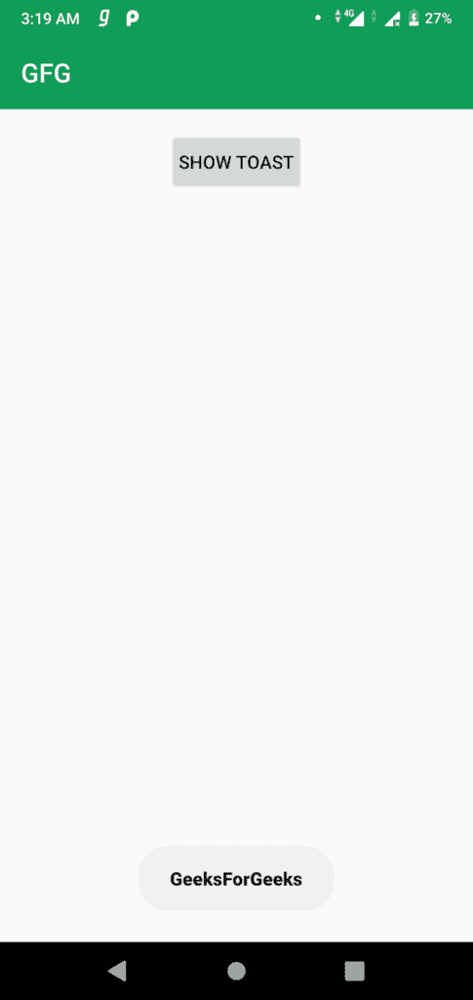

# 安卓|如何更改吐司字体？

> 原文:[https://www . geesforgeks . org/Android-如何改变-toast-font/](https://www.geeksforgeeks.org/android-how-to-change-toast-font/)

一 **[吐司](https://www.geeksforgeeks.org/android-what-is-toast-and-how-to-use-it-with-examples/)** 是反馈信息。当整个活动是交互式的并且对用户可见时，它占用很少的显示空间。几秒钟后就消失了。它会自动消失。如果用户想要永久可见的消息，可以使用 **[【通知】](https://www.geeksforgeeks.org/notifications-in-android-oreo-8/)** 。

吐司会根据开发人员定义的吐司长度自动消失。更改吐司信息字体的步骤如下:

1.  **第一步:** **在 <u>activity_main.xml</u> 文件中添加一个按钮，以自定义字体显示敬酒信息。**
    打开 activity_main.xml 文件，创建一个 id 为*的按钮 showToast。*

    ```java
    <?xml version="1.0" encoding="utf-8"?>
    <RelativeLayout 
        xmlns:android="http://schemas.android.com/apk/res/android"
        xmlns:app="http://schemas.android.com/apk/res-auto"
        xmlns:tools="http://schemas.android.com/tools"
        android:layout_width="match_parent"
        android:layout_height="match_parent"
        tools:context=".MainActivity">

        <!--  To show the Toolbar-->
        <android.support.v7.widget.Toolbar
            android:id="@+id/toolbar"
            android:layout_width="match_parent"
            android:background="@color/colorPrimary"
            app:title="GFG"
            app:titleTextColor="@android:color/white"
            android:layout_height="android:attr/actionBarSize"/>

        <!-- Button To show the toast message-->

        <Button
            android:id="@+id/showToast"
            android:layout_width="wrap_content"
            android:layout_height="wrap_content"
            android:text="Show Toast"
            android:layout_marginTop="16dp"
            android:padding="8dp"
            android:layout_below="@id/toolbar"
            android:layout_centerHorizontal="true"/>

    </RelativeLayout>
    ```

2.  **第二步:打开 <u>styles.xml</u> 文件，为吐司信息添加新样式。**

打开 style.xml 文件并添加以下代码。这里使用*无衬线黑色*字体。

```java
<!-- Toast Style -->
<style name="toastTextStyle" parent="TextAppearance.AppCompat">
    <item name="android:fontFamily">sans-serif-black</item>
</style>
```

*   **Step 3:** **Open <u>MainActivity.java</u> and add function to show custom Toast.**

    使用 **makeText()** 方法创建吐司的新实例。使用 getView()方法获取吐司的视图。打开 MainActivity.java 文件，添加显示祝酒词的功能。

    ```java
    private void showMessage(Boolean b, String msg)
    {

        // Creating new instance of Toast
        Toast toast
            = Toast.makeText(
                MainActivity.this,
                " " + msg + " ",
                Toast.LENGTH_SHORT);

        // Getting the View
        View view = toast.getView();

        // Finding the textview in Toast view
        TextView text
            = (TextView)view
                  .findViewById(
                      android.R.id.message);

        // Setting the Text Appearance
        if (Build.VERSION.SDK_INT
            >= Build.VERSION_CODES.M) {
            text.setTextAppearance(
                R.style.toastTextStyle);
        }

        // Showing the Toast Message
        toast.show();
    }
    ```

    *   **Step 4:** **<u>setOnClickListner</u> to the button and show the toast message.**

    要**setOnClickListener()**首先在 Java 文件中创建新的 button 类实例，并使用 xml 文件中给出的 id 找到 button 视图，然后在 Button 对象上调用 setOnClickListener()方法。

    ```java
    // Finding the button
    Button showToast
        = findViewById(R.id.showToast);

    // Setting the on click listener
    showToast
        .setOnClickListener(
            new View.OnClickListener() {
                @Override
                public void onClick(View v)
                {

                    // Calling the function
                    // to show toast message
                    showMessage();
                }
            });
    ```

    最后文件是

    ## activity_main.xml

    ```java
    <?xml version="1.0" encoding="utf-8"?>

    <RelativeLayout 
        xmlns:android="http://schemas.android.com/apk/res/android"
        xmlns:app="http://schemas.android.com/apk/res-auto"
        xmlns:tools="http://schemas.android.com/tools"
        android:layout_width="match_parent"
        android:layout_height="match_parent"
        tools:context=".MainActivity">

        <!--  To show the Toolbar-->
        <android.support.v7.widget.Toolbar
            android:id="@+id/toolbar"
            android:layout_width="match_parent"
            android:background="@color/colorPrimary"
            app:title="GFG"
            app:titleTextColor="@android:color/white"
            android:layout_height="android:attr/actionBarSize"/>

        <!-- Button To show the toast message-->

        <Button
            android:id="@+id/showToast"
            android:layout_width="wrap_content"
            android:layout_height="wrap_content"
            android:text="Show Toast"
            android:layout_marginTop="16dp"
            android:padding="8dp"
            android:layout_below="@id/toolbar"
            android:layout_centerHorizontal="true"/>

    </RelativeLayout>
    ```

    ## styles.xml

    ```java
    <resources >

        <!-- Base application theme. -->
        <style name="AppTheme" parent="Theme.AppCompat.Light.NoActionBar">
            <!-- Customize your theme here. -->
            <item name="colorPrimary">@color/colorPrimary</item>
            <item name="colorPrimaryDark">@color/colorPrimaryDark</item>
            <item name="colorAccent">@color/colorAccent</item>
        </style>

        <!-- Toast Style -->
        <style name="toastTextStyle" parent="TextAppearance.AppCompat">
            <item name="android:fontFamily">sans-serif-black</item>
        </style>
    </resources>
    ```

    ## MainActivity.java

    ```java
    package org.geeksforgeeks.customtoast;

    import android.os.Build;
    import android.support.v7.app.AppCompatActivity;
    import android.os.Bundle;
    import android.view.View;
    import android.widget.Button;
    import android.widget.TextView;
    import android.widget.Toast;

    public class MainActivity extends AppCompatActivity {

        @Override
        protected void onCreate(Bundle savedInstanceState)
        {
            super.onCreate(savedInstanceState);
            setContentView(R.layout.activity_main);

            // Finding the button
            Button showToast = findViewById(R.id.showToast);

            // Setting the on click listener
            showToast.setOnClickListener(new View.OnClickListener() {
                @Override
                public void onClick(View v)
                {
                    showMessage();
                }
            });
        }

        private void showMessage()
        {

            // Creating new instance of Toast
            Toast toast
                = Toast.makeText(
                    MainActivity.this,
                    "GeeksForGeeks",
                    Toast.LENGTH_SHORT);

            // Getting the View
            View view = toast.getView();

            // Finding the textview in Toast view
            TextView text
                = (TextView)view.findViewById(
                    android.R.id.message);

            // Setting the Text Appearance
            if (Build.VERSION.SDK_INT
                >= Build.VERSION_CODES.M) {
                text.setTextAppearance(
                    R.style.toastTextStyle);
            }

            // Showing the Toast Message
            toast.show();
        }
    }
    ```

    **输出:**
    [](https://media.geeksforgeeks.org/wp-content/uploads/20190906032021/Screenshot_20190906-031903.png)