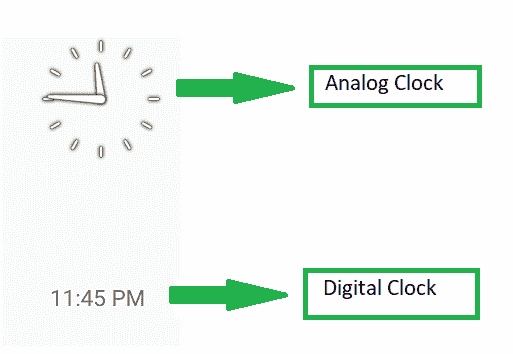
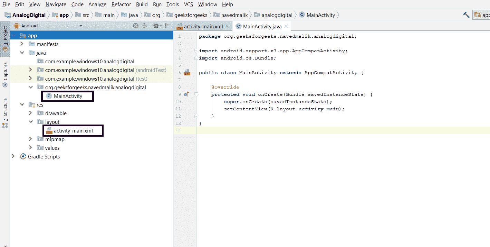
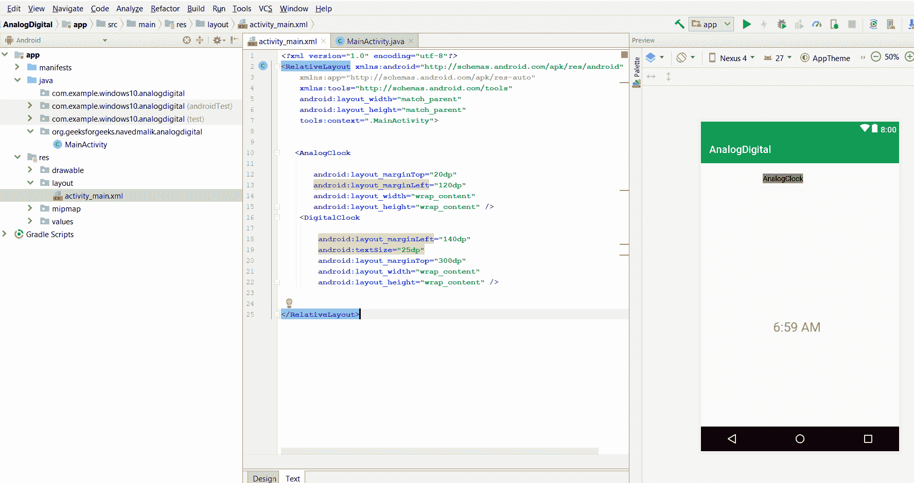

# 安卓|如何显示模拟时钟和数字时钟

> 原文:[https://www . geesforgeks . org/Android-如何显示-模拟时钟和数字时钟/](https://www.geeksforgeeks.org/android-how-to-display-analog-clock-and-digital-clock/)

**先决条件:**

*   [新手安卓应用开发基础](https://www.geeksforgeeks.org/android-app-development-fundamentals-for-beginners/)
*   [安卓工作室安装设置指南](https://www.geeksforgeeks.org/guide-to-install-and-set-up-android-studio/)
*   [安卓|从第一个 app/安卓项目开始](https://www.geeksforgeeks.org/android-starting-with-first-app-android-project/)
*   [安卓|运行你的第一个安卓应用](https://www.geeksforgeeks.org/android-running-your-first-android-app/)

**模拟和数字时钟**在安卓应用中用于显示时间。

1.  **模拟时钟:**模拟时钟是**视图**类的子类。它代表一个圆形时钟。在圆圈的周围，数字 1 到 12 似乎代表小时，两只手用来显示时间的瞬间——短的表示小时，长的表示分钟。
2.  **数字钟:**数字钟是 **TextView** 类的子类，使用数字以“HH:MM”格式显示时间。

**例如**


本文构建了一个简单的安卓应用程序来显示**模拟时钟和**数字时钟。

### 如何创建安卓模拟时钟和数字时钟？

这个例子将有助于根据上面显示的例子开发一个显示模拟时钟和数字时钟的安卓应用程序:
**下面是创建模拟和数字时钟安卓应用程序的步骤:**

*   **Step1:** Firstly create a new Android Application. This will create an XML file “activity_main.xml” and a Java File “MainActivity.Java”. Please refer the pre-requisites to learn more about this step.

    

*   **Step2:** Open “activity_main.xml” file and add following widgets in a Relative Layout:
    *   一个**模拟时钟**
    *   一个**数字时钟**

    这将使应用程序的用户界面。不需要分配标识，因为这些小部件会自己显示时间。

    

*   **步骤 3:** 保持 Java 文件原样。
*   **步骤 4:** 现在运行应用。两个时钟都显示在屏幕上。

**模拟数字钟 MainActivity.java 和 activity_main.xml 的完整代码如下:**

## activity_main.xml

```java
<?xml version="1.0" encoding="utf-8"?>
<RelativeLayout 
    xmlns:android="http://schemas.android.com/apk/res/android"
    xmlns:app="http://schemas.android.com/apk/res-auto"
    xmlns:tools="http://schemas.android.com/tools"
    android:layout_width="match_parent"
    android:layout_height="match_parent"
    tools:context=".MainActivity">

   <AnalogClock

       android:layout_marginTop="20dp"
       android:layout_marginLeft="120dp"
       android:layout_width="wrap_content"
       android:layout_height="wrap_content" />
    <DigitalClock

        android:layout_marginLeft="140dp"
        android:textSize="25dp"
        android:layout_marginTop="300dp"
        android:layout_width="wrap_content"
        android:layout_height="wrap_content" />

</RelativeLayout>
```

## MainActivity.java

```java
package org.geeksforgeeks.navedmalik.analogdigital;

import android.support.v7.app.AppCompatActivity;
import android.os.Bundle;

public class MainActivity extends AppCompatActivity {

    @Override
    protected void onCreate(Bundle savedInstanceState)
    {
        super.onCreate(savedInstanceState);
        setContentView(R.layout.activity_main);
    }
}
```

**输出:**
