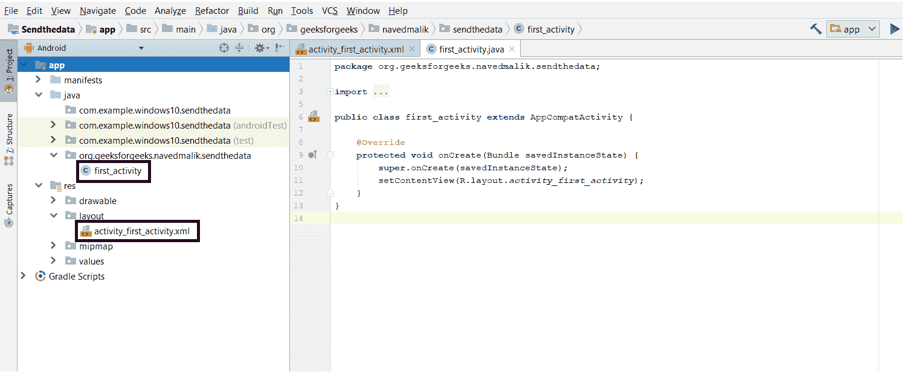
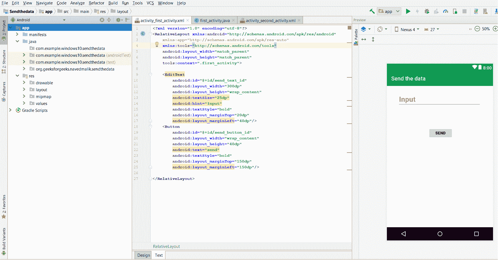
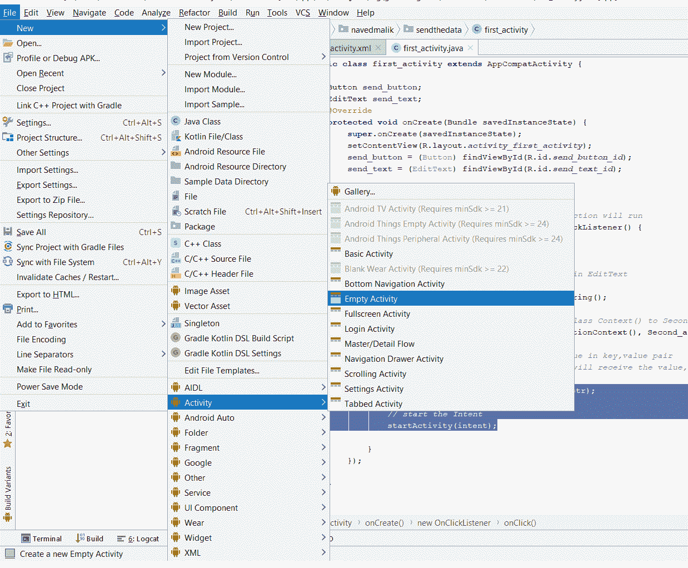
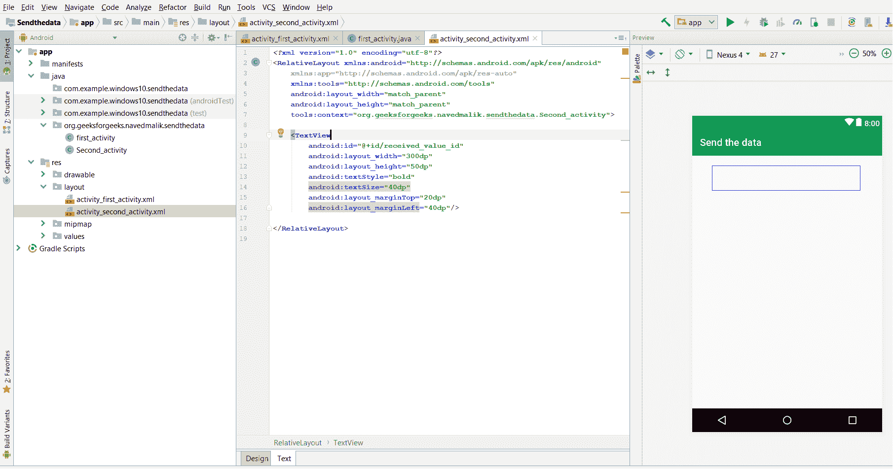

# 安卓|如何将数据从一个活动发送到第二个活动

> 原文:[https://www . geesforgeks . org/Android-如何将数据从一个活动发送到第二个活动/](https://www.geeksforgeeks.org/android-how-to-send-data-from-one-activity-to-second-activity/)

**先决条件:**

*   [新手安卓应用开发基础](https://www.geeksforgeeks.org/android-app-development-fundamentals-for-beginners/)
*   [安卓工作室安装设置指南](https://www.geeksforgeeks.org/guide-to-install-and-set-up-android-studio/)
*   [安卓|从第一个 app/安卓项目开始](https://www.geeksforgeeks.org/android-starting-with-first-app-android-project/)
*   [安卓|运行你的第一个安卓应用](https://www.geeksforgeeks.org/android-running-your-first-android-app/)

本文旨在讲述和展示如何“使用意图将数据从一个活动发送到第二个活动”。在本例中，我们有两个活动，**活动 _ 第一个**是源活动，**活动 _ 第二个**是目标活动。我们可以使用 putExtra()方法从一个活动中发送数据，并使用 getStringExtra()方法从第二个活动中获取数据。

**示例:**


在本例中，使用一个编辑文本来输入文本。当点击“发送”按钮时，该文本被发送到第二个活动。为此，将启动意图并运行以下方法:

*   **putExtra()** 方法用于发送数据，键值对**键**中的数据是变量名，**值**可以是 Int、String、Float 等。
*   **getstringxtra()**方法是获取上述方法发送的数据(密钥)。根据值的数据类型，还有其他方法，如 **getIntExtra()，getFloatExtra()**

### 如何创建一个安卓应用程序在两个活动之间发送和接收数据

**第一步:**首先创建一个新的安卓应用。这将创建一个 XML 文件和一个 Java 文件。请参考先决条件以了解有关此步骤的更多信息。



**步骤 2:** 打开“activity_first_activity.xml”文件，在[相对布局](https://www.geeksforgeeks.org/layouts-android-ui-design/)中添加以下小部件:

*   输入信息的编辑文本
*   发送数据的**按钮**

此外，将 **标识** 以及其他属性分配给每个组件，如下图和代码所示。组件上分配的标识有助于在 Java 文件中轻松找到和使用该组件。

**语法:**

```
android:id="@+id/id_name"
```

这里给定的标识如下:

*   发送按钮:发送按钮标识
*   编辑文本输入：send_text_id

这将使应用程序的用户界面。



**第三步:**现在，在 UI 之后，这一步将创建 App 的后端。为此，打开“first_activity.java”文件，并使用 findViewById()方法实例化在 XML 文件(EditText，send Button)中制作的组件。此方法借助于分配的标识将创建的对象绑定到用户界面组件。

**一般语法:**

> **组件类型对象=(组件类型)findviewbyid(r . id . idfthek 组件)；**

**所用组件的语法:**

> **Button send _ Button =(Button)findwiewbyid(r . id . send _ Button _ id)；**
> **send _ text =(EditText)findwiewbyid(r . id . send _ text _ id)；**

**步骤 4:** 该步骤包括设置发送和接收数据的操作。这些操作如下:

1.首先在发送按钮上添加监听器，该按钮将发送数据。具体如下:

> **send _ button . setonclicklistener(新视图。OnClickListener() {}**

点击此按钮后，将执行以下操作。

2.现在创建字符串类型变量来存储用户输入的编辑文本的值。获取该值并将其转换为字符串。具体如下:

> **String str = send_text.getText()。toString()；**

3.现在创建意图对象 First_activity.java 类到 Second_activity 类。具体如下:

> **意图意图=新意图(getApplicationContext()、Second _ activity . class)；**

其中 getApplicationContext()将获取当前活动。

4.将 putExtra 方法中的值放入键值对，然后开始活动。具体如下:

> **intent . putextra(" message _ key "，str)；**
> **开始活动(意向)；**

其中“str”是字符串值，键是“message_key ”,该键将用于获取字符串值

**步骤 5:** 现在我们必须创建一个 Second_Activity 来接收数据。
创建第二个活动的步骤如下:

> **安卓项目>文件>新增>活动>清空活动**



**第 6 步:**现在打开第二个 xml 文件。
添加显示接收消息的文本视图。为文本视图分配标识。第二项活动如下所示:



**第七步:**现在，打开你的第二个活动 java 文件，执行以下操作。

1.定义 TextView 变量，使用 findViewById()获取如上所示的 TextView。

> **receiver _ msg =(TextView)findwiewbyid(r . id . received _ value _ id)；**

2.现在在 second_activity.java 文件中，使用 **message_key** 通过 getStringExtra 方法创建 getTntent 对象以接收字符串类型变量中的值。

> **意向意向= GetEntent()；**
> **字符串字符串**

3.在第二个活动 xml 文件的 TextView 对象中设置的接收值

> **receiver _ msg . settext(str)；**

**第 8 步:**现在运行应用程序，操作如下:

*   当应用程序打开时，它会显示“输入”编辑文本。输入发送的值。
*   单击发送按钮，消息将显示在第二个屏幕上。

**以下是应用程序的完整代码。**

**文件名:activity_first_activity.xml**

## 可扩展标记语言

```
<?xml version="1.0" encoding="utf-8"?>
<RelativeLayout
    xmlns:android="http://schemas.android.com/apk/res/android"
    xmlns:app="http://schemas.android.com/apk/res-auto"
    xmlns:tools="http://schemas.android.com/tools"
    android:layout_width="match_parent"
    android:layout_height="match_parent"
    tools:context=".first_activity">

    <EditText
        android:id="@+id/send_text_id"
        android:layout_width="300dp"
        android:layout_height="wrap_content"
        android:textSize="25dp"
        android:hint="Input"
        android:textStyle="bold"
        android:layout_marginTop="20dp"
        android:layout_marginLeft="40dp"/>
    <Button
        android:id="@+id/send_button_id"
        android:layout_width="wrap_content"
        android:layout_height="40dp"
        android:text="send"
        android:textStyle="bold"
        android:layout_marginTop="150dp"
        android:layout_marginLeft="150dp"/>

</RelativeLayout>
```

**文件名:First_Activity.java**

## Java 语言(一种计算机语言，尤用于创建网站)

```
package org.geeksforgeeks.navedmalik.sendthedata;

import android.content.Intent;
import android.support.v7.app.AppCompatActivity;
import android.os.Bundle;
import android.view.View;
import android.widget.Button;
import android.widget.EditText;

public class first_activity extends AppCompatActivity {

    // define the variable
    Button send_button;
    EditText send_text;
    @Override
    protected void onCreate(Bundle savedInstanceState)
    {
        super.onCreate(savedInstanceState);
        setContentView(R.layout.activity_first_activity);
        send_button = (Button)findViewById(R.id.send_button_id);
        send_text = (EditText)findViewById(R.id.send_text_id);

        // add the OnClickListener in sender button
        // after clicked this button following Instruction will run
        send_button.setOnClickListener(new View.OnClickListener() {
            @Override
            public void onClick(View v)
            {

                // get the value which input by user in EditText
                // and convert it to string
                String str = send_text.getText().toString();

                // Create the Intent object of this class Context() to Second_activity class
                Intent intent = new Intent(getApplicationContext(), Second_activity.class);

                // now by putExtra method put the value in key, value pair
                // key is message_key by this key we will receive the value, and put the string

                intent.putExtra("message_key", str);

                // start the Intent
                startActivity(intent);
            }
        });
    }
}
```

**文件名:activity _ second _ activity . XML**

## 可扩展标记语言

```
<?xml version="1.0" encoding="utf-8"?>
<RelativeLayout xmlns:android="http://schemas.android.com/apk/res/android"
    xmlns:app="http://schemas.android.com/apk/res-auto"
    xmlns:tools="http://schemas.android.com/tools"
    android:layout_width="match_parent"
    android:layout_height="match_parent"
    tools:context="org.geeksforgeeks.navedmalik.sendthedata.Second_activity">

    <TextView
        android:id="@+id/received_value_id"
        android:layout_width="300dp"
        android:layout_height="50dp"
        android:textStyle="bold"
        android:textSize="40dp"
        android:layout_marginTop="20dp"
        android:layout_marginLeft="40dp"/>

</RelativeLayout>
```

**文件名:Second_Activity.java**

## Java 语言(一种计算机语言，尤用于创建网站)

```
package org.geeksforgeeks.navedmalik.sendthedata;

import android.content.Intent;
import android.support.v7.app.AppCompatActivity;
import android.os.Bundle;
import android.widget.TextView;

public class Second_activity extends AppCompatActivity {

    TextView receiver_msg;
    @Override
    protected void onCreate(Bundle savedInstanceState)
    {
        super.onCreate(savedInstanceState);
        setContentView(R.layout.activity_second_activity);

        receiver_msg = (TextView)findViewById(R.id.received_value_id);

        // create the get Intent object
        Intent intent = getIntent();

        // receive the value by getStringExtra() method
        // and key must be same which is send by first activity
        String str = intent.getStringExtra("message_key");

        // display the string into textView
        receiver_msg.setText(str);
    }
}
```

**输出:**

