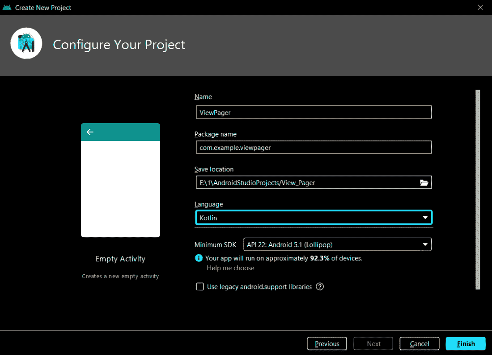
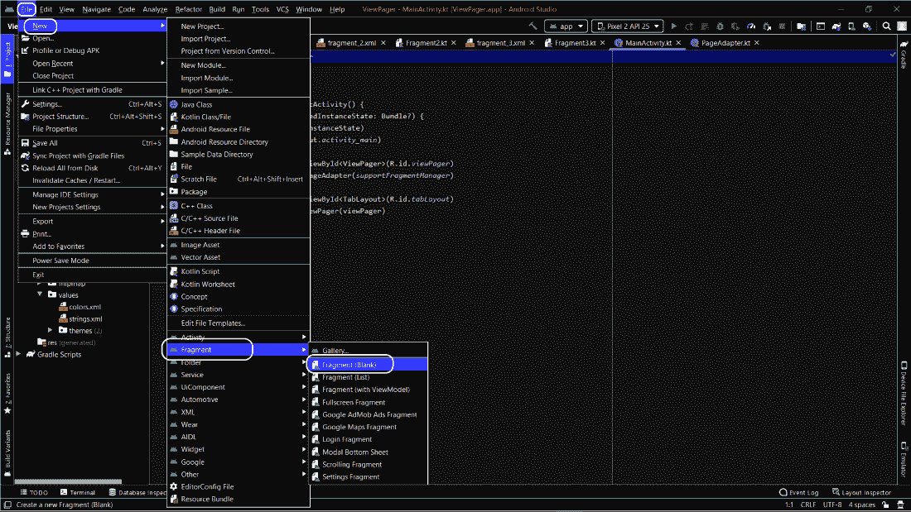
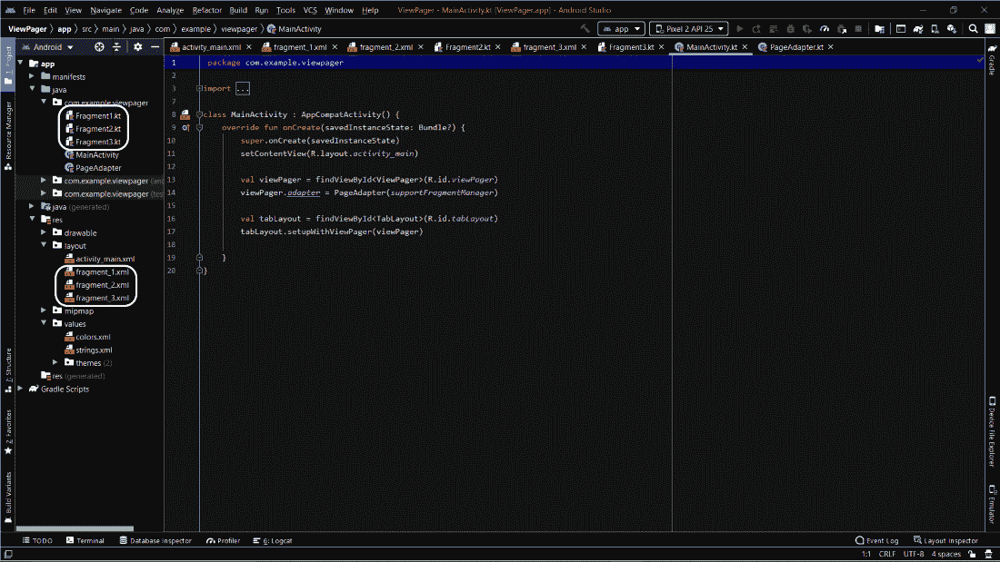

# 科特林 Android 查看寻呼机

> 原文:[https://www.geeksforgeeks.org/android-viewpager-in-kotlin/](https://www.geeksforgeeks.org/android-viewpager-in-kotlin/)

**视图页面**允许用户向左或向右滑动包含数据的页面，或者看到一个全新的屏幕。你可以在大多数社交媒体应用中找到这项功能。WhatsApp 在打开时还会在用户的应用程序中显示三个选项卡:聊天、状态和通话。学习这个特性是令人兴奋的，因为我们已经看到了这个特性在现实世界中的应用。它还用于帮助用户在第一次安装应用时了解该应用及其功能。我们将以**桌面布局**为例，在应用程序中应用**视图页面**概念。看完这篇文章，你可以很容易地在任何应用程序中应用这个特性。

### **简单浏览**

我们将从在**活动 _main.xml** 中添加[表格布局](https://www.geeksforgeeks.org/how-to-implement-a-tablayout-in-android-using-viewpager-and-fragments/)和视图页面开始。这样做之后，我们将向应用程序添加三个空白片段。我们将根据需要在片段的所有三个 XML 文件中更改文本。现在，我们将创建 PageAdapter.kt 类，其中我们必须使用三个函数 **getCount()** 、 **getItem()** 和 **getPageTitle()** 。最后，我们只需要调用**适配器**和**表格输出**。下面给出了一个示例 gif，以获得关于我们正在实现的想法的实用知识。


### **页面适配器中使用的重要功能**

*   **getCount()–**返回要显示的片段数。
*   **getItem()–**返回位置索引处的片段。
*   **getpage title–**返回给页面的标题(在我们的例子中，是给每个页面的标题，如 tab1、tab2、tab3)

### **分步实施**

**第一步:创建一个活动为空的项目**

要在安卓工作室创建新项目，请参考[如何在安卓工作室创建/启动新项目](https://www.geeksforgeeks.org/android-how-to-create-start-a-new-project-in-android-studio/)。确保在创建项目时选择了**科特林**作为语言。



**步骤 2:使用 activity_main.xml 文件**

导航到 **app > res >布局> activity_main.xml** 并将下面的代码添加到该文件中。下面是**activity _ main . XML**文件的代码。这里我们刚刚添加了 TabLayout 和 ViewPager。

## 可扩展标记语言

```java
<?xml version="1.0" encoding="utf-8"?>
<androidx.constraintlayout.widget.ConstraintLayout 
    xmlns:android="http://schemas.android.com/apk/res/android"
    xmlns:app="http://schemas.android.com/apk/res-auto"
    xmlns:tools="http://schemas.android.com/tools"
    android:layout_width="match_parent"
    android:layout_height="match_parent"
    tools:context=".MainActivity">

    <com.google.android.material.tabs.TabLayout
        android:id="@+id/tabLayout"
        android:layout_width="409dp"
        android:layout_height="wrap_content"
        android:layout_marginTop="1dp"
        android:layout_marginBottom="1dp"
        app:layout_constraintBottom_toTopOf="@+id/viewPager"
        app:layout_constraintEnd_toEndOf="parent"
        app:layout_constraintStart_toStartOf="parent"
        app:layout_constraintTop_toTopOf="parent" >
    </com.google.android.material.tabs.TabLayout>

    <androidx.viewpager.widget.ViewPager
        android:id="@+id/viewPager"
        android:layout_width="0dp"
        android:layout_height="0dp"
        android:layout_marginStart="1dp"
        android:layout_marginEnd="1dp"
        android:layout_marginBottom="1dp"
        app:layout_constraintBottom_toBottomOf="parent"
        app:layout_constraintEnd_toEndOf="parent"
        app:layout_constraintStart_toStartOf="parent"
        app:layout_constraintTop_toBottomOf="@+id/tabLayout" />

</androidx.constraintlayout.widget.ConstraintLayout>
```

**第三步:添加空白片段**

这是在 Android Studio 中创建空白片段的路径。



单击空白片段后，命名片段并单击完成。总共制作三个片段。



**第 4 步:处理片段的 XML 文件**

在每个片段中，我们都更改了文本，并将基本的东西添加到我们的 XML 文件中，如文本颜色、文本大小等。

**片段 1**

## 可扩展标记语言

```java
<?xml version="1.0" encoding="utf-8"?>
<FrameLayout 
    xmlns:android="http://schemas.android.com/apk/res/android"
    xmlns:tools="http://schemas.android.com/tools"
    android:layout_width="match_parent"
    android:layout_height="match_parent"
    tools:context=".Fragment1">

    <TextView
        android:layout_width="match_parent"
        android:layout_height="match_parent"
        android:textColor="@color/green"
        android:textSize="50dp"
        android:text="GFG 1" />

</FrameLayout>
```

**片段 2**

## 可扩展标记语言

```java
<?xml version="1.0" encoding="utf-8"?>
<FrameLayout 
    xmlns:android="http://schemas.android.com/apk/res/android"
    xmlns:tools="http://schemas.android.com/tools"
    android:layout_width="match_parent"
    android:layout_height="match_parent"
    tools:context=".Fragment2">

    <TextView
        android:layout_width="match_parent"
        android:layout_height="match_parent"
        android:textColor="@color/green"
        android:textSize="50dp"
        android:text="GFG 2" />

</FrameLayout>
```

**片段 3**

## 可扩展标记语言

```java
<?xml version="1.0" encoding="utf-8"?>
<FrameLayout
    xmlns:android="http://schemas.android.com/apk/res/android"
    xmlns:tools="http://schemas.android.com/tools"
    android:layout_width="match_parent"
    android:layout_height="match_parent"
    tools:context=".Fragment3">

    <TextView
        android:layout_width="match_parent"
        android:layout_height="match_parent"
        android:textColor="@color/green"
        android:textSize="50dp"
        android:text="GFG 3" />

</FrameLayout>
```