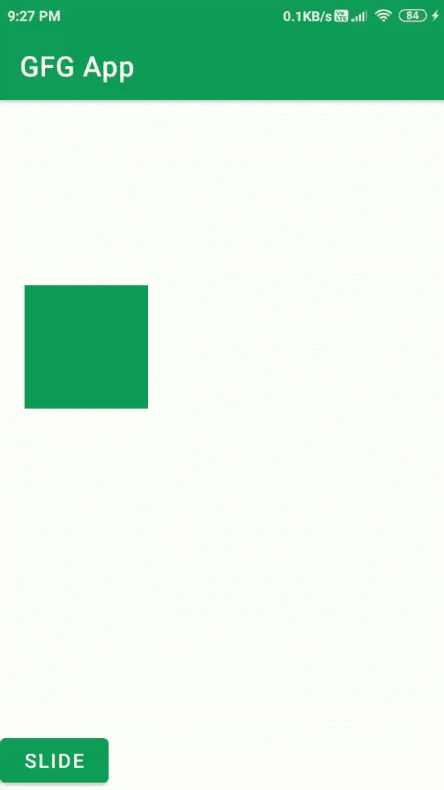
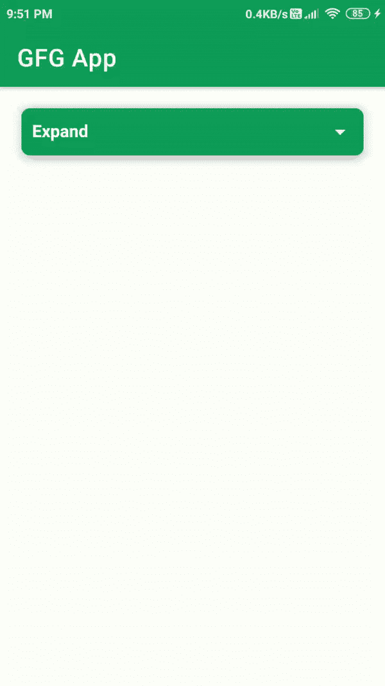

# 安卓动画示例

> 原文:[https://www . geesforgeks . org/animation-in-Android-with-example/](https://www.geeksforgeeks.org/animation-in-android-with-example/)

动画是向任何视图、图像或文本添加运动效果的过程。在动画的帮助下，您可以添加运动或更改特定视图的形状。安卓中的动画一般用来给你的 UI 一个丰富的观感。动画基本上有以下三种类型:

1.  **属性动画**
2.  **查看动画**
3.  **可绘制动画**

### **1。物业动画**

属性动画是一个健壮的框架，它允许制作几乎所有的动画。这是安卓 3.0 中引入的强大而灵活的动画之一。属性动画可用于添加[复选框](https://www.geeksforgeeks.org/checkbox-in-kotlin/)、[单选按钮](https://www.geeksforgeeks.org/android-how-to-add-radio-buttons-in-an-android-application/)中的任何动画，以及除任何视图之外的小部件。



### **2。查看动画**

视图动画可用于将动画添加到特定视图，以便在视图上执行补间动画。补间动画计算动画信息，如大小、旋转、起点和终点。这些动画速度较慢，灵活性较差。如果我们想在可以使用视图动画的地方扩展特定布局，可以使用视图动画的示例。视图动画的例子可以在可扩展的回收视图中看到。



### **3。可绘制动画**

如果您想在一个图像上制作另一个图像的动画，可以使用可绘制动画。理解的简单方法是制作可绘制动画，即一个接一个地加载一系列可绘制动画来创建动画。一个简单的可绘制动画的例子可以在许多应用程序徽标动画的闪屏中看到。


### 动画的重要方法

<figure class="table">

| 

方法

 | 

描述

 |
| --- | --- |
| startAnimation() | 此方法将启动动画。 |
| clearAnimation() | 此方法将清除在特定视图上运行的动画。 |

</figure>

### 例子

现在我们将看到向[图像视图](https://www.geeksforgeeks.org/imageview-in-kotlin/)添加动画的简单示例。注意，我们将使用 **Java** 语言来实现这个项目。

**第一步:创建新项目**

要在安卓工作室创建新项目，请参考[如何在安卓工作室创建/启动新项目](https://www.geeksforgeeks.org/android-how-to-create-start-a-new-project-in-android-studio/)。注意选择 **Java** 作为编程语言。

**第 2 步:处理字符串. xml 文件**

可以从**应用程序> res >值> strings.xml** 中找到。下面是**字符串. xml** 文件的片段。

## 可扩展标记语言

```
<resources>
    <string name="app_name">GFG App</string>
    <string name="blink">BLINK</string>
    <string name="clockwise">ROTATE</string>
    <string name="fade">FADE</string>
    <string name="move">MOVE</string>
    <string name="slide">SLIDE</string>
    <string name="zoom">ZOOM</string>
    <string name="stop_animation">STOP ANIMATION</string>
    <string name="course_rating">Course Rating</string>
    <string name="course_name">Course Name</string>
</resources>
```

**第三步:在应用程序项目的 build.gradle 文件中添加 google repository，如果默认情况下它不在那里**

> buildscript {
> 
> 存储库{
> 
> 谷歌()
> 
> mavenuentral _)
> 
> }

所有的 Jetpack 组件都可以在 Google Maven 存储库中找到，包括在 build.gradle 文件中

> 所有项目{
> 
> 存储库{
> 
> 谷歌()
> 
> mavenuentral _)
> 
> }
> 
> }

**第 4 步:使用 activity_main.xml 文件**

在 **activity_main.xml** 中创建 ImageView，并使用按钮将动画添加到视图中。导航至**应用程序> res >布局> activity_main.xml** 。下面是 **activity_main.xml** 文件的代码。

## 可扩展标记语言

```
<?xml version="1.0" encoding="utf-8"?>
<RelativeLayout
    xmlns:android="http://schemas.android.com/apk/res/android"
    xmlns:tools="http://schemas.android.com/tools"
    android:layout_width="match_parent"
    android:layout_height="match_parent"
    tools:context=".MainActivity">

    <ImageView
        android:id="@+id/imageview"
        android:layout_width="200dp"
        android:layout_height="200dp"
        android:layout_centerHorizontal="true"
        android:layout_marginTop="40dp"
        android:contentDescription="@string/app_name"
        android:src="@drawable/gfgimage" />

    <LinearLayout
        android:id="@+id/linear1"
        android:layout_width="match_parent"
        android:layout_height="wrap_content"
        android:layout_below="@id/imageview"
        android:layout_marginTop="30dp"
        android:orientation="horizontal"
        android:weightSum="3">

        <!--To start the blink animation of the image-->
        <Button
            android:id="@+id/BTNblink"
            style="@style/TextAppearance.AppCompat.Widget.Button"
            android:layout_width="0dp"
            android:layout_height="wrap_content"
            android:layout_margin="10dp"
            android:layout_weight="1"
            android:padding="3dp"
            android:text="@string/blink"
            android:textColor="@color/white" />

        <!--To start the rotate animation of the image-->
        <Button
            android:id="@+id/BTNrotate"
            style="@style/TextAppearance.AppCompat.Widget.Button"
            android:layout_width="0dp"
            android:layout_height="wrap_content"
            android:layout_margin="10dp"
            android:layout_weight="1"
            android:padding="3dp"
            android:text="@string/clockwise"
            android:textColor="@color/white" />

        <!--To start the fading animation of the image-->
        <Button
            android:id="@+id/BTNfade"
            style="@style/TextAppearance.AppCompat.Widget.Button"
            android:layout_width="0dp"
            android:layout_height="wrap_content"
            android:layout_margin="10dp"
            android:layout_weight="1"
            android:padding="3dp"
            android:text="@string/fade"
            android:textColor="@color/white" />

    </LinearLayout>
    <LinearLayout
        android:id="@+id/linear2"
        android:layout_width="match_parent"
        android:layout_height="wrap_content"
        android:layout_below="@id/linear1"
        android:layout_marginTop="30dp"
        android:orientation="horizontal"
        android:weightSum="3">

        <!--To start the move animation of the image-->
        <Button
            android:id="@+id/BTNmove"
            style="@style/TextAppearance.AppCompat.Widget.Button"
            android:layout_width="0dp"
            android:layout_height="wrap_content"
            android:layout_margin="10dp"
            android:layout_weight="1"
            android:padding="3dp"
            android:text="@string/move"
            android:textColor="@color/white" />

        <!--To start the slide animation of the image-->
        <Button
            android:id="@+id/BTNslide"
            style="@style/TextAppearance.AppCompat.Widget.Button"
            android:layout_width="0dp"
            android:layout_height="wrap_content"
            android:layout_margin="10dp"
            android:layout_weight="1"
            android:padding="3dp"
            android:text="@string/slide"
            android:textColor="@color/white" />

        <!--To start the zoom animation of the image-->
        <Button
            android:id="@+id/BTNzoom"
            style="@style/TextAppearance.AppCompat.Widget.Button"
            android:layout_width="0dp"
            android:layout_height="wrap_content"
            android:layout_margin="10dp"
            android:layout_weight="1"
            android:padding="3dp"
            android:text="@string/zoom"
            android:textColor="@color/white" />

    </LinearLayout>

    <!--To stop the animation of the image-->
    <Button
        android:id="@+id/BTNstop"
        android:layout_width="match_parent"
        android:layout_height="wrap_content"
        android:layout_below="@id/linear2"
        android:layout_marginLeft="30dp"
        android:layout_marginTop="30dp"
        android:layout_marginRight="30dp"
        android:text="@string/stop_animation" />

</RelativeLayout>
```

**第五步:为 ImageView** 创建 6 种不同类型的动画

为了创建新的动画，我们必须创建一个新的目录来存储我们所有的动画。导航到**应用程序>资源>右键单击资源> >新建> >目录> >将您的目录命名为“动漫”**。在这个目录中，我们将创建我们的动画。要创建新的动画，右键单击动画目录> >动画资源文件，并为您的文件命名。下面是 6 个不同动画的代码片段。

**1)闪烁动画**

## 可扩展标记语言

```
<?xml version="1.0" encoding="utf-8"?>
<set xmlns:android="http://schemas.android.com/apk/res/android">
    <alpha android:fromAlpha="0.0"
        android:toAlpha="1.0"
        android:interpolator="@android:anim/accelerate_interpolator"
        android:duration="500"
        android:repeatMode="reverse"
        android:repeatCount="infinite"/>
</set>
```

**2)渐变动画**

## 可扩展标记语言

```
<?xml version="1.0" encoding="utf-8"?>
<set xmlns:android="http://schemas.android.com/apk/res/android"
    android:interpolator="@android:anim/accelerate_interpolator">

    <!-- duration is the time for which animation will work-->
    <alpha
        android:duration="1000"
        android:fromAlpha="0"
        android:toAlpha="1" />

    <alpha
        android:duration="1000"
        android:fromAlpha="1"
        android:startOffset="2000"
        android:toAlpha="0" />

</set>
```

**3)移动动画**

## 可扩展标记语言

```
<?xml version="1.0" encoding="utf-8"?>
<set
    xmlns:android="http://schemas.android.com/apk/res/android"
    android:interpolator="@android:anim/linear_interpolator"
    android:fillAfter="true">

    <translate
        android:fromXDelta="0%p"
        android:toXDelta="75%p"
        android:duration="700" />
</set>
```

**4)旋转动画**

## 可扩展标记语言

```
<?xml version="1.0" encoding="utf-8"?>
<set
     xmlns:android="http://schemas.android.com/apk/res/android">
    <rotate
        android:duration="6000"
        android:fromDegrees="0"
        android:pivotX="50%"
        android:pivotY="50%"
        android:toDegrees="360" />

    <rotate
        android:duration="6000"
        android:fromDegrees="360"
        android:pivotX="50%"
        android:pivotY="50%"
        android:startOffset="5000"
        android:toDegrees="0" />

</set>
```

**5)幻灯片动画**

## 可扩展标记语言

```
<?xml version="1.0" encoding="utf-8"?>
<set xmlns:android="http://schemas.android.com/apk/res/android"
     android:fillAfter="true" >
    <scale
        android:duration="500"
        android:fromXScale="1.0"
        android:fromYScale="1.0"
        android:interpolator="@android:anim/linear_interpolator"
        android:toXScale="1.0"
        android:toYScale="0.0" />
</set>
```

6)缩放动画

## 可扩展标记语言

```
<?xml version="1.0" encoding="utf-8"?>
<set xmlns:android="http://schemas.android.com/apk/res/android"
    android:fillAfter="true" >

    <scale
        android:duration="500"
        android:fromXScale="1.0"
        android:fromYScale="1.0"
        android:interpolator="@android:anim/linear_interpolator"
        android:toXScale="1.0"
        android:toYScale="0.0" />
</set>
```

**步骤 6:使用 MainActivity.java 文件**

通过单击特定按钮将动画添加到图像视图中。导航到**应用程序> java >您的应用程序包名称>>MainActivity.java**。

## Java 语言(一种计算机语言，尤用于创建网站)

```
import androidx.appcompat.app.AppCompatActivity;
import android.os.Bundle;
import android.view.View;
import android.view.animation.Animation;
import android.view.animation.AnimationUtils;
import android.widget.Button;
import android.widget.ImageView;

public class MainActivity extends AppCompatActivity {

    ImageView imageView;
    Button blinkBTN, rotateBTN, fadeBTN, moveBTN, slideBTN, zoomBTN, stopBTN;

    @Override
    protected void onCreate(Bundle savedInstanceState) {
        super.onCreate(savedInstanceState);
        setContentView(R.layout.activity_main);
        imageView = findViewById(R.id.imageview);
        blinkBTN = findViewById(R.id.BTNblink);
        rotateBTN = findViewById(R.id.BTNrotate);
        fadeBTN = findViewById(R.id.BTNfade);
        moveBTN = findViewById(R.id.BTNmove);
        slideBTN = findViewById(R.id.BTNslide);
        zoomBTN = findViewById(R.id.BTNzoom);
        stopBTN = findViewById(R.id.BTNstop);

        blinkBTN.setOnClickListener(new View.OnClickListener() {
            @Override
            public void onClick(View v) {
                // To add blink animation
                Animation animation = AnimationUtils.loadAnimation(getApplicationContext(), R.anim.blink_animation);
                imageView.startAnimation(animation);
            }
        });

        rotateBTN.setOnClickListener(new View.OnClickListener() {
            @Override
            public void onClick(View v) {
                // To add rotate animation
                Animation animation = AnimationUtils.loadAnimation(getApplicationContext(), R.anim.rotate_animation);
                imageView.startAnimation(animation);
            }
        });
        fadeBTN.setOnClickListener(new View.OnClickListener() {
            @Override
            public void onClick(View v) {
                // To add fade animation
                Animation animation = AnimationUtils.loadAnimation(getApplicationContext(), R.anim.fade_animation);
                imageView.startAnimation(animation);
            }
        });
        moveBTN.setOnClickListener(new View.OnClickListener() {
            @Override
            public void onClick(View v) {
                // To add move animation
                Animation animation = AnimationUtils.loadAnimation(getApplicationContext(), R.anim.move_animation);
                imageView.startAnimation(animation);
            }
        });
        slideBTN.setOnClickListener(new View.OnClickListener() {
            @Override
            public void onClick(View v) {
                // To add slide animation
                Animation animation = AnimationUtils.loadAnimation(getApplicationContext(), R.anim.slide_animation);
                imageView.startAnimation(animation);
            }
        });
        zoomBTN.setOnClickListener(new View.OnClickListener() {
            @Override
            public void onClick(View v) {
                // To add zoom animation
                Animation animation = AnimationUtils.loadAnimation(getApplicationContext(), R.anim.zoom_animation);
                imageView.startAnimation(animation);
            }
        });
        stopBTN.setOnClickListener(new View.OnClickListener() {
            @Override
            public void onClick(View v) {
                // To stop the animation going on imageview
                imageView.clearAnimation();
            }
        });
    }
}
```

> **注意:** Drawables 和 strings 可以在 drawable 文件夹和 strings.xml 文件中找到。可从 **app > res >可绘制**中找到可绘制内容。

**输出:**

<video class="wp-video-shortcode" id="video-520171-1" width="640" height="360" preload="metadata" controls=""><source type="video/mp4" src="https://media.geeksforgeeks.org/wp-content/uploads/20201126131135/Screenrecorder-2020-11-26-12-51-05-314.mp4?_=1">[https://media.geeksforgeeks.org/wp-content/uploads/20201126131135/Screenrecorder-2020-11-26-12-51-05-314.mp4](https://media.geeksforgeeks.org/wp-content/uploads/20201126131135/Screenrecorder-2020-11-26-12-51-05-314.mp4)</video>