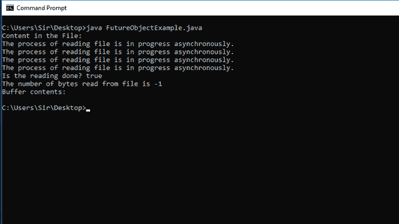
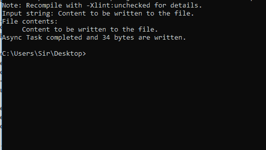

# Java NIO 中的异步文件通道

> 原文:[https://www . geeksforgeeks . org/asynchronousfileconnection-in-Java-nio/](https://www.geeksforgeeks.org/asynchronousfilechannel-in-java-nio/)

[Java.nio 包](https://www.geeksforgeeks.org/introduction-to-java-nio-with-examples/)在版本 java 1.4 版中推出。它允许我们同时处理不同的通道，因为它支持并发和多线程。异步文件通道 API 负责 java NIO 包，它是在 NIO 通道包下定义的。为了将异步文件通道应用编程接口导入我们的程序，请遵循以下语法:

**语法:**

```java
import java.nio.channels.AsynchronousFileChannel
```

异步通道对于多个并发线程来说是安全的，因为这种通道使文件操作能够异步执行，而不像同步输入/输出操作，在同步输入/输出操作中，线程进入动作并等待直到请求完成。这是异步文件通道和 NIO 的文件通道之间的唯一区别。

线程首先将请求传递给操作系统的内核，以便在线程继续执行另一个作业时完成请求。内核的工作完成后，它向线程发出信号，然后线程确认该信号并中断当前的工作，并根据需要在异步通道中处理输入/输出工作。

**接近:**

实现并发有两种方法，如下所列。我们将通过示例详细了解上述两种方法。

1.  未来对象
2.  完成处理程序

**方法 1:** 未来物体

它返回一个 java.util.concurrent.Future 对象。检索信息有两种有用的方法，这两种方法是–

1.  **get()方法:**它返回异步处理的操作的状态，在此基础上可以决定其他任务的进一步执行。
2.  **isDone()方法:**该方法会检查任务是否完成。

**例**

## Java 语言(一种计算机语言，尤用于创建网站)

```java
// Java Program to Illustrate AsynchronousFileChannel Class
// Via Future Object Approach

// Importing package
package com.java.nio;
// Importing required classes from java.nio package
import java.io.BufferedReader;
import java.io.FileReader;
import java.io.IOException;
import java.nio.ByteBuffer;
import java.nio.channels.AsynchronousFileChannel;
import java.nio.file.Path;
import java.nio.file.Paths;
import java.nio.file.StandardOpenOption;
import java.util.concurrent.ExecutionException;
import java.util.concurrent.Future;

// Main class
// FutureObjectExample
public class GFG {

    // Method 1
    // Main driver method
    public static void main(String[] args) throws Exception
    {

        // Calling the readFile() method that will run first
        readFile();
    }

    // Method 2
    // To read the file
    private static void readFile()
        throws IOException, InterruptedException,
               ExecutionException
    {

        // Path of the file
        String filePath
            = "C:/users/Sir/Desktop/fileCopy.txt";

        // First create the file and then specify its
        // correct path
        printFileContents(filePath);

        Path path = Paths.get(filePath);
        AsynchronousFileChannel channel
            = AsynchronousFileChannel.open(
                path, StandardOpenOption.READ);
        ByteBuffer buffer = ByteBuffer.allocate(400);
        Future<Integer> result = channel.read(buffer, 0);

        // Checking whether the task is been completed or
        // not
        while (!result.isDone()) {
            System.out.println(
                "The process of reading file is in progress asynchronously.");
        }

        // Print and display statements
        System.out.println("Is the reading done? "
                           + result.isDone());
        System.out.println(
            "The number of bytes read from file is "
            + result.get());

        buffer.flip();

        System.out.print("Buffer contents: ");

        while (buffer.hasRemaining()) {

            System.out.print((char)buffer.get());
        }

        System.out.println(" ");

        // Closing the channels using close() method
        buffer.clear();
        channel.close();
    }

    // Method 3
    // To print the contents of the file
    private static void printFileContents(String path)
        throws IOException
    {

        FileReader fr = new FileReader(path);
        BufferedReader br = new BufferedReader(fr);

        String textRead = br.readLine();

        System.out.println("Content in the File: ");

        while (textRead != null) {

            // After reading all the text from the file it
            // print the number of bytes in the file.
            System.out.println("     " + textRead);
            textRead = br.readLine();
        }

        // Closing the channels

        // Closing the fr object
        fr.close();
        // Closing the br object
        br.close();
    }
}
```

**输出:**



**方法 2:** 完成处理程序

对于这种方法，我们将使用 CompletionHandler 接口，它由两个有用的方法组成，我们将覆盖这两个方法。在这种情况下，创建了一个完成处理程序来消耗异步输入/输出操作的结果，因为一旦任务完成，那么只有该处理程序具有要执行的功能。

这两种方法如下:

1.  **completed()方法:**I/O 操作成功完成时调用该方法。
2.  **失败()方法:**如果 I/O 操作失败，则调用此方法。

**例**

## Java 语言(一种计算机语言，尤用于创建网站)

```java
// Java Program to Illustrate AsynchronousFileChannel Class
// Via Completion handler Approach

// Importing required classes from respective packages
package com.java.nio;
import java.io.BufferedReader;
import java.io.FileReader;
import java.io.IOException;
import java.nio.ByteBuffer;
import java.nio.channels.AsynchronousFileChannel;
import java.nio.channels.CompletionHandler;
import java.nio.file.Path;
import java.nio.file.Paths;
import java.nio.file.StandardOpenOption;

// Main class
// CompletionHandler
public class GFG {

    // Method 1
    // Main driver method
    public static void main(String[] args) throws Exception
    {

        // Calling the writefile() method
        writeFile();
    }

    // Method 2
    // To write into  a file
    private static void writeFile() throws IOException
    {

        // Custom string
        String input = "Content to be written to the file.";

        System.out.println("Input string: " + input);

        byte[] byteArray = input.getBytes();

        ByteBuffer buffer = ByteBuffer.wrap(byteArray);

        // Specifying path of File
        Path path = Paths.get(
            "C:/users/Sir/Desktop/fileCopy.txt");

        AsynchronousFileChannel channel
            = AsynchronousFileChannel.open(
                path, StandardOpenOption
                          .WRITE); // calling the API
        CompletionHandler handler
            = new CompletionHandler() {
                  // Method 3
                  @Override
                  public void completed(Object result,
                                        Object attachment)
                  {
                      System.out.println(
                          attachment + " completed and "
                          + result + " bytes are written.");
                  }

                  // Method 4
                  @Override
                  public void failed(Throwable exc,
                                     Object attachment)
                  {
                      System.out.println(
                          attachment
                          + " failed with exception:");
                      exc.printStackTrace();
                  }
              };

        channel.write(buffer, 0, "Async Task", handler);

        // Closing the channel object that we created earlier
        // using close() method
        channel.close();

        printFileContents(path.toString());
    }

    // Method 5
    // To print the file contents
    private static void printFileContents(String path)
        throws IOException
    {

        FileReader fr = new FileReader(path);
        BufferedReader br = new BufferedReader(fr);

        String textRead = br.readLine();

        System.out.println("File contents: ");

        // Till there is some content in file
        while (textRead != null) {
            System.out.println("     " + textRead);
            textRead = br.readLine();
        }

        // Closing the fr object
        fr.close();
        // Closing the br object
        br.close();
    }
}
```

**输出:**

