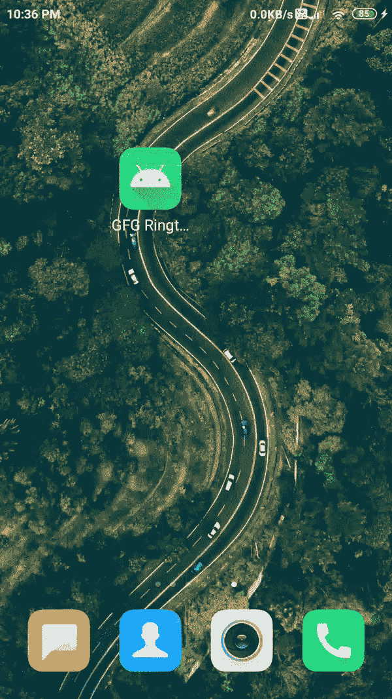

# 安卓中的音频管理器，示例

> 原文:[https://www . geesforgeks . org/audio manager-in-Android-with-example/](https://www.geeksforgeeks.org/audiomanager-in-android-with-example/)

**AudioManager** 是安卓提供的一个类，可以用来控制你的安卓设备的铃声音量。借助这个音频管理器类，您可以轻松控制设备的振铃音量。音频管理器类可以通过在安卓中调用 getSystemService()方法来使用。当您创建音频管理器类时，您可以使用**设置铃声()**方法来更改设备的铃声音量。**设置振铃器模式()**方法使用一个整数参数来设置设备的振铃器模式。 **setRingerMode()** 方法中需要传递三个不同的整数参数如下:

<figure class="table">

| **振铃器 _ 模式 _ 正常** | This mode will set your device mode to Normal/General mode. |
| **林格 _ 模式 _ 无声** | This mode sets your device mode to SILENT mode. |
| **林格 _ 模式 _ 活力四射** | This mode will set your device mode to vibrant mode. |

</figure>

### 例子

这是我们创建铃声管理器应用程序的简单示例。此应用程序将帮助您将设备的当前状态从“一般”更改为“振动”，然后更改为“静音模式”。下面给出了一个 GIF 示例，以了解我们将在本文中做什么。请注意，我们将使用 **Java** 语言来实现这个项目。



### **分步实施**

**第一步:创建新项目**

在安卓工作室创建新项目请参考 [如何在安卓工作室创建/启动新项目](https://www.geeksforgeeks.org/android-how-to-create-start-a-new-project-in-android-studio/) 。注意选择 **Java** 作为编程语言。

**第二步:在 AndroidManifest.xml 文件**中添加权限

在 **AndroidManifest.xml** 文件中添加下一行。

**第三步:在应用程序项目的 build.gradle 文件中添加 google repository，如果默认情况下它不在那里**

> buildscript {
> 
> 存储库{
> 
> 谷歌()
> 
> mavenuentral _)
> 
> }

所有的 Jetpack 组件都可以在 Google Maven 存储库中找到，包括在 build.gradle 文件中

> 所有项目{
> 
> 存储库{
> 
> 谷歌()
> 
> mavenuentral _)
> 
> }
> 
> }

**第四步:修改 strings.xml 文件**

下面是 **strings.xml** 文件的代码。

## 可扩展标记语言

```
<resources>
    <string name="app_name">GFG Ringtone Manager</string>
    <string name="vibrate_mode">vibrate_mode</string>
    <string name="silent_mode">silent_mode</string>
    <string name="ring_mode">ringtone_mode</string>
    <string name="welcome_to_ringtone_manager_app">Welcome to Ringtone Manager App</string>
    <string name="current_mode">Current Mode</string>
</resources>
```

**第 5 步:使用 activity_main.xml 文件**

下面是 **activity_main.xml** 文件的代码。代码中添加了注释，以更详细地理解代码。

## 可扩展标记语言

```
<?xml version="1.0" encoding="utf-8"?>
<!--XML Code for your activity_main.xml-->
<RelativeLayout
    xmlns:android="http://schemas.android.com/apk/res/android"
    xmlns:tools="http://schemas.android.com/tools"
    android:layout_width="match_parent"
    android:layout_height="match_parent"
    tools:context=".MainActivity">

    <!-- Textview to display the heading of the app-->
    <TextView
        android:id="@+id/idTVHeading"
        android:layout_width="match_parent"
        android:layout_height="wrap_content"
        android:layout_marginLeft="20dp"
        android:layout_marginTop="50dp"
        android:layout_marginRight="20dp"
        android:text="@string/welcome_to_ringtone_manager_app"
        android:textAlignment="center"
        android:textColor="@color/green"
        android:textSize="20sp" />

    <!-- Textview to display the current mode
         of the Ringer mode-->
    <TextView
        android:id="@+id/idTVCurrentMode"
        android:layout_width="match_parent"
        android:layout_height="wrap_content"
        android:layout_below="@id/idTVHeading"
        android:layout_marginTop="60dp"
        android:text="@string/current_mode"
        android:textAlignment="center"
        android:textAllCaps="true"
        android:textColor="@color/black"
        android:textSize="20sp"
        android:textStyle="bold" />

    <LinearLayout
        android:layout_width="match_parent"
        android:layout_height="wrap_content"
        android:layout_below="@id/idTVCurrentMode"
        android:layout_marginTop="80dp"
        android:orientation="horizontal"
        android:weightSum="3">

        <!-- width of image button is 0dp because
             we have mentioned weight=1-->
        <!-- tint represents the color of icons
             of image button-->
        <!-- all icons of image button are placed
             in drawable folder-->
        <ImageButton
            android:id="@+id/idIBVibrateMode"
            android:layout_width="0dp"
            android:layout_height="100dp"
            android:layout_margin="10dp"
            android:layout_weight="1"
            android:background="@color/green"
            android:contentDescription="@string/vibrate_mode"
            android:src="@drawable/ic_vibrate"
            android:tint="@color/white" />

        <ImageButton
            android:id="@+id/idIBSilentMode"
            android:layout_width="0dp"
            android:layout_height="100dp"
            android:layout_margin="10dp"
            android:layout_weight="1"
            android:background="@color/green"
            android:contentDescription="@string/silent_mode"
            android:src="@drawable/ic_silent_mode"
            android:tint="@color/white" />

        <ImageButton
            android:id="@+id/idIBRingtoneMode"
            android:layout_width="0dp"
            android:layout_height="100dp"
            android:layout_margin="10dp"
            android:layout_weight="1"
            android:background="@color/green"
            android:contentDescription="@string/ring_mode"
            android:src="@drawable/ic_ringtone_mode"
            android:tint="@color/white" />
    </LinearLayout>
</RelativeLayout>
```

**步骤 6:使用 MainActivity.java 文件**

以下是**MainActivity.java**文件的代码。代码中添加了注释，以更详细地理解代码。

## Java 语言(一种计算机语言，尤用于创建网站)

```
import android.app.NotificationManager;
import android.content.Context;
import android.content.Intent;
import android.media.AudioManager;
import android.os.Build;
import android.os.Bundle;
import android.view.View;
import android.widget.ImageButton;
import android.widget.TextView;
import android.widget.Toast;
import androidx.appcompat.app.AppCompatActivity;

public class MainActivity extends AppCompatActivity {

    // TextView to display the current ringer mode
    TextView currentStateTV;

    // Image buttons to switch ringer mode.
    ImageButton silentIB, vibrateIB, ringtoneIB;

    // object class variable for audio manager class.
    private AudioManager audioManager;

    // current mode to store integer value of ringer mode.
    int currentmode;

    @Override
    protected void onCreate(Bundle savedInstanceState) {
        super.onCreate(savedInstanceState);
        setContentView(R.layout.activity_main);
        currentStateTV = findViewById(R.id.idTVCurrentMode);
        silentIB = findViewById(R.id.idIBSilentMode);
        vibrateIB = findViewById(R.id.idIBVibrateMode);
        ringtoneIB = findViewById(R.id.idIBRingtoneMode);
        audioManager = (AudioManager) getSystemService(Context.AUDIO_SERVICE);

        // current mode will store current mode
        // of ringer of users device..
        currentmode = audioManager.getRingerMode();

        switch (currentmode) {
            case AudioManager.RINGER_MODE_NORMAL:
                currentStateTV.setText("Ringer Mode");
                break;
            case AudioManager.RINGER_MODE_SILENT:
                currentStateTV.setText("Silent Mode");
                break;
            case AudioManager.RINGER_MODE_VIBRATE:
                currentStateTV.setText("Vibrate Mode");
            default:
                currentStateTV.setText("Fail to get mode");
        }

        silentIB.setOnClickListener(new View.OnClickListener() {
            @Override
            public void onClick(View v) {
                NotificationManager notificationManager = (NotificationManager) getSystemService(Context.NOTIFICATION_SERVICE);

                // the below code is to check the permission that the access
                // notification policy settings from users device..
                if (Build.VERSION.SDK_INT >= Build.VERSION_CODES.M && !notificationManager.isNotificationPolicyAccessGranted()) {
                    Intent intent = new Intent(android.provider.Settings.ACTION_NOTIFICATION_POLICY_ACCESS_SETTINGS);
                    startActivity(intent);
                }

                // set ringer mode here will sets your ringer mode to silent mode
                audioManager.setRingerMode(AudioManager.RINGER_MODE_SILENT);
                Toast.makeText(MainActivity.this, "Silent Mode Activated..", Toast.LENGTH_SHORT).show();
                currentStateTV.setText("Silent Mode Activated..");
            }
        });

        vibrateIB.setOnClickListener(new View.OnClickListener() {
            @Override
            public void onClick(View v) {
                // set ringer mode here will sets your ringer mode to vibrate mode
                audioManager.setRingerMode(AudioManager.RINGER_MODE_VIBRATE);
                Toast.makeText(MainActivity.this, "Vibrate Mode Activated..", Toast.LENGTH_SHORT).show();
                currentStateTV.setText("Vibrate Mode Activated..");
            }
        });

        ringtoneIB.setOnClickListener(new View.OnClickListener() {
            @Override
            public void onClick(View v) {
                // set ringer mode here will sets your ringer mode to normal mode
                audioManager.setRingerMode(AudioManager.RINGER_MODE_NORMAL);
                Toast.makeText(MainActivity.this, "Ringtone Mode Activated..", Toast.LENGTH_SHORT).show();
                currentStateTV.setText("Ringtone Mode Activated..");
            }
        });
    }
}
```

**输出:在设备上运行应用**

<video class="wp-video-shortcode" id="video-517179-1" width="640" height="360" preload="metadata" controls=""><source type="video/mp4" src="https://media.geeksforgeeks.org/wp-content/uploads/20201121223921/Screenrecorder-2020-11-21-22-36-56-501.mp4?_=1">[https://media.geeksforgeeks.org/wp-content/uploads/20201121223921/Screenrecorder-2020-11-21-22-36-56-501.mp4](https://media.geeksforgeeks.org/wp-content/uploads/20201121223921/Screenrecorder-2020-11-21-22-36-56-501.mp4)</video>

**项目链接:** [点击此处](https://media.geeksforgeeks.org/wp-content/cdn-uploads/20210906005950/GFG-Audio-Manager-master.zip)