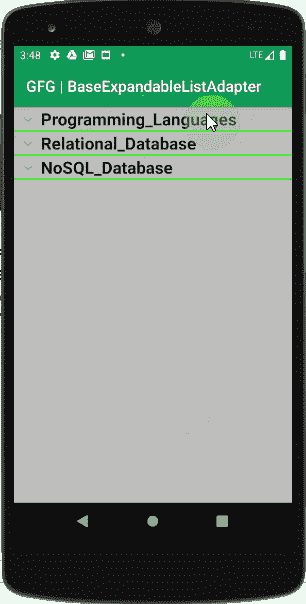

# 安卓中的 BaseExpandableListAdapter 示例

> 原文:[https://www . geeksforgeeks . org/base expandablelelistaper-in-Android-with-example/](https://www.geeksforgeeks.org/baseexpandablelistadapter-in-android-with-example/)

在许多安卓应用中，开发者可能需要为巨大的主数据项显示多数据。也就是说，根据我们的例子，在“编程语言”下，我们需要显示“Python”、“Java”等。，而在“关系数据库”下我们需要显示“Oracle”、“MySQL”等。，为此，我们可以使用“**base expandablelistatadapter**”。它是用户界面组件和数据源之间的桥梁，数据源在用户界面组件中填充数据。它保存数据，然后将数据发送到适配器视图，然后该视图可以从适配器视图中获取数据，并在不同的视图上显示数据，如 ExpandableListView。它将提供对子代数据(按组分类)的访问，并为子代和组实例化视图。下面给出一个 GIF 示例，了解一下 在这篇 文章中我们要做什么。 注意，我们要用 **Java** 语言实现这个项目。



让我们通过代码来看看。以下是 CustomizedAdapter.java 文件的代码片段:

## Java 语言(一种计算机语言，尤用于创建网站)

```java
import android.content.Context;
import android.view.LayoutInflater;
import android.view.View;
import android.view.ViewGroup;
import android.widget.BaseExpandableListAdapter;
import android.widget.TextView;
import java.util.ArrayList;

public class CustomizedAdapter extends BaseExpandableListAdapter {

    private Context context;
    private ArrayList<GroupInformation> mainSetName;

    public CustomizedAdapter(Context context, ArrayList<GroupInformation> deptList) {
        this.context = context;
        this.mainSetName = deptList;
    }

    @Override
    public Object getChild(int groupPosition, int childPosition) {
        ArrayList<ChildInfo> productList = mainSetName.get(groupPosition).getSubsetName();
        return productList.get(childPosition);
    }

    @Override
    public long getChildId(int groupPosition, int childPosition) {
        return childPosition;
    }

    @Override
    public View getChildView(int groupPosition, int childPosition, boolean isLastChild,
                             View view, ViewGroup parent) {

        ChildInfo detailInfo = (ChildInfo) getChild(groupPosition, childPosition);
        if (view == null) {
            LayoutInflater infalInflater = (LayoutInflater) context.getSystemService(Context.LAYOUT_INFLATER_SERVICE);
            view = infalInflater.inflate(R.layout.child_items, null);
        }
        TextView childItem = (TextView) view.findViewById(R.id.childItm);
        childItem.setText(detailInfo.getName().trim());

        return view;
    }

    @Override
    public int getChildrenCount(int groupPosition) {

        ArrayList<ChildInfo> productList = mainSetName.get(groupPosition).getSubsetName();
        return productList.size();

    }

    @Override
    public Object getGroup(int groupPosition) {
        return mainSetName.get(groupPosition);
    }

    @Override
    public int getGroupCount() {
        return mainSetName.size();
    }

    @Override
    public long getGroupId(int groupPosition) {
        return groupPosition;
    }

    @Override
    public View getGroupView(int groupPosition, boolean isLastChild, View view,
                             ViewGroup parent) {

        GroupInformation headerInfo = (GroupInformation) getGroup(groupPosition);
        if (view == null) {
            LayoutInflater inf = (LayoutInflater) context.getSystemService(Context.LAYOUT_INFLATER_SERVICE);
            view = inf.inflate(R.layout.group_items, null);
        }

        TextView heading = (TextView) view.findViewById(R.id.data);
        heading.setText(headerInfo.getName().trim());

        return view;
    }

    @Override
    public boolean hasStableIds() {
        return true;
    }

    @Override
    public boolean isChildSelectable(int groupPosition, int childPosition) {
        return true;
    }

}
```