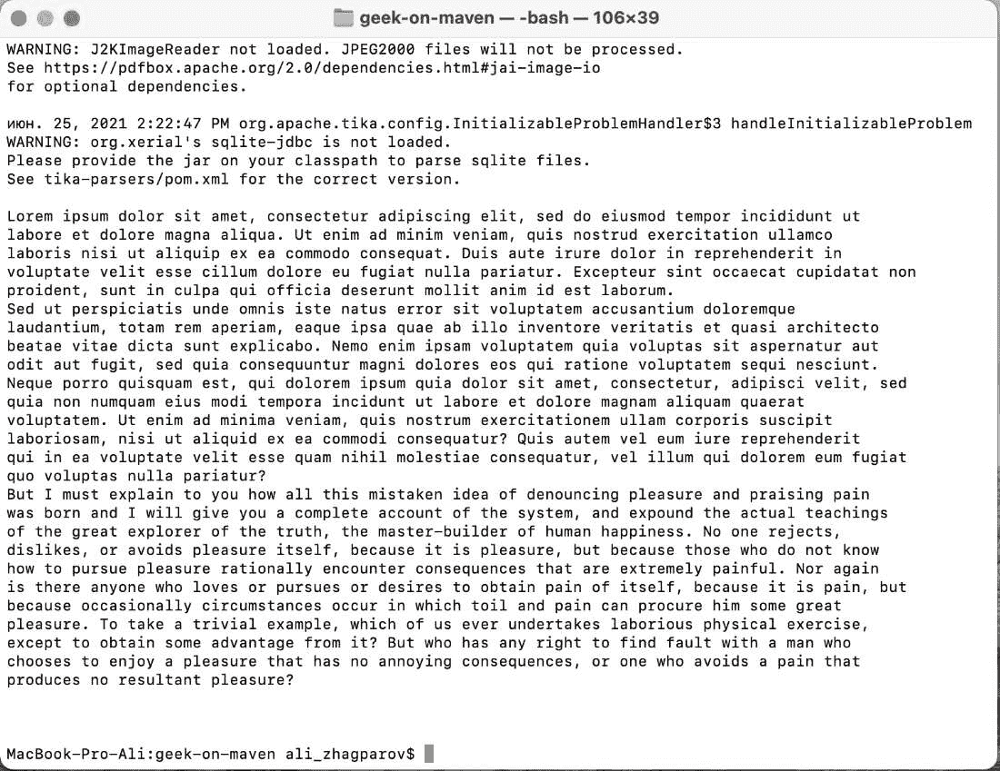
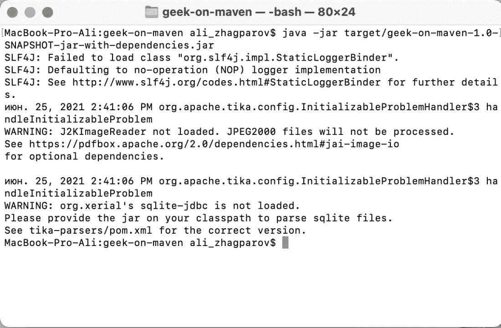
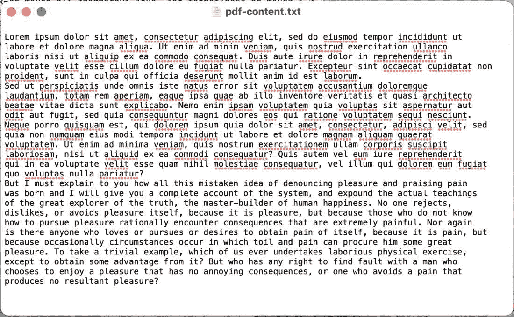

# Java 中的 BodyContentHandler 类

> 原文:[https://www . geesforgeks . org/bodycontenthandler-in-Java 类/](https://www.geeksforgeeks.org/bodycontenthandler-class-in-java/)

[Apache Tika](https://www.geeksforgeeks.org/parsing-pdfs-in-python-with-tika/) 是一个允许你从不同文档中提取数据的库(*)。PDF* ，。 *DOCX* 等。).在本教程中，我们将使用 BodyContentHandler 提取数据。将使用的下一个依赖项如下所示:

```java
<dependency>
<groupId>org.apache.tika < / groupId >
<artifactId>tika - parsers < / artifactId >
<version>1.26 < / version >
< / dependency >
```

***【body contenthandler】***是一个类修饰器，允许你获取 XHTML *< body >标签中的所有内容。<正文>或<正文/ >* 不计入结果值。

我们先来讨论一下这个类的各种构造函数如下:

<figure class="table">

| 【正文内容处理程序() | Write all the contents into the internal stringbuffer area, and just call *tostring () to get the contents. By default, the maximum content length of* is 100 000 characters. If this limit is reached, a *saxexception* will be thrown. |
| 正文内容处理程序(写入限制) | 将所有内容写入内部字符串缓冲区，要获取内容只需调用 toString()。

*【写入限制】*是可以读取的最大字符数，设置-1 禁用该限制。如果达到这个极限，将抛出**异常**。 |
| body contenthandler(输出流输出流) | Writes everything to the given output stream. There are no content restrictions. |
| 正文内容处理程序(编写器) | Write everything to the given Writer. There are no content restrictions. |
| 正文内容处理程序(内容处理程序) | Pass everything to the given handler. |

</figure>

*这个类的 me* 方法如下:

<figure class="table">

| way | Action performed by |
| --- | --- |
| *匹配内容处理器* | You are allowed to pass [T0】 XPath 【T1] |

</figure>

获取数据

> ***注意:** BodyContentHandler 类 d* o *es* 没有实现 *ContentHandler* 接口的任何方法，只是描述了 *MatchingContentHandler* 获取 XHTML body 内容的 XPath。

**实施:**

**示例 1:** 将所有内容读入内部字符串缓冲区

## Java 语言(一种计算机语言，尤用于创建网站)

```java
// Java Program to Read Everything into Inner String Buffer

// Main class
public class GFG {

    // Method 1
    // To parse the string
    public String parseToStringExample(String fileName)
        throws IOException, TikaException, SAXException
    {

        // Creating an object of InputStream class
        InputStream stream
            = this.getClass()
                  .getClassLoader()
                  .getResourceAsStream(fileName);

        Parser parser = new AutoDetectParser();
        ContentHandler handler = new BodyContentHandler();
        Metadata metadata = new Metadata();
        ParseContext context = new ParseContext();

        // Parsing the string
        parser.parse(stream, handler, metadata, context);

        return handler.toString();
    }

    // Method 2
    // Main driver method
    public static void main(String[] args)
        throws TikaException, IOException, SAXException
    {

        // Creating object of main class in main method
        GFG example = new GFG();

        // Display message for better readability
        System.out.println("Result");

        // Calling the method 1 to parse string by
        // providing file as an argument
        System.out.println(example.parseToStringExample(
            "test-reading.pdf"));
    }
}
```

**输出:**



**示例 2:** 将内容写入指定最大内容长度的文件

## Java 语言(一种计算机语言，尤用于创建网站)

```java
// Java Program to Write Content into File by
// Specifying the Maximum Content Length

// Main class
// BodyContentHandlerWriteToFileExample
public class GFG {

    // Method 1
    // Main driver method
    public static void main(String[] args)
        throws TikaException, IOException, SAXException
    {

        // Creating an object of the class
        GFG example = new GFG();

        // Calling the Method 2 in main() method and
        // passing the file and directory path as arguments
        // to it
        example.writeParsedDataToFile(
            "test-reading.pdf",
            "/Users/ali_zhagparov/Desktop/pdf-content.txt");
    }

    // Method 2
    // Writing parsed data to a file
    public void
    writeParsedDataToFile(String readFromFileName,
                          String writeToFileName)
        throws IOException, TikaException, SAXException
    {

        // Creating an object of InputStream
        InputStream stream
            = this.getClass()
                  .getClassLoader()
                  .getResourceAsStream(readFromFileName);

        // Creating an object of File class
        File yourFile = new File(writeToFileName);

        // If file is already existing then
        // no operations to be performed
        yourFile.createNewFile();

        FileOutputStream fileOutputStream
            = new FileOutputStream(yourFile, false);
        Parser parser = new AutoDetectParser();
        ContentHandler handler
            = new BodyContentHandler(fileOutputStream);
        Metadata metadata = new Metadata();
        ParseContext context = new ParseContext();

        parser.parse(stream, handler, metadata, context);
    }
}
```

**输出:**

在控制台窗口上看不到任何东西，因为它会记录目录映射，在这种情况下，它会尝试将所有信息写入文件



该计划的结果是。txt“with”。pdf '文件内容如下:

