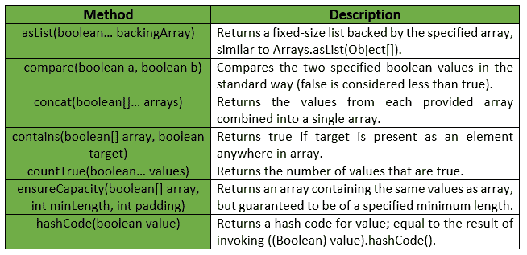
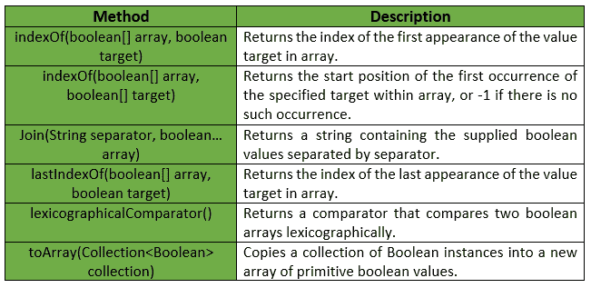

# 布尔类|番石榴|爪哇

> 原文:[https://www.geeksforgeeks.org/booleans-class-guava-java/](https://www.geeksforgeeks.org/booleans-class-guava-java/)

**布尔**是一个用于基元类型布尔的实用程序类。它提供了属于布尔原语的**静态实用方法，这些方法在布尔或数组中都找不到。**

****申报:****

```
@GwtCompatible(emulated=true)
public final class Booleans
extends Object 
```

**下面给出的是番石榴类提供的一些方法:

**例外:****

*   ****确保容量:** *如果最小长度或填充值为负，则显示“异常”。***
*   ****to array:***NullPointerException*如果集合或其任何元素为空。**

**下表显示了番石榴树类提供的一些其他方法:

下面给出了一些示例，显示了番石榴树类方法的实现:
**示例 1 :****

```
// Java code to show implementation
// of Guava Booleans.asList() method

import com.google.common.primitives.Booleans;
import java.util.*;

class GFG {
    // Driver method
    public static void main(String[] args)
    {
        boolean arr[] = { true, false, true, false, true };

        // Using Booleans.asList() method which
        // converts array of primitives to array of objects
        List<Boolean> myList = Booleans.asList(arr);

        // Displaying the elements
        System.out.println(myList);
    }
}
```

**输出:**

```
[true, false, true, false, true] 
```

****例 2 :****

```
// Java code to show implementation
// of Guava Booleans.toArray() method

import com.google.common.primitives.Booleans;
import java.util.*;

class GFG {
    // Driver method
    public static void main(String[] args)
    {
        List<Boolean> myList = Arrays.asList(true, false, true, false, true);

        // Using Booleans.toArray() method which
        // converts a List of Booleans to an
        // array of boolean
        boolean[] arr = Booleans.toArray(myList);

        // Displaying the elements
        System.out.println(Arrays.toString(arr));
    }
}
```

**输出:**

```
[true, false, true, false, true] 
```

****例 3 :****

```
// Java code to show implementation
// of Guava Booleans.concat() method

import com.google.common.primitives.Booleans;
import java.util.*;

class GFG {
    // Driver method
    public static void main(String[] args)
    {
        boolean[] arr1 = { true, false, true };
        boolean[] arr2 = { false, true };

        // Using Booleans.concat() method which
        // combines arrays from specified
        // arrays into a single array
        boolean[] arr = Booleans.concat(arr1, arr2);

        // Displaying the elements
        System.out.println(Arrays.toString(arr));
    }
}
```

**输出:**

```
[true, false, true, false, true] 
```

****例 4 :****

```
// Java code to show implementation
// of Guava Booleans.contains() method

import com.google.common.primitives.Booleans;

class GFG {
    // Driver method
    public static void main(String[] args)
    {
        boolean[] arr = { true, false, true, false, true };

        // Using Booleans.contains() method which
        // checks if element is present in array
        // or not
        System.out.println(Booleans.contains(arr, true));
        System.out.println(Booleans.contains(arr, false));
    }
}
```

**输出:**

```
true
true 
```

****例 5 :****

```
// Java code to show implementation
// of Guava Booleans.compare() method

import com.google.common.primitives.Booleans;

class GFG {
    // Driver method
    public static void main(String[] args)
    {
        // To compare true vs true
        System.out.println(Booleans.compare(true, true));
    }
}
```

**输出:**

```
0 
```

****例 6 :****

```
// Java code to show implementation
// of Guava Booleans.indexOf() method

import com.google.common.primitives.Booleans;

class GFG {
    // Driver method
    public static void main(String[] args)
    {
        boolean[] arr = { true, false, true, false, true };

        // To print index of first occurence of false
        System.out.println(Booleans.indexOf(arr, false));
    }
}
```

**输出:**

```
1 
```