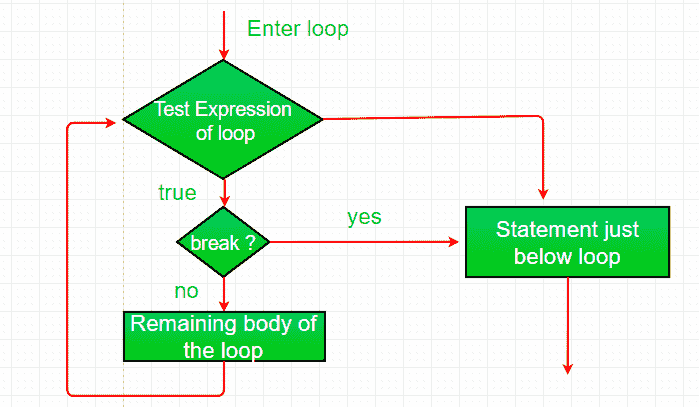

# Java 中的 Break 语句

> 原文:[https://www.geeksforgeeks.org/break-statement-in-java/](https://www.geeksforgeeks.org/break-statement-in-java/)

中断语句是用于终止循环的循环控制语句。一旦在循环中遇到 break 语句，循环迭代就停止在那里，控制立即从循环返回到循环后的第一个语句。
**语法:**

```
break;
```

基本上，break 语句用于我们不确定循环的实际迭代次数或者我们想要基于某种条件终止循环的情况。


**Break:** 在 Java 中，Break 主要用于:

*   在 switch 语句中终止一个序列(如上所述)。
*   退出循环。
*   用作 goto 的“文明”形式。

**使用中断退出循环**

使用 break，我们可以绕过条件表达式和循环体中的任何剩余代码，强制立即终止循环。
注意:Break 在一组嵌套循环中使用时，只会从最里面的循环中断开。



示例:

## Java 语言(一种计算机语言，尤用于创建网站)

```
// Java program to illustrate using
// break to exit a loop
class BreakLoopDemo {
    public static void main(String args[])
    {
        // Initially loop is set to run from 0-9
        for (int i = 0; i < 10; i++) {
            // terminate loop when i is 5.
            if (i == 5)
                break;

            System.out.println("i: " + i);
        }
        System.out.println("Loop complete.");
    }
}
```

**输出**:

```
i: 0
i: 1
i: 2
i: 3
i: 4
Loop complete.
```

**使用 break 作为 Goto 的一种形式**

Java 没有 goto 语句，因为它提供了一种以任意和非结构化方式进行分支的方法。Java 使用这个标签。标签用于识别代码块。
语法:

```
label:
{
  statement1;
  statement2;
  statement3;
  .
  .
}
```

现在，break 语句可以用于跳出目标块。
注意:您不能打断任何没有为封闭块定义的标签。
语法:

```
break label;
```

示例:

## Java 语言(一种计算机语言，尤用于创建网站)

```
// Java program to illustrate 
// using break with goto
class BreakLabelDemo {
    public static void main(String args[])
    {
        boolean t = true;

    // label first
    first : {

    // Illegal statement here 
    // as label second is not
    // introduced yet break second;
    second : {
    third : {
        // Before break
        System.out.println("Before the break statement");

        // break will take the control out of
        // second label
        if (t)
            break second;
        System.out.println("This won't execute.");
    }
        System.out.println("This won't execute.");
    }

        // First block
        System.out.println("This is after second block.");
    }
    }
}
```

**输出**:

```
Before the break statement.
This is after the second block.
```

**相关文章:**

*   [Java 中的决策](https://www.geeksforgeeks.org/decision-making-javaif-else-switch-break-continue-jump/)
*   [c++中的 Break 语句](https://www.geeksforgeeks.org/break-statement-cc/)