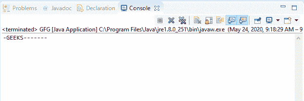

# Java 中的 BufferedInputStream read()方法，示例

> 原文:[https://www . geeksforgeeks . org/bufferedinputstream-read-method-in-Java-with-examples/](https://www.geeksforgeeks.org/bufferedinputstream-read-method-in-java-with-examples/)

1.  **read()** method of **BufferedInputStream** class in Java is used to read the next byte of data from the input stream. When this read() method is called on the input stream then this read() method reads one character of the input stream at a time.

    **语法:**

    ```java
    public int read()

    ```

    **覆盖:**
    覆盖 **FilterInputStream** 类的 read()方法。

    **参数:**此方法不接受任何参数。

    **返回值:**此方法不返回值。

    **异常:**如果通过调用其 close()方法关闭了输入流，或者发生了输入/输出错误，该方法将抛出 **IOException** 。

    下面的程序说明了 IO 包中 BufferedInputStream 类的 read()方法:

    **程序:**假设存在文件“c:/demo.txt”。

    ```java
    // Java program to illustrate
    // BufferedInputStream read() method

    import java.io.*;

    public class GFG {
        public static void main(String[] args)
            throws Exception
        {

            // Create input stream 'demo.txt'
            // for reading containing
            // text "GEEKSFORGEEKS"
            FileInputStream inputStream
                = new FileInputStream("c:/demo.txt");

            // Convert inputStream to
            // bufferedInputStream
            BufferedInputStream buffInputStr
                = new BufferedInputStream(
                    inputStream);

            // Read until a single byte is available
            while (buffInputStr.available() > 0) {

                // Read the byte and
                // convert the integer to character
                char c = (char)buffInputStr.read();

                // Print the characters
                System.out.println("Char : " + c);
            }
        }
    }
    ```

    **Input:**[](https://media.geeksforgeeks.org/wp-content/uploads/20200524091315/INPUT_GEEKSFORGEEKS3.png)**Output:**[](https://media.geeksforgeeks.org/wp-content/uploads/20200524091536/read-11.png)
2.  **read(byte[ ] b, int off, int len)** method of **BufferedInputStream** class in Java is used to read bytes from the byte-input stream into the specified byte array which starts at the offset given by user. It is basically used to start reading after preserving the characters in an array.

    **实施:**

    *   在这个方法的实现中，一次又一次地调用 read()方法。当调用此方法时，如果发现 IOException，那么它将从对 read(byte[ ] b，int off，int len)方法的调用中返回异常。
    *   如果进一步发现任何 IOException，那么它捕获异常，并且输入文件应该结束。
    *   读取到该点的字节存储在字节数组 b 中，并返回异常发生前读取的字节数。

    **语法:**

    ```java
    public int read(byte[] b,
                    int off,
                    int len)

    ```

    **覆盖:**
    覆盖 **FilterInputStream** 类的 read()方法。

    **参数:**该方法接受三个参数。

    *   **b**–表示目的缓冲区。
    *   **off**–表示开始存储字节的偏移量。
    *   **len**–表示读取的最大字节数。

    **返回值:**此方法不返回值。

    **异常:**如果通过调用其 close()方法关闭了输入流，或者发生了输入/输出错误，该方法将抛出 **IOException** 。

    下面的程序说明了 IO 包中 BufferedInputStream 类的 read(byte，int，int)方法:

    **程序:**假设存在文件“c:/demo.txt”。

    ```java
    // Java program to illustrate
    // BufferedInputStream
    // read(byte int int) method

    import java.io.*;
    public class GFG {
        public static void main(String[] args)
        {

            // Create input stream 'demo.txt'
            // for reading containing
            // text "GEEKSFORGEEKS"
            FileInputStream inputStream
                = new FileInputStream("c:/demo.txt");

            // Convert inputStream to
            // bufferedInputStream
            BufferedInputStream buffInputStr
                = new BufferedInputStream(
                    inputStream);

            // Read number of bytes available
            int rem_byte = buffInputStr.available();

            // Byte array is declared
            byte[] barr = new byte[rem_byte];

            // Read byte into barr,
            // starts at offset 1,
            // 5 bytes to read
            buffInputStr.read(barr, 1, 5);

            // For each byte in barr
            for (byte b : barr) {
                if (b == (byte)0)
                    b = (byte)'-';
                System.out.print((char)b);
            }
        }
    }
    ```

    **Input:**[](https://media.geeksforgeeks.org/wp-content/uploads/20200524091751/INPUT_GEEKSFORGEEKS4.png)**Output:**[](https://media.geeksforgeeks.org/wp-content/uploads/20200524092008/read-21.png)

**参考文献:**
1。[https://docs . Oracle . com/javase/10/docs/API/Java/io/bufferedinputstream . html # read()](https://docs.oracle.com/javase/10/docs/api/java/io/BufferedInputStream.html#read())
2。[https://docs . Oracle . com/javase/10/docs/API/Java/io/bufferedinputstream . html # read(byte % 5B % 5D，int，int)](https://docs.oracle.com/javase/10/docs/api/java/io/BufferedInputStream.html#read(byte%5B%5D, int, int))