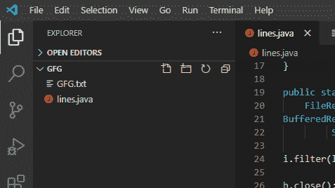
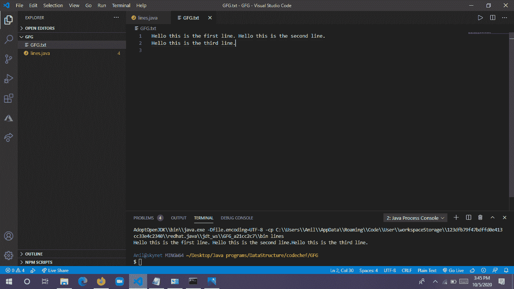

# Java 中的 BufferedReader Class lines()方法，带示例

> 原文:[https://www . geeksforgeeks . org/bufferedeer-class-line-method-in-Java-with-examples/](https://www.geeksforgeeks.org/bufferedreader-class-lines-method-in-java-with-examples/)

**BufferedReader.lines()** 是 Java 库中的 Java 缓冲读取器类的方法，它根据 Stream 从这个缓冲读取器类返回行。在流的帮助下，有很多方法可以根据我们的需要模拟输出。

**语法:**

```
BufferedReader.lines() : Stream<String>
```

**参数:**该方法不取任何一种参数。

**返回:**该方法根据流和泛型类型返回行流，并将流更改为字符串。

**异常:**当访问包装在未检查异常中的底层缓冲区时，将引发 IOException。

**示例:** **找到包含 Hello 作为** **单词的行，它只会在连续扫描中工作**

*   该目录包含一个名为 GFG.txt 的 txt 文件



*   文本文件包含两行:



## Java 语言(一种计算机语言，尤用于创建网站)

```
// Java program to demonstrate the continuous scanning
// by BufferedReader.lines() method and return the stream
// of lines that contains the specific word

import java.io.*;
import java.io.BufferedReader;
import java.io.FileReader;
import java.io.IOException;
import java.util.*;
import java.util.Arrays;
import java.util.List;
import java.util.stream.Stream;

class GFG {
    public static void main(String[] args)
    {
        FileReader f= new FileReader("location of the file");

        BufferedReader b = new BufferedReader(f);

        // taking the stream as a string
        Stream<String> i = b.lines(); 

        i.filter(line -> line.contains("Hello")).findAny().ifPresent(System.out::println);

        // filter the stream that line contains Hello is
        // preset output
        b.close();
        f.close();
    }
}
```

**输出:**

```
Hello this is the first line. Hello this is the second line.
```