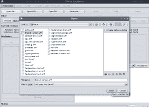
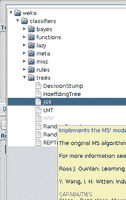
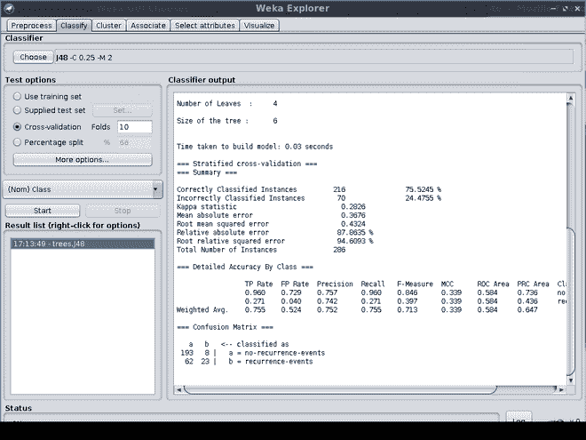

# 使用 J48 分类器建立机器学习模型

> 原文:[https://www . geesforgeks . org/building-a-machine-learning-model-use-j48-classifier/](https://www.geeksforgeeks.org/building-a-machine-learning-model-using-j48-classifier/)

**什么是 J48 分类器？**

J48 是一种基于迭代 Dichotomiser 3 的机器学习决策树分类算法。有助于对数据进行分类和连续的检查。

> **注意:**为了构建我们的 J48 机器学习模型，我们将使用 weka 工具。

**什么是韦卡？**

Weka 是新西兰怀卡托大学开发的开源工具，在 GNU 公共许可下获得许可。你可以在任何操作系统上下载 [weka](https://waikato.github.io/weka-wiki/downloading_weka/) 。Weka 有图形用户界面和应用编程接口可供使用。

**后续步骤:**

**步骤 1:** 使用图形用户界面创建模型

**第二步:**打开 Weka 后点击“浏览器”选项卡


**步骤 3:** 在“预处理”选项卡中，点击“打开文件”，选择“乳腺癌. arff”文件，该文件将位于数据文件夹内的安装路径中。



> 在此选项卡中，您可以查看所有属性并使用它们。

**第 4 步:**在“分类”标签中点击选择按钮。现在在 WEKA/分类器/树/下选择 J48



**第五步:**现在你可以点击 J48 分类器选择，像改变批量大小、置信度等一样摆弄它。在“测试选项”下，我们将使用默认的交叉验证选项作为折叠 10，并点击开始。



**实施:**

现在我们已经讨论完了，Weka 有 Java API，你可以用它来创建机器学习模型，所以 di 现在让我们用 API 来创建一个模型

**例**

## Java 语言(一种计算机语言，尤用于创建网站)

```java
// Java Program for Creating a Model Based on J48 Classifier

// Importing required classes
import java.io.BufferedReader;
import java.io.FileReader;
import java.util.Random;
import weka.classifiers.Evaluation;
import weka.classifiers.trees.J48;
import weka.core.Instances;

// Main class
public class BreastCancer {

    // Main driver method
    public static void main(String args[])
    {

        // Try bloc kto check for exceptions
        try {

            // Creating J48 classifier
            J48 j48Classifier = new J48();

            // Dataset path
            String breastCancerDataset
                = "/home/droid/Tools/weka-3-8-5/data/breast-cancer.arff";

            // Create bufferedreader to read the dataset
            BufferedReader bufferedReader
                = new BufferedReader(
                    new FileReader(breastCancerDataset));

            // Create dataset instances
            Instances datasetInstances
                = new Instances(bufferedReader);

            // Set Target Class
            datasetInstances.setClassIndex(
                datasetInstances.numAttributes() - 1);

            // Evaluation
            Evaluation evaluation
                = new Evaluation(datasetInstances);

            // Cross Validate Model with 10 folds
            evaluation.crossValidateModel(
                j48Classifier, datasetInstances, 10,
                new Random(1));
            System.out.println(evaluation.toSummaryString(
                "\nResults", false));
        }

        // Catch block to check fo rexceptions
        catch (Exception e) {

            // Print and display the display message
            // using getMessage() method
            System.out.println("Error Occured!!!! \n"
                               + e.getMessage());
        }

        // Display message to be printed ion console
        // when program is successfully executed
        System.out.print("Successfully executed.");
    }
}
```

**输出:**

```java
Successfully executed.
```