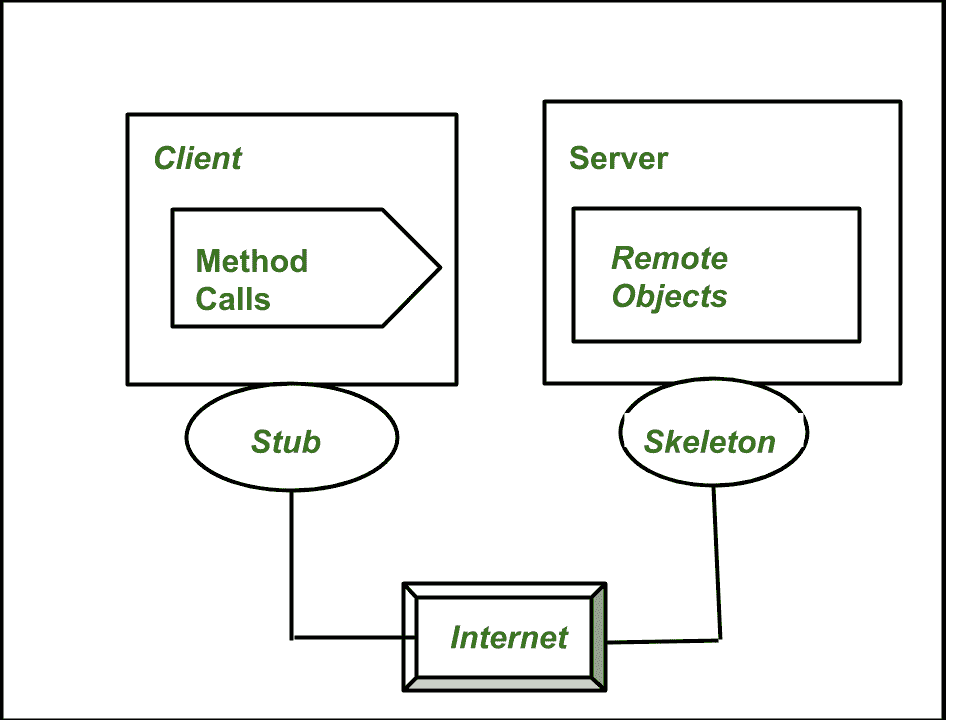
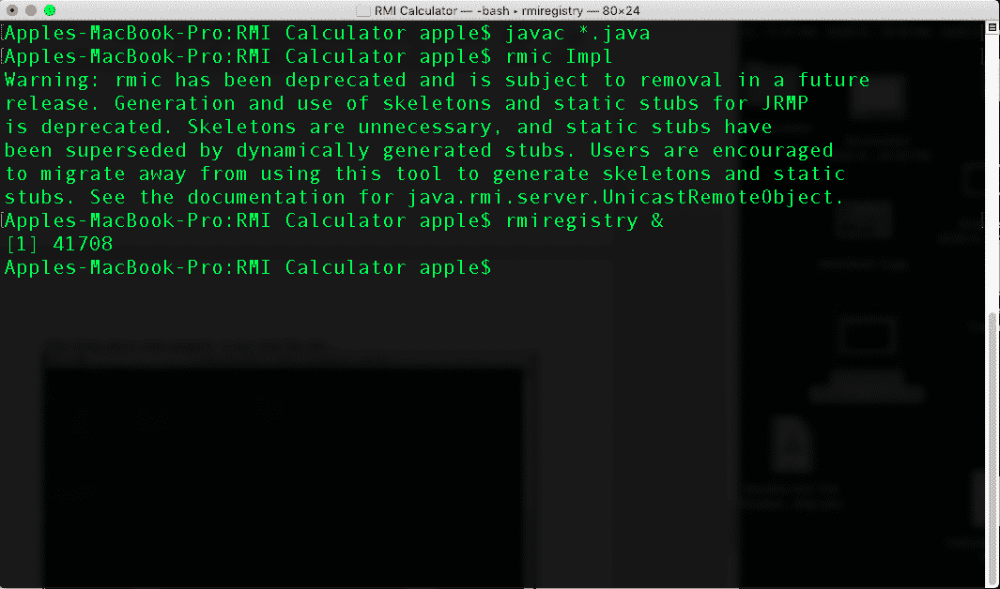

# 在 Java 中使用 RMI(远程方法调用)的计算器

> 原文:[https://www . geesforgeks . org/calculator-using-RMI remote-method-invoke-in-Java/](https://www.geeksforgeeks.org/calculator-using-rmiremote-method-invocation-in-java/)

[RMI](https://www.geeksforgeeks.org/remote-method-invocation-in-java/) (远程方法调用)是一个用来访问运行在另一个 JVM ( 服务器端)上的对象的 API。主要用于分布式系统的创建，Java 罗马提供。*存根*和*骨架*是用于处理客户端和服务器之间通信的两个对象。下图显示了 RMI 的概述。



马绍尔群岛的工作

在这里，

*   **Stub 对象:**客户端机器上的 Stub 对象构建一个信息块，并将该信息发送给服务器。
*   **骨架对象:**骨架对象将请求从存根对象传递到远程对象。RMI 包含一个保存所有服务器对象的 rmiregistry。服务器将所有对象绑定到注册表，然后客户端从相应的注册表中获取对象，之后客户端使用获取的对象调用方法。

### 使用 RMI 创建计算器的步骤

**第一步:创建远程界面**

首先，我们将创建 4 个接口(加法、减法、乘法、除法)。这些界面对操作有帮助。要创建远程接口，我们需要扩展*远程接口* ，接口内的方法原型应该抛出*远程异常*。

## 再见 java

```java
// Creating a AddInterface interface
import java.rmi.Remote;
public interface AddInterface extends Remote {
    // Declaring the method prototype
    public int add(int x, int y) throws RemoteException;
}
```

## 上来 java

```java
// Creating a SubInterface interface
import java.rmi.Remote;
public interface SubInterface extends Remote {
    // Declaring the method prototype
    public int sub(int x, int y) throws RemoteException;
}
```

## MulI.java 档案

```java
// Creating a MulInterface interface
import java.rmi.Remote;
public interface MulInterface extends Remote {
    // Declaring the method prototype
    public int mul(int x, int y) throws RemoteException;
}
```

## DivI.java

```java
// Creating a DivInterface interface
import java.rmi.Remote;
public interface DivInterface extends Remote {
    // Declaring the method prototype
    public int div(int x, int y) throws RemoteException;
}
```

**第二步:远程接口**的实现

现在是时候为所有 i *接口*提供实现了。要实现远程接口，这个类应该扩展到的 java.rmi 包的*unicastremote object*类。此外，需要创建一个默认构造函数，以便从类中的父构造函数抛出 java.rmi.RemoteException。

## 部署. java

```java
// Java program to implement the AddInterface,
// subInterface, MulInterface, and DivInterface
import java.rmi.*;
import java.rmi.server.*;

public class Impl extends UnicastRemoteObject
    implements AddInterface, SubInterface, MulInterface,
               DivInterface {

    // Default constructor to throw RemoteException
    // from its parent constructor
    public Impl() throws Exception { super(); }

    // Implementation of the AddInterface,
    // subInterface, MulInterface, and DivInterface
    public int add(int x, int y) { return x + y; }
    public int sub(int x, int y) { return x - y; }
    public int mul(int x, int y) { return x * y; }
    public int div(int x, int y) { return x / y; }
}
```

**第三步:创建并执行服务器应用程序。**

下一步是创建服务器应用程序，并在单独的命令提示符下执行。命名类的重新绑定方法用于将远程对象绑定到新名称。

## Server.java

```java
// Program for server application
import java.rmi.*;
import java.rmi.registry.*;
public class Server {
    public static void main(String[] args) throws Exception
    {

        // Create an object of the interface
        // implementation class
        Impl obj = new Impl();

        // Binds the remote object by the name ADD
        Naming.rebind("ADD", obj);

        System.out.println("Server Started");
    }
}
```

**第四步:创建并执行** **客户端应用程序。**

下一步是创建客户端应用程序，并在单独的命令提示符下执行。命名类的查找方法用于获取存根对象的引用。

## Client.java

```java
// Program for client application
import java.rmi.*;
import java.util.*;
public class Client {
    public static void main(String[] args) throws Exception
    {
        Scanner sc = new Scanner(System.in);
        while (true) {
            // User Menu
            System.out.println(
                "\n1.Addition\n2.Subtraction\n3.multiplication\n4.division\n5.Exit");
            System.out.println("Enter the option:");
            int opt = sc.nextInt();
            if (opt == 5) {
                break;
            }
            System.out.println(
                "Enter the the first number:");
            int a = sc.nextInt();
            System.out.println("Enter the second number:");
            int b = sc.nextInt();
            int n;
            switch (opt) {
            case 1:
                // lookup method to find reference of remote
                // object
                AddInterface obj
                    = (AddInterface)Naming.lookup("ADD");
                n = obj.add(a, b);
                System.out.println("Addition= " + n);
                break;
            case 2:
                SubInterface obj1
                    = (SubInterface)Naming.lookup("ADD");
                n = obj1.sub(a, b);
                System.out.println("Subtraction= " + n);
                break;
            case 3:
                MulInterface obj2
                    = (MulInterface)Naming.lookup("ADD");
                n = obj2.mul(a, b);
                System.out.println("Multiplication = " + n);
                break;
            case 4:
                DivInterface obj3
                    = (DivInterface)Naming.lookup("ADD");
                n = obj3.div(a, b);
                System.out.println("Division = " + n);
                break;
            }
        }
    }
}
```

**第五步:编译所有的 java 程序**

现在我们需要编译所有的 java 程序。为了编译所有的 java 程序，我们需要打开命令提示符并进入相应的文件夹。现在进入存储所有文件的文件夹。我们可以使用以下命令一次编译所有文件；

```java
javac *.java
```

**第 6 步:创建一个存根和骨架**

rmic 工具用于调用创建 Stub 和 Skeleton 对象的 rmi 编译器。它的原型是:

```java
rmic classname
```

**步骤 7:通过 rmiregistry 工具**启动注册表服务

现在使用 rmi registry 工具启动 rmi 注册表服务。我们需要指定端口号。如果我们不指定端口号，它会使用默认端口号，例如我们使用的端口号是 5259。

```java
rmiregistry 5259  or  rmiregistry &  or start rmiregistry(windows)
```

正确执行上述步骤后，可能会如下所示:



**输出:**成功完成上述步骤后，可以看到以下输出或以上步骤中的任何混淆可以观看以下视频

<video class="wp-video-shortcode" id="video-476479-1" width="640" height="360" preload="metadata" controls=""><source type="video/mp4" src="https://media.geeksforgeeks.org/wp-content/uploads/20200828144459/rmical.mp4?_=1">[https://media.geeksforgeeks.org/wp-content/uploads/20200828144459/rmical.mp4](https://media.geeksforgeeks.org/wp-content/uploads/20200828144459/rmical.mp4)</video>