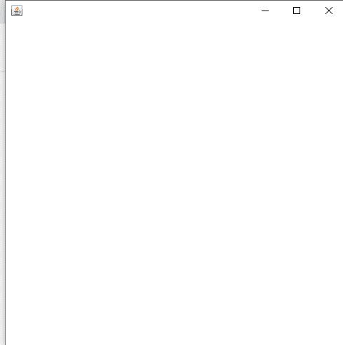
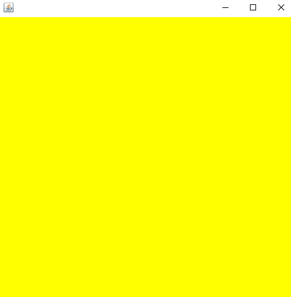
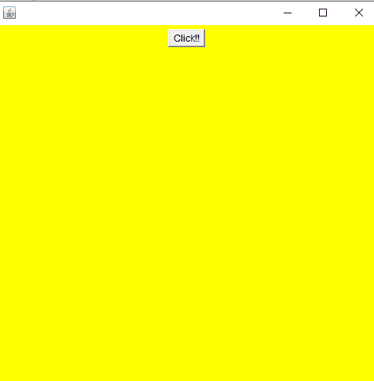
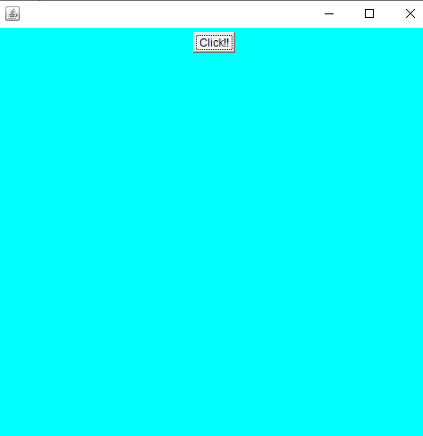

# 使用 Java JShell 中的 ActionListener 更改背景颜色

> 原文:[https://www . geesforgeks . org/changing-background-color-using-action listener-in-jshell-in-Java/](https://www.geeksforgeeks.org/changing-background-color-using-actionlistener-in-jshell-in-java/)

[Java Shell 工具(JShell)](https://www.geeksforgeeks.org/jshell-java-9-new-feature/) 是学习 Java 编程语言和制作 Java 代码原型的交互式工具。JShell 是一个读取-评估-打印循环(REPL)，它在输入声明、语句和表达式时对它们进行评估，并立即显示结果。该工具从命令行运行。JShell 是在 java 9 中引入的，因此不能在 java 8 中使用。
Jshell 减少了运行 Java 程序和测试业务逻辑所需的所有工作。如果不使用 Jshell，Java 程序的创建包括以下步骤。

使用 **Swing 类**的概念来处理帧，可以在 [JShell](https://www.geeksforgeeks.org/jshell-java-9-new-feature/) 中创建一个帧，并且可以在该帧上添加一个按钮，其工作方式与 Swing 中的 ActionListener 相同。

**程序:**

1.  首先导入 awt 包来创建一个框架
2.  创建框架对象
3.  设置可见性
4.  设置框架的大小
5.  设置框架的位置
6.  设置框架的背景颜色
7.  创建按钮
8.  向框架添加按钮
9.  设置框架布局
10.  使用动作监听器

**实施:**

**步骤 1:** 首先导入 awt 包，创建一个框架

**语法:**

```java
jshell>import java.awt.* ;
```

**步骤 2:** 创建框架对象

**语法:**

```java
jshell>Frame f = new frame() ;   || 'f' is object name
```

```java
f==>java.awt.Frame[frame, 0, 0, 0, 0*0, invalid, hidden, layout...t, title = resizable, normal ]
```

**步骤 3:** 设置框架的可见性，因为创建框架对象后，框架在屏幕上仍然不可见。

**语法:**将可见性设置为真

```java
jshell>f.setVisible(true) ;
```

**输出:**当帧的可视性为真时。


> *   By default, the visibility of the frame is false.
> *   Show this frame when visibility is set to true.
> *   This frame can be seen in the upper left corner.
> *   If the frame visibility is set to false, the frame will be hidden.

**语法:**将可见性设置为假

```java
jshell>f.setVisible(false) ;
```

**输出:**当帧的可视性为假时。

> 没有图像

**步骤 4:** 设置框架的尺寸

语法:这里第一个参数是高度，第二个是 [setSize()](https://www.geeksforgeeks.org/java-awt-dimension-class/) 函数中的宽度。

```java
jshell>f.setSize(length_pixelValue , breadth_pixelValue) ;
```

考虑价值的仲裁:

*   length_pixelValue = 500
*   breadth_pixelValue = 500

```java
jshell>f.setSize(500, 500) ;
```

**输出:**此帧将在左上角可见。



**步骤 5:** 设置框架的位置

**语法:**

```java
jshell>f.setLocation(100,100) ;
```

*   设置框架的位置是指从 X 轴和 Y 轴的距离。
    *   第一个参数定义离屏幕左边距的距离。
    *   第二个参数 r 定义了距屏幕上边距的距离。

**步骤 6:** 设置框架的背景颜色

**语法:**

```java
jshell>f.setBackground(Color.yellow) ;
```

**输出:**



**步骤 7:** 创建按钮

> jshell >按钮 b1 =新按钮(“点击！!")
> 
> b1 ==> java.awt.Button[button0，0，0，0×0，无效，标签=Click！！]

**第 8 步:**向框架添加按钮

> jshell> f.add(b1)
> 
> $8 ==> java.awt.Button[button0，0，0，0×0，无效，标签=Click！！]

**步骤 9:** 设置框架布局

> jshell>



**步骤 10:** 使用动作监听器

**语法:**

```java
jshell>b1.addActionListener(e->setBackground(Colour.cyan)) ;
```

**输出:**



> 点击按钮后，背景颜色变为青色。这里我们也可以说，在 JShell 中我们可以使用 [Lambda 表达式](https://www.geeksforgeeks.org/lambda-expressions-java-8/)。因此，成功地改变了背景颜色。

**示例:**

## Java 语言(一种计算机语言，尤用于创建网站)

```java
// Java Program to change Background Color
// Using ActionListener in JShell

// Importing awt package
jshell > import java.awt.*

             // Creating  a frame object
             jshell
    > Frame f
    = new Frame()

      // Setting object created above
      f
      ==
      > java.awt
              .Frame[frame0, 0, 0, 0x0, invalid, hidden,
                     layo... t, title =, resizable, normal]

          // Setting visibility to frame
          jshell
          > f.setVisible(true)

            // Setting size of frame
            jshell
          > f.setSize(500, 500)

            // Setting location of frame from X and Y axis
            jshell
          > f.setLocation(100, 100)

            // Setting background color
            jshell
          > f.setBackground(Color.yellow)

                jshell
          > Button
          b1 = new Button("Click!!") b1 ==
               > java.awt.Button[button0, 0, 0, 0x0,
                                 invalid, label = Click !!]

                   jshell
                   > f.add(b1) $8
               ==
               > java.awt.Button[button0, 0, 0, 0x0,
                                 invalid, label = Click !!]

                   jshell
                   > f.setLayout(new FlowLayout());

// Changing background color
jshell
    > b1.addActionListener(e -> f.setBackground(Color.cyan))

      // Terminate
      jshell
    >
```