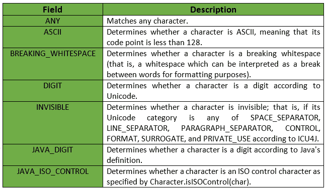

# 带示例的 CharMatcher 字段|番石榴|爪哇

> 原文:[https://www . geesforgeks . org/charmatcher-fields-with-examples-guava-Java/](https://www.geeksforgeeks.org/charmatcher-fields-with-examples-guava-java/)

[CharMatcher 类](https://www.geeksforgeeks.org/charmatcher-class-guava-java/)提供以下常量来获取 CharMatcher 实例。

[](https://www.geeksforgeeks.org/charmatcher-class-guava-java/) 
[](https://www.geeksforgeeks.org/charmatcher-class-guava-java/)

以下是其中的一些

### <u>手指</u>

<u>**CharMatcher。数字**根据 Unicode 判断一个字符是否是数字。如果您只想匹配 ASCII 数字，可以使用范围(' 0 '，' 9 ')。
**句法**:</u>

```
public static final CharMatcher DIGIT 
```

<u>下面是上述字段的实现。</u>

<u>**程序 1:**</u>

```
// Program for CharMatcher.DIGIT field in Java
import com.google.common.base.CharMatcher;

class GFG {

    // Driver code
    public static void main(String args[])
    {
        // Input string to check for matching
        String input = "123 is divisible by 3";

        // Printing the input
        System.out.println(input);

        // Declaring a CharMatcher object
        CharMatcher matcher = CharMatcher.DIGIT;

        // Retaining the result after matching
        String result = matcher.retainFrom(input);

        // Printing the result
        System.out.println(result);
    }
}
```

<u>**Output:**

```
123 is divisible by 3
1233

```</u> 

<u>**参考:**[https://Google . github . io/guava/releases/19.0/API/docs/com/Google/common/base/charmatcher . html # DIGIT](https://google.github.io/guava/releases/19.0/api/docs/com/google/common/base/CharMatcher.html#DIGIT)</u>

### <u><u>爪哇 _ 字母</u></u>

 <u>**CharMatcher。JAVA_LETTER** 根据 JAVA 的定义判断一个字符是字母还是数字。
**句法**:

```
public static final CharMatcher JAVA_LETTER

```

下面是上述字段的实现。

**程序 1:**

```
// Program for CharMatcher.JAVA_LETTER field in Java
import com.google.common.base.CharMatcher;

class GFG {

    // Driver code
    public static void main(String args[])
    {
        // Input string to check for matching
        String input = "123 is divisible by 3";

        // Printing the input
        System.out.println(input);

        // Declaring a CharMatcher object
        CharMatcher matcher = CharMatcher.JAVA_LETTER;

        // Retaining the result after matching
        String result = matcher.retainFrom(input);

        // Printing the result
        System.out.println(result);
    }
}
```

**Output:**

```
123 is divisible by 3
isdivisibleby

```

**参考:**[https://Google . github . io/guava/releases/19.0/API/docs/com/Google/common/base/charmatcher . html # JAVA _ LETTER](https://google.github.io/guava/releases/19.0/api/docs/com/google/common/base/CharMatcher.html#JAVA_LETTER)

### ASCII

**CharMatcher。ASCII** 确定一个字符是否为 ASCII，表示其码位小于 128。
**句法**:

```
public static final CharMatcher ASCII

```

下面是上述字段的实现。

**程序 1:**

```
// Program for CharMatcher.ASCII field in Java
import com.google.common.base.CharMatcher;

class GFG {

    // Driver code
    public static void main(String args[])
    {
        // Input string to check for matching
        String input = "GeekforGeeks is fun.\u00be";

        // Printing the input
        System.out.println(input);

        // Declaring a CharMatcher object
        CharMatcher matcher = CharMatcher.ASCII;

        // Retaining the result after matching
        String result = matcher.retainFrom(input);

        // Printing the result
        System.out.println(result);
    }
}
```

**Output:**

```
GeekforGeeks is fun.?
GeekforGeeks is fun.

```

**参考:**[https://Google . github . io/guava/releases/19.0/API/docs/com/Google/common/base/charmatcher . html # ASCII](https://google.github.io/guava/releases/19.0/api/docs/com/google/common/base/CharMatcher.html#ASCII)

### <u>任意</u>

**CharMatcher。任意**字段匹配任意字符，即匹配所有字符。
**句法**:

```
public static final CharMatcher ANY

```

下面是上述字段的实现。

**程序 1:**

```
// Program for CharMatcher.ANY field in Java
import com.google.common.base.CharMatcher;

class GFG {

    // Driver code
    public static void main(String args[])
    {
        // Input string to check for matching
        String input = "GeekforGeeks is fun.";

        // Declaring a CharMatcher object
        CharMatcher matcher = CharMatcher.ANY;

        // Retaining the result after matching
        String result = matcher.retainFrom(input);

        // Printing the result
        System.out.println(result);
    }
}
```

**Output:**

```
GeekforGeeks is fun.

```

**参考:**[https://Google . github . io/guava/releases/19.0/API/docs/com/Google/common/base/charmatcher . html # ANY](https://google.github.io/guava/releases/19.0/api/docs/com/google/common/base/CharMatcher.html#ANY)

### <u>爪哇 _ 小写</u>

<u>**CharMatcher。**根据 JAVA 的定义，判断一个字符是否是小写。</u>

<u>**语法**:</u>

```
public static final CharMatcher JAVA_LOWER_CASE 
```

<u>下面是上述字段的实现。</u>

<u>**程序 1:**</u>

```
// Program for CharMatcher.JAVA_LETTER_OR_DIGIT field in Java
import com.google.common.base.CharMatcher;

class GFG {

    // Driver code
    public static void main(String args[])
    {
        // Input string to check for matching
        String input = "gEEKSfORgEEKS";

        // Printing the input
        System.out.println(input);

        // Declaring a CharMatcher object
        CharMatcher matcher = CharMatcher.JAVA_LOWER_CASE;

        // Retaining the result after matching
        String result = matcher.retainFrom(input);

        // Printing the result
        System.out.println(result);
    }
}
```

<u>**Output:**

```
gEEKSfORgEEKS
gfg

```</u> 

<u>**注意:**这个类只处理字符值。它不理解 0x10000 到 0x10FFFF 范围内的补充 Unicode 代码点。这样的逻辑字符使用代理项对被编码到一个字符串中，CharMatcher 将这些字符视为两个独立的字符。</u>

<u>**参考:**[https://Google . github . io/guava/releases/19.0/API/docs/com/Google/common/base/charmatcher . html # JAVA _ low _ CASE](https://google.github.io/guava/releases/19.0/api/docs/com/google/common/base/CharMatcher.html#JAVA_LOWER_CASE)</u>

### <u><u>爪哇 _ 上位 _ 案例</u></u>

 <u>**CharMatcher。JAVA_UPPER_CASE** 根据 JAVA 的定义判断一个字符是否是大写。
**句法**:

```
public static final CharMatcher JAVA_UPPER_CASE 

```

下面是上述字段的实现。

**程序 1:**

```
// Program for CharMatcher.JAVA_UPPER_CASE field in Java
import com.google.common.base.CharMatcher;

class GFG {

    // Driver code
    public static void main(String args[])
    {
        // Input string to check for matching
        String input = "c++ JAVA python";

        // Printing the input
        System.out.println(input);

        // Declaring a CharMatcher object
        CharMatcher matcher = CharMatcher.JAVA_UPPER_CASE;

        // Retaining the result after matching
        String result = matcher.retainFrom(input);

        // Printing the result
        System.out.println(result);
    }
}
```

**Output:**

```
c++ JAVA python
JAVA

```

**参考:**[https://Google . github . io/guava/releases/19.0/API/docs/com/Google/common/base/charmatcher . html # JAVA _ UPPER _ CASE](https://google.github.io/guava/releases/19.0/api/docs/com/google/common/base/CharMatcher.html#JAVA_UPPER_CASE)

### <u>爪哇 _ 字母 _ 或 _ 数字</u>

**CharMatcher。JAVA_LETTER_OR_DIGIT** 根据 JAVA 的定义判断一个字符是字母还是数字。
**句法**:

```
public static final CharMatcher JAVA_LETTER_OR_DIGIT

```

下面是上述字段的实现。

**程序 1:**

```
// Program for CharMatcher.JAVA_LETTER_OR_DIGIT field in Java
import com.google.common.base.CharMatcher;

class GFG {

    // Driver code
    public static void main(String args[])
    {
        // Input string to check for matching
        String input = "#13 is a prime & number%";

        // Printing the input
        System.out.println(input);

        // Declaring a CharMatcher object
        CharMatcher matcher = CharMatcher.JAVA_LETTER_OR_DIGIT;

        // Retaining the result after matching
        String result = matcher.retainFrom(input);

        // Printing the result
        System.out.println(result);
    }
}
```

**Output:**

```
#13 is a prime & number%
13isaprimenumber

```

**参考:**[https://Google . github . io/guava/releases/19.0/API/docs/com/Google/common/base/charmatcher . html # JAVA _ LETTER _ OR _ digest](https://google.github.io/guava/releases/19.0/api/docs/com/google/common/base/CharMatcher.html#JAVA_LETTER_OR_DIGIT)

### <u>爪哇 _ 数字</u>

**CharMatcher。JAVA_DIGIT** 根据 JAVA 的定义判断一个字符是否为数字。如果您只想匹配 ASCII 数字，可以使用范围(' 0 '，' 9 ')。
**句法**:

```
public static final CharMatcher JAVA_DIGIT

```

下面是上述字段的实现。

**程序 1:**

```
// Program for CharMatcher.JAVA_DIGIT field in Java
import com.google.common.base.CharMatcher;

class GFG {

    // Driver code
    public static void main(String args[])
    {
        // Input string to check for matching
        String input = "13 is a prime number";

        // Printing the input
        System.out.println(input);

        // Declaring a CharMatcher object
        CharMatcher matcher = CharMatcher.JAVA_DIGIT;

        // Retaining the result after matching
        String result = matcher.retainFrom(input);

        // Printing the result
        System.out.println(result);
    }
}
```

**Output:**

```
13 is a prime number
13

```

**参考:**[https://Google . github . io/guava/releases/19.0/API/docs/com/Google/common/base/charmatcher . html # JAVA _ digest](https://google.github.io/guava/releases/19.0/api/docs/com/google/common/base/CharMatcher.html#JAVA_DIGIT)</u></u>