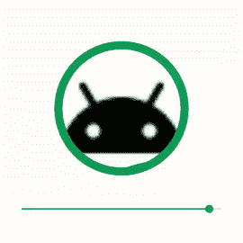

# 带 Seekbar 的安卓循环填充加载器

> 原文:[https://www . geesforgeks . org/circular-filable-loader-in-Android-with-seek bar/](https://www.geeksforgeeks.org/circular-fillable-loader-in-android-with-seekbar/)

**循环填充加载器**是在任何安卓应用程序中加载时显示[进度栏](https://www.geeksforgeeks.org/progressbar-in-kotlin/)的一种出色方式。以另一种形式显示进度栏是增加用户体验的最佳方式之一。您可以在大多数应用程序中看到这些定制加载器。在本文中，我们将看到如何在安卓系统中实现循环填充加载器。下面给出了一个 GIF 示例，以了解我们在本文中要做什么。注意，我们将使用 **Java** 语言来实现这个项目。



### 圆形填充装载机的应用

*   安卓系统中表示进度条的独特方式。
*   使用循环可填充加载器可以提高用户体验。
*   给我们的进度条以动画效果。

### 循环可填充加载程序的属性

<figure class="table">

| 

属性

 | 

描述

 |
| --- | --- |
| **cfl_border** | 用于给出边框。 |
| **cfl_border_width** | 用于给边框赋予宽度。 |
| **cfl_progress** | 用于显示循环填充加载程序的进度。 |
| **CFL _ wave _ 振幅** | 用于给波赋予振幅。 |
| **cfl_wave_color** | 用于赋予波浪颜色。 |

</figure>

### 方法 1

### **分步实施**

**第一步:创建新项目**

要在安卓工作室创建新项目，请参考[如何在安卓工作室创建/启动新项目](https://www.geeksforgeeks.org/android-how-to-create-start-a-new-project-in-android-studio/)。注意选择 **Java** 作为编程语言。

**第二步:在 build.gradle(模块:app)文件**中添加依赖项

导航到**渐变脚本>构建.渐变(模块:应用)**，并在依赖项部分添加以下依赖项。

> 实现' com . mikhaellopez:circulafilableloaders:1 . 3 . 2 '

**第三步:在你的 activity_main.xml 文件中新建一个状态进度条**

导航到**应用程序> res >布局**打开 activity_main.xml 文件。下面是 **activity_main.xml** 文件的代码。

## 可扩展标记语言

```java
<?xml version="1.0" encoding="utf-8"?>
<RelativeLayout 
    xmlns:android="http://schemas.android.com/apk/res/android"
    xmlns:app="http://schemas.android.com/apk/res-auto"
    xmlns:tools="http://schemas.android.com/tools"
    android:layout_width="match_parent"
    android:layout_height="match_parent"
    android:paddingLeft="16dp"
    android:paddingTop="16dp"
    android:paddingRight="16dp"
    android:paddingBottom="16dp"
    tools:context=".MainActivity">

    <!--Circular Fallible Loader-->
    <com.mikhaellopez.circularfillableloaders.CircularFillableLoaders
        android:id="@+id/circularFillableLoaders"
        android:layout_width="200dp"
        android:layout_height="200dp"
        android:layout_centerInParent="true"
        android:src="@drawable/ic_baseline_android_24"
        app:cfl_border="true"
        app:cfl_border_width="12dp"
        app:cfl_progress="80"
        app:cfl_wave_amplitude="0.06"
        app:cfl_wave_color="@color/purple_200" />

    <!--Seek bar to increase fallible part-->
    <SeekBar
        android:id="@+id/seekBar"
        android:layout_width="match_parent"
        android:layout_height="wrap_content"
        android:layout_below="@+id/circularFillableLoaders"
        android:layout_centerHorizontal="true"
        android:layout_marginTop="40dp" />

</RelativeLayout>
```