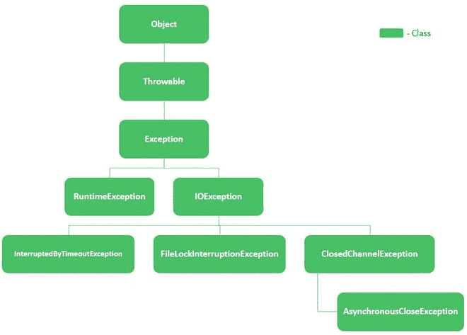

# 用示例关闭 Java 中的通道异常

> 原文:[https://www . geeksforgeeks . org/closedchannelexception-in-Java-with-examples/](https://www.geeksforgeeks.org/closedchannelexception-in-java-with-examples/)

当在关闭的通道或对尝试的操作关闭的通道上尝试输入/输出操作时，调用类 ClosedChannelException。也就是说，如果引发此异常，并不意味着通道完全关闭，而是对尝试的操作关闭。

**语法:**

```
public class ClosedChannelException
extends IOException
```

ClosedChannelException 的层次结构如下:



现在让我们先看看这个类的构造函数细节，然后再来看它的方法。

<figure class="table">

| constructors | describe |
| --- | --- |
| 闭合通道异常() | An instance of the class is constructed. |

</figure>

现在让我们讨论从 [Throwable 类继承的方法。](https://www.geeksforgeeks.org/throwable-class-in-java-with-examples/)它们以表格形式描述如下:

<figure class="table">

| way | describe |
| --- | --- |
| [Add suppressed (throws exceptions)](https://www.geeksforgeeks.org/throwable-addsuppressed-method-in-java-with-examples/?ref=rp) | Add this exception to the suppressed exception in order to schedule this exception. |
| [【充质痕迹()](https://www.geeksforgeeks.org/throwable-fillinstacktrace-method-in-java/) | Record the current state information of the stack frame of the current thread in this Throwable object, and fill in the execution stack trace. |
| [get case()](https://www.geeksforgeeks.org/throwable-getcause-method-in-java-with-examples/?ref=rp) | If the reason is unknown, return the reason or null of the Throwable. |
| [获取本地化消息()](https://www.geeksforgeeks.org/throwable-getlocalizedmessage-method-in-java-with-examples/) | Returns the localized description of this Throwable. Subclasses can override descriptions. If the subclass does not override this method, the result will be the same as that of getMessage (). |
| [getMessage()](https://www.geeksforgeeks.org/throwable-getmessage-method-in-java-with-examples/?ref=rp) | Returns the detailed message description of this Throwable. |
| [getStackTrace（）](https://www.geeksforgeeks.org/throwable-getstacktrace-method-in-java-with-examples/) | Returns an array of stack trace elements, each element representing a stack frame. Allows access to stack trace information printed by printStackTrace (). |
| [getSuppressed()](https://www.geeksforgeeks.org/throwable-getsuppressed-method-in-java-with-examples/?ref=rp) |  |
| [T0】 init cause | Initialize this throwable reason with a given value. |
| [打印堆栈跟踪()](https://www.geeksforgeeks.org/throwable-printstacktrace-method-in-java-with-examples/?ref=rp) | Print this Throwable and its backtracking on the error output stream. |
| [打印堆栈跟踪(打印流)](https://www.geeksforgeeks.org/throwable-printstacktrace-method-in-java-with-examples/?ref=rp) | Print this Throwable and its backtracking on the specified print stream. |
| [打印堆栈跟踪(PrintWriter s)](https://www.geeksforgeeks.org/throwable-printstacktrace-method-in-java-with-examples/?ref=rp) | Print this Throwable and its backtracking to the specified print writer. |
| [设置堆栈跟踪(堆栈跟踪元素[]堆栈跟踪)](https://www.geeksforgeeks.org/throwable-setstacktrace-method-in-java-with-examples/?ref=rp) | Set the stack trace element of this Throwable. It is designed for remote procedure call framework and advanced systems, and allows clients to override the default stack trace. |
| [toString()](https://www.geeksforgeeks.org/throwable-tostring-method-in-java-with-examples/?ref=rp) | Returns a brief description of the Throwable in the format: the class name of the object: the result of calling getLocalizedMessage () of the object. If getLocalizedMessage () returns null, only the class name is returned. |

</figure>

> **注意:** *这个*指的是方法被调用的上下文中的对象。

**实现:**我们本质上是要创建一个通道，关闭它，然后尝试在关闭的通道上执行读操作。这将触发关闭通道异常。步骤如下:

1.  我们将创建一个 [RandomAccessFile](https://www.geeksforgeeks.org/java-io-randomaccessfile-class-method-set-1/) 类的实例，以“读写”模式从您的系统中打开一个文本文件。
2.  现在我们使用[文件通道](https://www.geeksforgeeks.org/filechannel-class-trylock-method-in-java-with-examples/)类创建一个打开文件的通道。
3.  之后，我们使用 [ByteBuffer](https://www.geeksforgeeks.org/java-nio-bytebuffer-class-in-java/) 类创建一个缓冲区来从该通道读取字节数据。
4.  此外，[字符集类，](https://www.geeksforgeeks.org/charset-name-method-in-java-with-examples/)我们将编码方案定义为“US-ASCII”。
5.  最后，在我们开始读取这个文件之前，我们关闭通道。

> 因此，当在此通道上尝试读取操作时，将引发 ClosedChannelException。我们在 catch 块中捕获异常，您可以在其中添加任何特定于您的需求的异常处理，这里我们只打印一条消息。

**例**

## Java 语言(一种计算机语言，尤用于创建网站)

```
// Java Program to Illustraye Working of
// ClosedChannelException

// Importing required classes
// Input output classes
import java.io.IOException;
import java.io.RandomAccessFile;
// Classes from java.nio package
import java.nio.ByteBuffer;
import java.nio.channels.ClosedChannelException;
import java.nio.channels.FileChannel;
import java.nio.charset.Charset;

// Main class
// For ClosedChannelException
public class GFG {

    // Main driver method
    public static void main(String args[])
        throws IOException
    {

        // Try block to check for exceptions
        try {

            // Open a file in your system using the
            // RandomAccessFile class Custom local directory
            // on machine
            RandomAccessFile randomAccessFile
                = new RandomAccessFile(
                    "D:/Documents/textDoc.txt", "rw");

            // Now creating a channel using the FileChannel
            // class to the file opened using the
            // RandomAccessFile class
            FileChannel fileChannel
                = randomAccessFile.getChannel();

            // Create a buffer to read bytes from the
            // channel using the ByteBuffer class
            ByteBuffer byteBuffer
                = ByteBuffer.allocate(512);
            Charset charset = Charset.forName("US-ASCII");

            // Close the file channel
            // We do this so the exception is thrown
            fileChannel.close();

            // Try to read from the fileChannel which is now
            // closed
            while (fileChannel.read(byteBuffer) > 0) {

                byteBuffer.rewind();
                System.out.print(
                    charset.decode(byteBuffer));
                byteBuffer.flip();
            }

            // Closing the connections to free up memory
            // resources using close() method
            randomAccessFile.close();
        }

        // Catch block to handle the exceptions

        // Handling Application specific Exception
        catch (ClosedChannelException e) {

            // Print message if exception is occured
            System.out.println(
                "ClosedChannelException has occurred");
        }
    }
}
```

**输出:**

