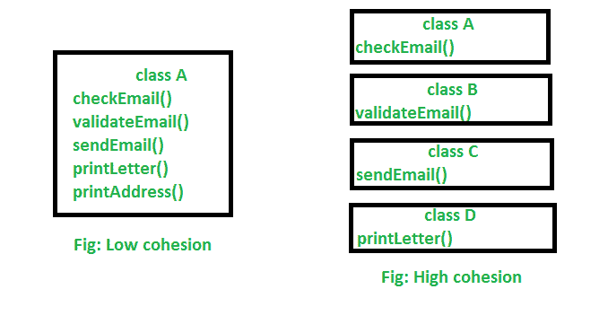

# Java 中的内聚性

> 原文:[https://www.geeksforgeeks.org/cohesion-in-java/](https://www.geeksforgeeks.org/cohesion-in-java/)

Java 中的内聚性是面向对象的原则，它与确保一个类的设计有一个单一的、专注的目的紧密相关。在面向对象设计中，内聚性指的是单个类是如何设计的。

> **注:**一个班级越专注，该班级的凝聚力越强。

高内聚的优势在于，这样的类比低内聚的类更容易维护(并且更少被频繁更改)。高内聚的另一个好处是，目标明确的类比其他类更容易重用。

**示例:**假设我们有一个将两个数字相乘的类，但是同一个类创建了一个显示结果的弹出窗口。这是一个低内聚类的例子，因为窗口和乘法运算没有太多的共同点。为了使它具有高内聚性，我们必须创建一个类 Display 和一个类 Multiply。显示器将调用乘法的方法来获得结果并显示它。这样才能开发出高内聚的解决方案。

**让我们了解一下** **高衔接程序的结构:**

## Java 语言(一种计算机语言，尤用于创建网站)

```java
// Java program to illustrate
// high cohesive behavior

class Multiply {

    int a = 5;
    int b = 5;

    public int mul(int a, int b)
    {
        this.a = a;
        this.b = b;
        return a * b;
    }
}

class Display {
    public static void main(String[] args)
    {
        Multiply m = new Multiply();
        System.out.println(m.mul(5, 5));
    }
}
```

**Output**

```java
25
```

## Java 语言(一种计算机语言，尤用于创建网站)

```java
// Java program to illustrate
// high cohesive behavior

class Name {
    String name;
    public String getName(String name)
    {
        this.name = name;
        return name;
    }
}

class Age {
    int age;
    public int getAge(int age)
    {
        this.age = age;
        return age;
    }
}

class Number {
    int mobileno;
    public int getNumber(int mobileno)
    {
        this.mobileno = mobileno;
        return mobileno;
    }
}

class Display {
    public static void main(String[] args)
    {
        Name n = new Name();
        System.out.println(n.getName("Geeksforgeeks"));
        Age a = new Age();
        System.out.println(a.getAge(10));
        Number no = new Number();
        System.out.println(no.getNumber(1234567891));
    }
}
```

**Output**

```java
Geeksforgeeks
10
1234567891
```

**高内聚低内聚的示意图:**



**说明:**在上图中，我们可以看到在低内聚中，只有一个类负责执行大量不常见的作业，这降低了可重用性和维护的机会。但是在高内聚中，所有作业都有一个单独的类来执行特定的作业，这导致了更好的可用性和维护性。

**高内聚和低内聚的区别:**

*   高凝聚力是指你有一个做明确工作的班级。低凝聚力是指一个班级做很多没有多少共同点的工作。
*   高内聚给了我们更好的维护工具，低内聚导致了难以维护、理解和降低重用性的单一类

本文由 [**比沙尔·库马尔·杜贝**](https://auth.geeksforgeeks.org/profile.php?user=Bishal Dubey) 供稿。如果你喜欢 GeeksforGeeks 并想投稿，你也可以使用[write.geeksforgeeks.org](http://www.write.geeksforgeeks.org)写一篇文章或者把你的文章邮寄到 review-team@geeksforgeeks.org。看到你的文章出现在极客博客主页上，帮助其他极客。如果你发现任何不正确的地方，或者你想分享更多关于上面讨论的话题的信息，请写评论。