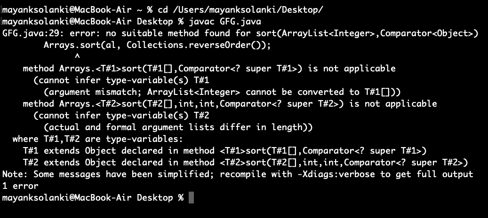

# collections . reverse order()Java 语言，带示例

> 原文:[https://www . geesforgeks . org/collections-reverse order-Java-examples/](https://www.geeksforgeeks.org/collections-reverseorder-java-examples/)

[Collections 类](https://www.geeksforgeeks.org/collections-class-in-java/)的*****reverse order()***方法本身存在于 [java.util 包](https://www.geeksforgeeks.org/java-util-package-java/)中，它返回一个比较器，使用这个比较器我们可以按相反的顺序对 Collection 进行排序。自然排序是由对象自己的 compareTo 方法强加的排序。**

****语法:****

```
public static  Comparator reverseOrder()
```

****参数:**一个比较器，其顺序将被返回的比较器反转(也可以为空)**

****返回类型:**一个比较器，对实现[可比接口](https://www.geeksforgeeks.org/comparator-interface-java/)的对象集合施加与自然顺序相反的顺序。**

**现在，为了更深入地了解基层，我们将覆盖下面列出的不同用例:**

1.  **要按降序对列表进行排序**
2.  **按降序排列数组**
3.  **当有用户定义的比较器进行反向比较时，按卷号降序对学生进行排序。**

****案例 1:** 按降序对列表进行排序**

****例****

## **Java 语言(一种计算机语言，尤用于创建网站)**

```
// Java Program to Demonstrate Working of reverseOrder()
// method of Collections class
// To sort a list in descending order

// Importing required utility classes
import java.util.*;

// Main class
// Collectionsorting
public class GFG {

    // Main driver method
    public static void main(String[] args)
    {
        // Creating a list of integers for which we
        // create an empty ArrayList by
        // declaring object of ArrayList class
        ArrayList<Integer> al = new ArrayList<Integer>();

        // Custom input integer elements
        al.add(30);
        al.add(20);
        al.add(10);
        al.add(40);
        al.add(50);

        // Using sort() method of Collections class to
        // sort the elements and passing list and using
        // reverseOrder() method to sort in descending order
        Collections.sort(al, Collections.reverseOrder());

        // Lastly printing the descending sorted list on
        // console
        System.out.println(
            "List after the use of Collection.reverseOrder()"
            + " and Collections.sort() :\n" + al);
    }
}
```

****Output**

```
List after the use of Collection.reverseOrder() and Collections.sort() :
[50, 40, 30, 20, 10]
```** 

> ****注意:**极客们现在你们一定在想我们能用[*arrays . sort()*](https://www.geeksforgeeks.org/arrays-sort-in-java-with-examples/)*吗？***
> 
> **Arrays.sort()不能直接用于按降序对基元数组进行排序。如果我们试图通过传递 Collections.reverseOrder()定义的反向比较器来调用 Arrays.sort()方法，它将抛出如下所示的错误:**

****

> ****提示**:但是这对于像**整数**数组这样的“对象数组”来说很好，但是对于像 int 数组这样的原始数组就不行了。**

****情况 2:** 按降序排列数组**

****例****

## **Java 语言(一种计算机语言，尤用于创建网站)**

```
// Java Program to Demonstrate Working of reverseOrder()
// method of Collections class
// To Sort an Array in Descending Order

// Importing required utility classes
import java.util.*;

// Main class
// CollectionSorting
public class GFG {

    // Main driver method
    public static void main(String[] args)
    {

        // Creating an array to be sorted in descending
        // order
        Integer[] arr = { 30, 20, 40, 10 };

        // Collections.sort method is sorting the
        // elements of arr[] in descending order
        // later on Arrays.sort() is applied to sort array
        Arrays.sort(arr, Collections.reverseOrder());

        // Printing the sorted array on console
        System.out.println(
            "Array after the use of Collection.reverseOrder()"
            + " and Arrays.sort() :\n"
            + Arrays.toString(arr));
    }
}
```

****Output**

```
Array after the use of Collection.reverseOrder() and Arrays.sort() :
[40, 30, 20, 10]
```** 

****案例 3:** 当有用户自定义的比较器做反向比较时，按卷号降序对学生进行排序。**

```
public static Comparator reverseOrder(Comparator c) 
```

**它返回一个比较器，该比较器与传递的比较器对象的顺序相反。我们可以使用这种方法按照用户定义的比较器的相反顺序对列表进行排序。例如，在下面的程序中，我们创建了一个与用户定义的比较器相反的比较器，以按卷号降序对学生进行排序。**

****示例:****

## **Java 语言(一种计算机语言，尤用于创建网站)**

```
// Java Program to Demonstrate Working of
// reverseOrder(Comparator c)
// To sort students in descending order of roll numbers
// when there is a user defined comparator to do reverse

// Importing required classes
import java.io.*;
import java.lang.*;
import java.util.*;

// Class 1
// Helper student class
// to represent a student
class Student {
    int rollno;
    String name, address;

    // Constructor
    public Student(int rollno, String name, String address)
    {

        // This keyword refers to current instance itself
        this.rollno = rollno;
        this.name = name;
        this.address = address;
    }

    // Method of Student class
    // To print student details inside main() method
    public String toString()
    {

        return this.rollno + " " + this.name + " "
            + this.address;
    }
}

// Class 2
// Helper class implementing interface
class Sortbyroll implements Comparator<Student> {

    // Method
    // Used for sorting in ascending order of
    // roll number
    public int compare(Student a, Student b)
    {
        return a.rollno - b.rollno;
    }
}

// Class 3
// Main class
class GFG {

    // Main driver method
    public static void main(String[] args)
    {

        // Creating an empty ArrayList
        ArrayList<Student> ar = new ArrayList<Student>();

        // Adding custom attributes defined in Student class
        // using add() method
        ar.add(new Student(111, "bbbb", "london"));
        ar.add(new Student(131, "aaaa", "nyc"));
        ar.add(new Student(121, "cccc", "jaipur"));

        // Display message for better readability
        System.out.println("Unsorted");

        // Printing list of students
        for (int i = 0; i < ar.size(); i++)
            System.out.println(ar.get(i));

        // Sorting a list of students in descending order of
        // roll numbers using a Comparator
        // that is reverse of Sortbyroll()
        Comparator c
            = Collections.reverseOrder(new Sortbyroll());
        Collections.sort(ar, c);

        // Display message for better readability
        System.out.println("\nSorted by rollno");

        // Printing sorted students in descending order
        for (int i = 0; i < ar.size(); i++)
            System.out.println(ar.get(i));
    }
}
```

****输出:****

```
Unsorted
111 bbbb london
131 aaaa nyc
121 cccc jaipur

Sorted by rollno
131 aaaa nyc
121 cccc jaipur
111 bbbb london
```

> **这里要记住的关键是上面的程序使用未经检查和不安全的操作。**

**本文由**莫希特·古普塔**供稿。如果你喜欢 GeeksforGeeks 并想投稿，你也可以使用[write.geeksforgeeks.org](http://www.write.geeksforgeeks.org)写一篇文章或者把你的文章邮寄到 review-team@geeksforgeeks.org。看到你的文章出现在极客博客主页上，帮助其他极客。**