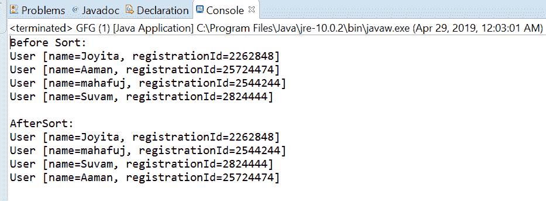
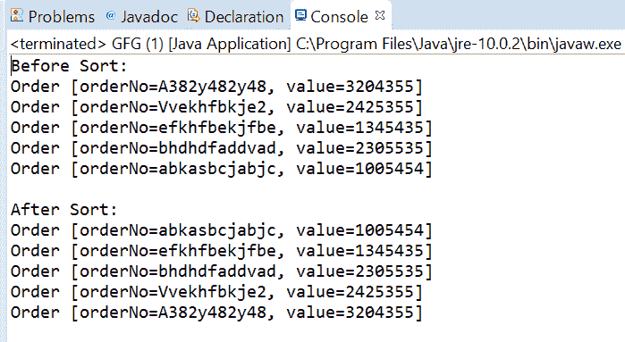

# 比较器比较 Java 中的 Long()方法和示例

> 原文:[https://www . geesforgeks . org/comparator-comparing long-in-method-in-Java-with-examples/](https://www.geeksforgeeks.org/comparator-comparinglong-method-in-java-with-examples/)

java 中[比较器接口](https://www.geeksforgeeks.org/comparator-interface-java/)的**comparison long([Java . util . function . tolongfunction](https://www.geeksforgeeks.org/tolongfunction-interface-in-java-with-examples/))**方法接受一个函数作为参数，该函数从类型 T 中提取一个长排序关键字，并返回一个按该排序关键字进行比较的比较器。如果指定的函数也是可序列化的，则返回的比较器是可序列化的。

**语法:**

```java
static <T> Comparator<T> 
    comparingLong(ToLongFunction <T> keyExtractor)

```

**参数:**该方法接受单个参数**键提取器**，该函数用于提取长排序键。

**返回值:**该方法返回一个比较器，通过提取的键进行比较

**异常:**如果参数为空，此方法将引发 NullPolongerException。

下面的程序说明了 comparing long(Java . util . function . tolongfunction)方法:
**程序 1:**

```java
// Java program to demonstrate Comparator
// comparingLong(ToLongFunction)  method

import java.util.Arrays;
import java.util.Collections;
import java.util.Comparator;
import java.util.List;
public class GFG {
    public static void main(String[] args)
    {

        // create some user objects
        User u1 = new User("Aaman", 25724474);
        User u2 = new User("Joyita", 2262848);
        User u3 = new User("Suvam", 2824444);
        User u4 = new User("mahafuj", 2544244);

        // before sort
        List<User> list = Arrays.asList(u2, u1, u4, u3);
        System.out.println("Before Sort:");
        list.forEach(user -> System.out.println(user));

        Collections.sort(list,
                         Comparator.comparingLong(
                             User::getregistrationId));
        System.out.println("\nAfterSort:");
        list.forEach(user -> System.out.println(user));
    }
}

class User implements Comparable<User> {
    public String name;
    public long registrationId;

    public User(String name, long registrationId)
    {
        this.name = name;
        this.registrationId = registrationId;
    }

    public int compareTo(User u1)
    {
        return name.compareTo(u1.name);
    }

    public String getName()
    {
        return name;
    }

    public void setName(String name)
    {
        this.name = name;
    }

    public long getregistrationId()
    {
        return registrationId;
    }

    public void setregistrationId(long registrationId)
    {
        this.registrationId = registrationId;
    }

    @Override
    public String toString()
    {
        return "User [name=" + name
            + ", registrationId="
            + registrationId + "]";
    }
}
```

打印在集成开发环境控制台上的输出如下所示。
**输出:**


**程序 2:**

```java
// Java program to demonstrate Comparator
// comparingLong(ToLongFunction)  method

import java.util.Arrays;
import java.util.Collections;
import java.util.Comparator;
import java.util.List;
public class GFG {
    public static void main(String[] args)
    {

        // before sort
        List<Order> list = Arrays.asList(
            new Order("A382y482y48", 3204355),
            new Order("Vvekhfbkje2", 2425355),
            new Order("efkhfbekjfbe", 1345435),
            new Order("bhdhdfaddvad", 2305535),
            new Order("abkasbcjabjc", 1005454));
        System.out.println("Before Sort:");
        list.forEach(order -> System.out.println(order));

        Collections.sort(list,
                         Comparator.comparingLong(
                             Order::getValue));
        System.out.println("\nAfter Sort:");
        list.forEach(order -> System.out.println(order));
    }
}

class Order implements Comparable<Order> {
    public String orderNo;
    public long value;

    public int compareTo(Order o1)
    {
        return orderNo.compareTo(o1.orderNo);
    }

    public Order(String orderNo, long value)
    {
        super();
        this.orderNo = orderNo;
        this.value = value;
    }

    @Override
    public String toString()
    {
        return "Order [orderNo=" + orderNo
            + ", value=" + value + "]";
    }

    public String getOrderNo()
    {
        return orderNo;
    }

    public void setOrderNo(String orderNo)
    {
        this.orderNo = orderNo;
    }

    public long getValue()
    {
        return value;
    }

    public void setValue(long value)
    {
        this.value = value;
    }
}
```

控制台上打印的输出如下所示。
**输出:**


**参考文献:**T2