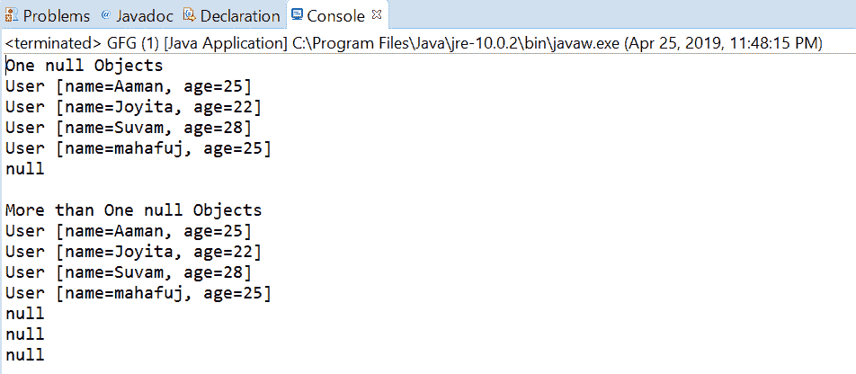

# Java 中的比较器 nullsLast()方法，带示例

> 原文:[https://www . geesforgeks . org/comparator-nullslast-method-in-Java-with-examples/](https://www.geeksforgeeks.org/comparator-nullslast-method-in-java-with-examples/)

**NullSlast([Java . util . comparator](https://www.geeksforgeeks.org/comparator-interface-java/))**方法返回一个比较器，它是一个空友好的比较器，并且认为空值大于非空值。null 首先通过以下逻辑进行操作:

1.  null 元素被认为大于非 null。
2.  当两个元素都为空时，则认为它们相等。
3.  当两个元素都为非空时，指定的比较器决定顺序。
4.  如果指定的比较器为空，则返回的比较器认为所有非空元素相等。
5.  如果指定的比较器可序列化，则返回的比较器可序列化。

**语法:**

```
static <T> Comparator<T> nullsLast (Comparator<T> comparator)

```

**参数:**该方法接受单个参数**比较器**，该比较器用于比较非空值

**返回值:**该方法返回一个比较器，该比较器认为空值大于非空值，并将非空对象与提供的比较器进行比较。

下面的程序说明了 nullsLast(java.util.Comparator)方法:
**程序 1:**

```
// Java program to demonstrate
// Comparator.nullsLast (java.util.Comparator)  method

import java.util.Arrays;
import java.util.Comparator;

public class GFG {

    public static void main(String[] args)
    {

        // create a collection of an array of names
        // also contains nulls
        String[] strings = { "aman", "suvam", null,
                             "sahil", null };

        // print the array
        System.out.println("Before sorting: "
                           + Arrays.toString(strings));

        // apply nullsLast  method
        // and sort the array
        Arrays.sort(strings,
                    Comparator.nullsLast(
                        Comparator.naturalOrder()));

        // print the array
        System.out.println("After sorting: "
                           + Arrays.toString(strings));
    }
}
```

打印在集成开发环境控制台上的输出如下所示。
**输出:**


**程序 2:**

```
// Java program to demonstrate
// Comparator.nullsLast (java.util.Comparator)  method

import java.util.Arrays;
import java.util.Collections;
import java.util.Comparator;
import java.util.List;
public class GFG {
    public static void main(String[] args)
    {

        // create some user objects
        User u1 = new User("Aaman", 25);
        User u2 = new User("Joyita", 22);
        User u3 = new User("Suvam", 28);
        User u4 = new User("mahafuj", 25);

        System.out.println("One null Objects");
        List<User> list
            = Arrays.asList(u1, u2, u3, null, u4);
        Collections.sort(list,
                         Comparator.nullsLast(
                             Comparator.comparing(
                                 User::getName)));
        list.forEach(user -> System.out.println(user));

        System.out.println("\nMore than One null Objects");
        list = Arrays.asList(u1, u4, null, u2, u3, null, null);
        Collections.sort(list,
                         Comparator.nullsLast(
                             Comparator.comparing(
                                 User::getName)));
        list.forEach(user -> System.out.println(user));
    }
}
class User implements Comparable<User> {
    public String name;
    public int age;

    public User(String name, int age)
    {
        this.name = name;
        this.age = age;
    }

    public int compareTo(User u1)
    {
        return name.compareTo(u1.name);
    }

    public String getName()
    {
        return name;
    }

    public void setName(String name)
    {
        this.name = name;
    }

    public int getAge()
    {
        return age;
    }

    public void setAge(int age)
    {
        this.age = age;
    }

    @Override
    public String toString()
    {
        return "User [name=" + name
            + ", age=" + age + "]";
    }
}
```

控制台上打印的输出如下所示。
**输出:**


**参考文献:**[https://docs . Oracle . com/javase/10/docs/API/Java/util/comparator . html # nullsLast(Java . util . comparator)](https://docs.oracle.com/javase/10/docs/api/java/util/Comparator.html#nullsLast (java.util.Comparator))