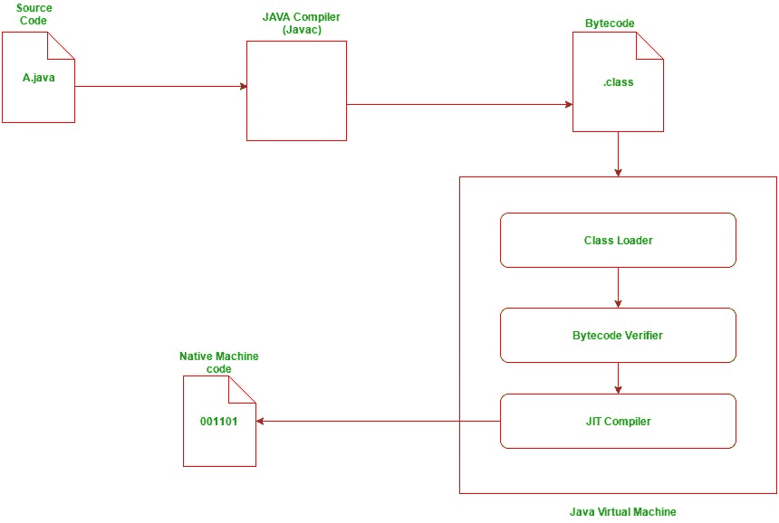
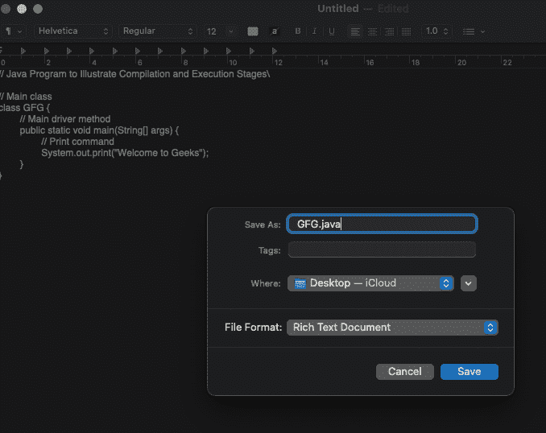

# Java 程序的编译和执行

> 原文:[https://www . geesforgeks . org/编译-执行-Java-程序/](https://www.geeksforgeeks.org/compilation-execution-java-program/)

作为一种独立于平台的编程语言，Java 并不支持一步编译。相反，它涉及两步执行，首先通过独立于操作系统的编译器；第二，在为每个操作系统定制的虚拟机(JVM)中。

两个主要阶段解释如下:

> ### Principle 1: Compilation

第一，来源。“java”文件通过编译器传递，然后编译器将源代码编码成独立于机器的编码，称为字节码。源文件中包含的每个类的内容都存储在单独的。“类”文件。在将源代码转换为字节码时，编译器遵循以下步骤:

**第一步:解析**:读取一组*。java 源文件并将生成的令牌序列映射到 AST(抽象语法树)-节点中。

**第二步:输入**:将定义的符号输入符号表。

**步骤 3:处理注释:**如果被请求，处理在指定编译单元中找到的注释。

**第 4 步:属性**:属性语法树。这一步包括名称解析、类型检查和常量折叠。

**第五步:流程**:对上一步的树进行数据流分析。这包括检查分配和可达性。

**第六步:去糖**:重写 AST，翻译掉一些句法糖。

**第七步:生成**:生成’。类文件。

https://www.youtube.com/watch?v=0f-Sx81bIWQ

> ### **Principle 2:** Implement

编译器生成的类文件独立于机器或操作系统，这允许它们在任何系统上运行。为了运行，主类文件(包含方法 main 的类)被传递给 JVM，然后在执行最终的机器代码之前经历三个主要阶段。这些阶段是:
这些状态包括:

1.  类加载器
2.  校验员字节码

让我们讨论所有 3 个阶段。

**第一阶段:** [级装载机](https://www.geeksforgeeks.org/classloader-in-java/)

主类被加载到内存中，绕过它的。类的文件，通过调用后者。程序中引用的所有其他类都是通过类加载器加载的。
类加载器本身是一个对象，它创建了一个由字符串名称引用的类主体的平面命名空间。方法定义如下图所示:

插图:

```
// loadClass function prototype

Class r = loadClass(String className, boolean resolveIt);

// className: name of the class to be loaded
// resolveIt: flag to decide whether any referenced class should be loaded or not.
```

有两种类型的类装入器

*   原始的
*   非原始的

原始类加载器嵌入到所有 JVM 中，是默认的类加载器。非原始类加载器是用户定义的类加载器，可以对其进行编码以定制类加载过程。非原始类加载器(如果定义的话)比缺省类加载器更适合加载类。

**阶段 2:** [字节码验证器](https://www.geeksforgeeks.org/verification-java-jvm/)

在类装入器装入一个类的字节码后，它必须被字节码验证器检查，该验证器的工作是检查指令没有执行破坏性的动作。以下是进行的一些检查:

*   变量在使用前被初始化。
*   方法调用匹配对象引用的类型。
*   不违反访问私有数据和方法的规则。
*   局部变量访问属于运行时堆栈。
*   运行时堆栈不会溢出。
*   如果以上任何检查失败，验证器不允许加载该类。

**阶段 3:** [准时制编译器](https://www.geeksforgeeks.org/just-in-time-compiler/)

这是 java 程序遇到的最后一个阶段，它的工作是将加载的字节码转换成机器代码。当使用 JIT 编译器时，硬件可以执行本机代码，而不是让 JVM 重复解释相同的字节码序列，并导致相对较长的翻译过程。这可能导致执行速度的性能提升，除非方法的执行频率降低。



这个过程可以很好地用下面给出的图表来说明，我们由此得出结论。

> **结论:**由于上面描述的两步执行过程，一个 java 程序独立于目标操作系统。然而，由于相同的原因，执行时间比在编译的平台相关程序中编写的类似程序要长得多。

**实施:**

考虑简单的打印程序是写在机器的本地目录的某个地方。

## Java 语言(一种计算机语言，尤用于创建网站)

```
// Java Program to Illustrate Compilation and Execution
// Stages

// Main class
class GFG {

    // Main driver method
    public static void main(String[] args)
    {

        // Print command
        System.out.print("Welcome to Geeks");
    }
}
```

**Output**

```
Welcome to Geeks
```

让我们了解真正的编译和执行过程。

**第一步:**让我们创建一个文件，在文本文件中编写简单的打印代码，并将其保存为”。java "扩展。



**第二步:**打开终端(这里我们使用的是 macOS)，使用下面的命令进入桌面目录，如下所示。

```
 cd /Users/mayanksolanki/GFG.java
```

**步骤 3:** 让我们尝试用下面的命令编译我们的程序

```
javac GFG.java
```

**第 4 步:**最后用下面的命令运行，如下所示:

```
java GFG 
```

> **注意:** GFG.class 文件是在第三步之后创建的，这意味着现在我们在 java 编程语言中的整个代码都是安全加密的，因为它只包含二进制。在第 4 步中，我们正在运行该文件。为了便于理解，请参考以下媒体。

