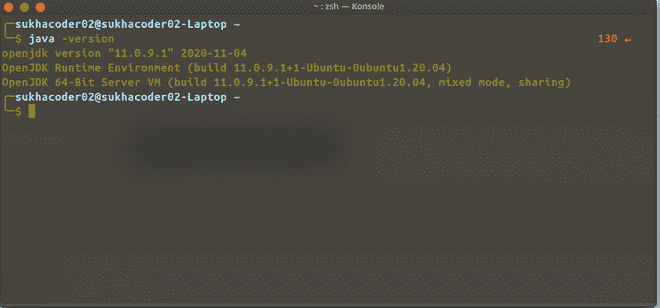
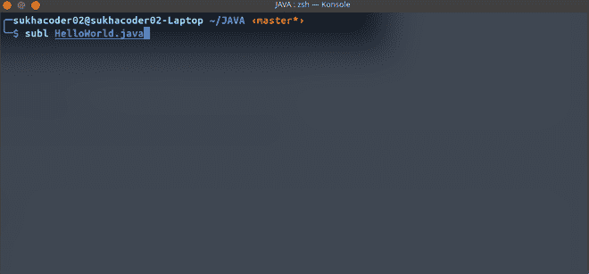
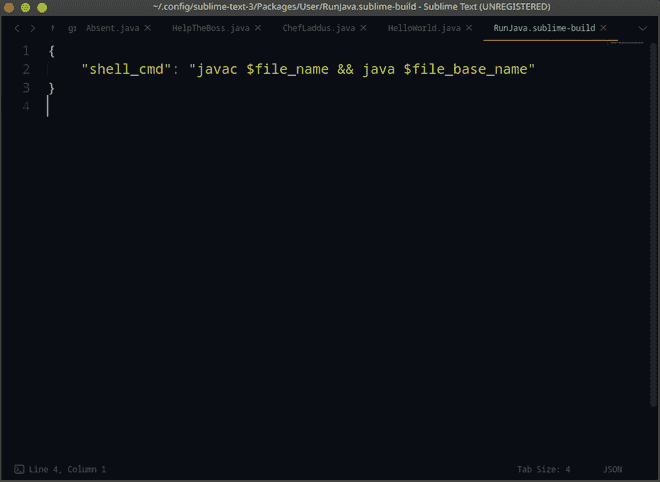
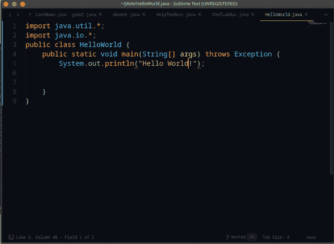
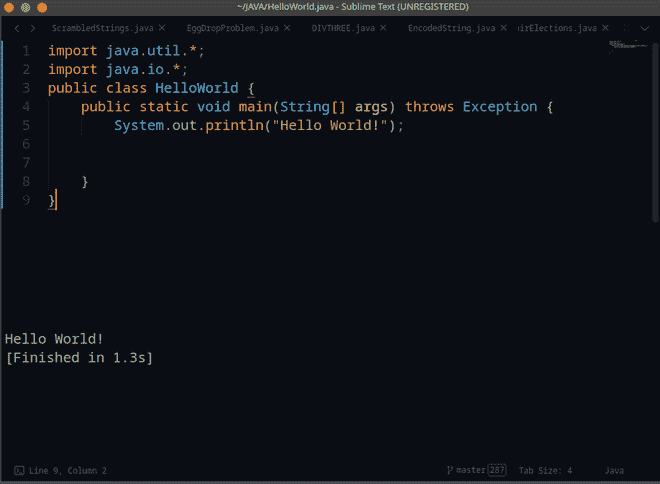

# 在 Linux 中编译运行高级文本的 Java 程序

> 原文:[https://www . geesforgeks . org/编译并运行-Java-programs-in-supreme-text-in-Linux/](https://www.geeksforgeeks.org/compile-and-run-java-programs-in-sublime-text-in-linux/)

[威震文字](https://www.geeksforgeeks.org/different-python-ides-and-code-editors/)是威震 HQ 为桌面使用开发的免费极简编码编辑器。这个开发和信息技术程序使你能够只专注于你的代码，而忽略了所有其他类型的吸引眼球的东西。

**程序:**

1.  打开终端，输入特定命令，检查软件是否存在。存在本身将被显示为跟随的命令。
2.  配置崇高文本的构建以运行程序
3.  创建新的构建系统
4.  保存构建系统并运行它

**步骤 1:** 在输入命令之前，确保机器上安装了 Java 编译器。现在打开终端，输入命令“java -version ”,它会告诉你机器上安装了什么版本的 java。这个命令将让我们确认版本，并确保机器上安装了 java。

```java
$ java -version
```

如果 java 安装在你的机器上，那么你会在消息中看到 openjdk 版本号作为响应，以及其他信息，如下图所示。



**第二步:**配置崇高文本的构建运行 java 程序，就好像你不是真的想从 GUI 打开崇高文本一样，只需使用这个命令，为自己节省一些鼠标移动。

```java
$ subl <file-name>
```



**步骤 3:** 创建一个新的构建系统，该系统遵循两个步骤。首先点击“*工具→构建系统→新建构建系统”。*到目前为止，一个名为“无标题.崇高-构建”的新文件打开了。最后，只需将以下代码复制并粘贴到该文件中。

```java
{
    "shell_cmd": "javac $file_name && java $file_base_name"
}
```

上面的指令在 **shell** 中运行给定的命令，将 **$file_name** 替换为您的**实际文件名**，将$file_base_name 替换为不带扩展名的**文件名(文件名不带。java 扩展)，**每当在**崇高文本中调用代码运行命令(Ctrl + B)时。**



**步骤 4:** 保存构建系统并运行它。

*   首先，给它取一个类似 RunJava.sublime-build 的名字，方法是点击“***”Ctrl+S“***
*   打开一个新的 java 文件，写一些基本代码并保存。



*   然后点击*工具→构建系统→选择*你新创建的构建文件 RunJava(在这种情况下)。
*   最后运行程序，按 Ctrl + B。



> 底部出现一个新窗口，显示代码的**输出**。请记住，此运行窗口不能接受输入。它可以显示你的代码输出。