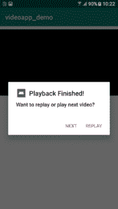

# 关于如何在安卓系统中构建视频播放器的完整指南

> 原文:[https://www . geeksforgeeks . org/complete-关于如何在安卓中构建视频播放器的指南/](https://www.geeksforgeeks.org/complete-guide-on-how-to-build-a-video-player-in-android/)

本文解释了如何使用[安卓工作室](https://www.geeksforgeeks.org/guide-to-install-and-set-up-android-studio/)构建视频播放器的分步过程。
在安卓系统中观看视频，有一个特殊的类叫做“ **MediaPlayer** ”。在本文中，我们将有 2 个视频通过“[对话框](https://www.geeksforgeeks.org/android-alert-dialog-box-and-how-to-create-it/)连接，即在第一个视频完成后会出现一个对话框，询问用户是想要重播还是播放下一个视频。
在安卓中插入视频，我们放入**原始文件夹**。“原始”文件夹出现在
中

```java
"app"--> "res" --> "raw"
```

在这个文件夹中，你只需要粘贴你想播放的视频。
**制作视频播放器的步骤:**

1.  在创建前端时，我们只需要一个组件，即视频视图。
2.  像*播放、倒带、前进*这样的图标只会在我们触摸 VideoView 的时候出现，它们只会出现 3 秒钟，然后就会消失。它是由谷歌提供的，这是它的默认行为。

3.  Coming to back-end part i.e Java coding, we are getting media controls by:

    > vw.setMediaController(新 MediaController(this))；

4.  然后，在 ArrayList 中添加原始文件夹的视频，并调用一个名为 setVideo()的方法，给出第一个视频的参数。

    > //大视频歌曲不运行
    > videolist.add(R.raw。褪色);
    > 视频列表。添加(r . raw。机场)；
    > 设置视频(视频列表。get(0))；

5.  Now in setVideo() defining, we need an [Uri object](https://www.geeksforgeeks.org/java-net-uri-class-java/) so as to pass to a method called as setVideoURI(). Therefore,

    > string uri path = " Android . resource:///+getPackageName()+"/+id；
    > Uri Uri = Uri . parse(Uripath)；
    > VW . SetVideouri(uri)；
    > 大众 start()；

    **注意:**应用一启动，第一个视频就开始播放。这是因为我们从 onCreate()内部调用 setVideo()，然后在 setVideo()内部调用 vw.start()，其中 vw 是 VideoView。

6.  现在，生成对话框的代码是在名为 onCompletion()的方法中完成的。如何生成对话框

    > //正在创建 AlertDialog 的对象
    > 警报对话框.生成器 obj =新警报对话框.建设者（本);

7.  最后，我们处理了用户动作的编码，即用户点击了什么(重放或下一步)。使用简单的逻辑，如递增和递减。

    ```java
    public void onClick(DialogInterface dialog, int which) {
      if (which == -1) {
        vw.seekTo(0);
        vw.start();
      }
      else {
        ++currvideo;
        if (currvideo == videolist.size())
          currvideo = 0;
        setVideo(videolist.get(currvideo));
      }
    }
    ```

**上述程序的完整代码(activity_main 和 MainActivity)如下所示:**

## activity_main.xml

```java
<?xml version="1.0" encoding="utf-8"?>
<RelativeLayout 
    xmlns:android="http://schemas.android.com/apk/res/android"
    xmlns:app="http://schemas.android.com/apk/res-auto"
    xmlns:tools="http://schemas.android.com/tools"
    android:layout_width="match_parent"
    android:layout_height="match_parent"
    tools:context=".MainActivity">

   <VideoView
       android:id="@+id/vidvw"
       android:layout_marginTop="10dp"
      android:layout_width="match_parent"
       android:layout_height="match_parent"
       />
</RelativeLayout>
```

## MainActivity.java

```java
package com.example.videoapp_demo;

import android.content.DialogInterface;
import android.media.MediaPlayer;
import android.net.Uri;
import android.support.v7.app.AlertDialog;
import android.support.v7.app.AppCompatActivity;
import android.os.Bundle;
import android.widget.MediaController;
import android.widget.VideoView;

import java.util.ArrayList;

public class MainActivity
    extends AppCompatActivity
    implements MediaPlayer.OnCompletionListener {

    VideoView vw;
    ArrayList<Integer> videolist = new ArrayList<>();
    int currvideo = 0;
    @Override
    protected void onCreate(Bundle savedInstanceState)
    {
        super.onCreate(savedInstanceState);
        setContentView(R.layout.activity_main);
        vw = (VideoView)findViewById(R.id.vidvw);
        vw.setMediaController(new MediaController(this));
        vw.setOnCompletionListener(this);

        // video name should be in lower case alphabet.
        videolist.add(R.raw.middle);
        videolist.add(R.raw.faded);
        videolist.add(R.raw.aeroplane);
        setVideo(videolist.get(0));
    }

    public void setVideo(int id)
    {
        String uriPath
            = "android.resource://"
              + getPackageName() + "/" + id;
        Uri uri = Uri.parse(uriPath);
        vw.setVideoURI(uri);
        vw.start();
    }

    public void onCompletion(MediaPlayer mediapalyer)
    {
        AlertDialog.Builder obj = new AlertDialog.Builder(this);
        obj.setTitle("Playback Finished!");
        obj.setIcon(R.mipmap.ic_launcher);
        MyListener m = new MyListener();
        obj.setPositiveButton("Replay", m);
        obj.setNegativeButton("Next", m);
        obj.setMessage("Want to replay or play next video?");
        obj.show();
    }

    class MyListener implements DialogInterface.OnClickListener {
        public void onClick(DialogInterface dialog, int which)
        {
            if (which == -1) {
                vw.seekTo(0);
                vw.start();
            }
            else {
                ++currvideo;
                if (currvideo == videolist.size())
                    currvideo = 0;
                setVideo(videolist.get(currvideo));
            }
        }
    }
}
```

**输出:**

*   **播放第一段视频:**
    [](https://media.geeksforgeeks.org/wp-content/uploads/20191210103250/Screenshot_20191210-102137.png) 

    第一首歌《褪色》

    T9】

*   **Dialog box after the first video:**[](https://media.geeksforgeeks.org/wp-content/uploads/20191210103449/Screenshot_20191210-102206.png) 

    After the first song is finished, the dialog box is generating

*   **Playing the second video:**[](https://media.geeksforgeeks.org/wp-content/uploads/20191210103629/Screenshot_20191210-102248.png) 

    When we click "Next", then the second video starts to run