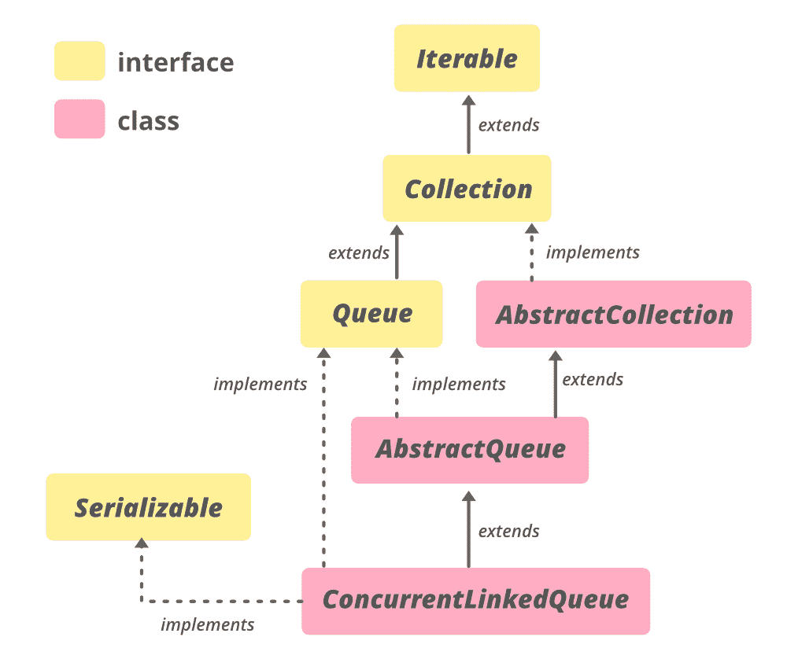

# Java 中的 ConcurrentLinkedQueue 示例

> 原文:[https://www . geeksforgeeks . org/concurrentlinkedqueue-in-Java-with-examples/](https://www.geeksforgeeks.org/concurrentlinkedqueue-in-java-with-examples/)

Java 中的 **ConcurrentLinkedQueue** 类是 [Java 集合框架](https://www.geeksforgeeks.org/collections-in-java-2/)的一部分。属于 **java.util.concurrent** 包。它是在 JDK 1.5 中引入的。用于同时借助[链表](https://www.geeksforgeeks.org/linked-list-set-1-introduction/)实现[队列](https://www.geeksforgeeks.org/queue-data-structure/)。它是队列的一个**无界** **线程安全**实现，以先进先出的方式在队列尾部插入元素。当多个线程共享一个无界队列时，可以使用它。此类不允许空元素。迭代器弱一致。这个类及其迭代器实现了**队列**和**迭代器**接口的所有可选方法。
**阶级等级:**

```java
java.lang.Object
  ↳ java.util.AbstractCollection<E>
     ↳ java.util.AbstractQueue<E>
        ↳ Class ConcurrentLinkedQueue<E>
```



**申报:**

> 公共类 ConcurrentLinkedQueue <e>扩展抽象集合<e>实现队列<e>，可序列化</e></e></e>

这里， **E** 是这个集合维护的元素类型。

### ConcurrentLinkedQueue 的构造函数

要构造一个 ConcurrentLinkedQueue，我们需要从**Java . util . ConcurrentLinkedQueue**导入。

**1。ConcurrentLinkedQueue()** :此构造函数用于构造空队列。

> 并发队列 <e>clq =新并发队列<e>()；</e></e>

**2。ConcurrentLinkedQueue(Collection)<E>c)**:这个构造函数用来构造一个以 Collection 的元素作为参数传递的队列。

> 并发队列<e>clq =新并发队列<e>(集合<e>c)；</e></e></e>

下面是一个用 Java 说明 ConcurrentLinkedQueue 的示例程序:

**例 1:**

## Java 语言(一种计算机语言，尤用于创建网站)

```java
// Java program to demonstrate ConcurrentLinkedQueue

import java.util.concurrent.*;

class ConcurrentLinkedQueueDemo {

    public static void main(String[] args)
    {
        // Create a ConcurrentLinkedQueue
        // using ConcurrentLinkedQueue() constructor
        ConcurrentLinkedQueue<Integer>
            clq = new ConcurrentLinkedQueue<Integer>();

        clq.add(12);
        clq.add(70);
        clq.add(1009);
        clq.add(475);

        // Displaying the existing LinkedQueue
        System.out.println("ConcurrentLinkedQueue: "
                           + clq);

        // Create a ConcurrentLinkedQueue
        // using ConcurrentLinkedQueue(Collection c)
        // constructor
        ConcurrentLinkedQueue<Integer>
            clq1 = new ConcurrentLinkedQueue<Integer>(clq);

        // Displaying the existing LinkedQueue
        System.out.println("ConcurrentLinkedQueue1: "
                           + clq1);
    }
}
```

**Output:** 

```java
ConcurrentLinkedQueue: [12, 70, 1009, 475]
ConcurrentLinkedQueue1: [12, 70, 1009, 475]
```

**例 2:**

## Java 语言(一种计算机语言，尤用于创建网站)

```java
// Java code to illustrate
// methods of ConcurrentLinkedQueue

import java.util.concurrent.*;

class ConcurrentLinkedQueueDemo {

    public static void main(String[] args)
    {

        // Create a ConcurrentLinkedQueue
        // using ConcurrentLinkedQueue()
          // constructor
        ConcurrentLinkedQueue<Integer>
            clq = new ConcurrentLinkedQueue<Integer>();

        clq.add(12);
        clq.add(70);
        clq.add(1009);
        clq.add(475);

        // Displaying the existing ConcurrentLinkedQueue
        System.out.println("ConcurrentLinkedQueue: "
                           + clq);

        // Displaying the first element
        // using peek() method
        System.out.println("First Element is: "
                           + clq.peek());

        // Remove and display the first element
        // using poll() method
        System.out.println("Head Element is: "
                           + clq.poll());

        // Displaying the existing ConcurrentLinkedQueue
        System.out.println("ConcurrentLinkedQueue: "
                           + clq);

        // Get the size using size() method
        System.out.println("Size: "
                           + clq.size());
    }
}
```

**Output:** 

```java
ConcurrentLinkedQueue: [12, 70, 1009, 475]
First Element is: 12
Head Element is: 12
ConcurrentLinkedQueue: [70, 1009, 475]
Size: 3
```

### 基本操作

**1。添加元素**

添加元素 ConcurrentLinkedQueue 提供了两种方法。

*   [add()](https://www.geeksforgeeks.org/concurrentlinkedqueue-add-method-in-java/) 它插入元素，作为参数传递到这个 ConcurrentLinkedQueue 的尾部。如果插入成功，此方法返回真。ConcurrentLinkedQueue 是无界的，所以这个方法永远不会抛出 IllegalStateException 或返回 false。
*   [addAll()](https://www.geeksforgeeks.org/concurrentlinkedqueue-addall-method-in-java/) 它插入集合的所有元素，作为参数传递到 ConcurrentLinkedQueue 的末尾。元素的插入顺序与集合的迭代器返回的顺序相同。

## Java 语言(一种计算机语言，尤用于创建网站)

```java
// Java Program Demonstrate adding
// elements to ConcurrentLinkedQueue

import java.util.concurrent.*;
import java.util.*;

public class AddingElementsExample {

    public static void main(String[] args)
    {

        // Create an instance of ConcurrentLinkedQueue
        ConcurrentLinkedQueue<String> queue = new ConcurrentLinkedQueue<String>();

        // Add String to queue using add method
        queue.add("Kolkata");
        queue.add("Patna");
        queue.add("Delhi");
        queue.add("Jammu");

        // Displaying the existing ConcurrentLinkedQueue
        System.out.println("ConcurrentLinkedQueue: " + queue);

        // create a ArrayList of Strings
        ArrayList<String> arraylist = new ArrayList<String>();

        // add String to ArrayList
        arraylist.add("Sanjeet");
        arraylist.add("Rabi");
        arraylist.add("Debasis");
        arraylist.add("Raunak");
        arraylist.add("Mahesh");

        // Displaying the existing Collection
        System.out.println("Collection to be added: " + arraylist);

        // apply addAll() method and passed
        // the arraylist as parameter
        boolean response = queue.addAll(arraylist);

        // Displaying the existing ConcurrentLinkedQueue
        System.out.println("Collection added: " + response);

        // Displaying the existing ConcurrentLinkedQueue
        System.out.println("ConcurrentLinkedQueue: " + queue);
    }
}
```

**Output**

```java
ConcurrentLinkedQueue: [Kolkata, Patna, Delhi, Jammu]
Collection to be added: [Sanjeet, Rabi, Debasis, Raunak, Mahesh]
Collection added: true
ConcurrentLinkedQueue: [Kolkata, Patna, Delhi, Jammu, Sanjeet, Rabi, Debasis, Raunak, Mahesh]
```

**2。拆卸元件**

ConcurrentLinkedQueue 的 [remove(Object o)](https://www.geeksforgeeks.org/concurrentlinkedqueue-remove-method-in-java/) 方法用于移除指定元素的单个实例(如果存在)。它删除了一个元素 **e** ，使得 o 等于(e)。如果这个 ConcurrentLinkedQueue 包含指定的元素，它将返回 true，否则它将返回 false。

## Java 语言(一种计算机语言，尤用于创建网站)

```java
// Java Program Demonstrate removing
// elements from ConcurrentLinkedQueue

import java.util.concurrent.*;

public class RemovingElementsExample {

    public static void main(String[] args)
    {

        // Create an instance of ConcurrentLinkedQueue
        ConcurrentLinkedQueue<Integer> queue = new ConcurrentLinkedQueue<Integer>();

        // Add Numbers to queue using add(e) method
        queue.add(4353);
        queue.add(7824);
        queue.add(78249);
        queue.add(8724);

        // Displaying the existing ConcurrentLinkedQueue
        System.out.println("ConcurrentLinkedQueue: " + queue);

        // apply remove() for Number 78249
        boolean response = queue.remove(78249);

        // print results
        System.out.println("Removing Number 78249 successful: " + response);

        // Displaying the existing ConcurrentLinkedQueue
        System.out.println("Updated ConcurrentLinkedQueue: " + queue);
    }
}
```

**Output**

```java
ConcurrentLinkedQueue: [4353, 7824, 78249, 8724]
Removing Number 78249 successful: true
Updated ConcurrentLinkedQueue: [4353, 7824, 8724]
```

**3。迭代元素**

ConcurrentLinkedQueue 的[迭代器()](https://www.geeksforgeeks.org/concurrentlinkedqueue-iterator-method-in-java/)方法用于以适当的顺序返回与这个 ConcurrentLinkedQueue 相同元素的迭代器。从这个方法返回的元素包含从第一个(头)到最后一个(尾)的元素。返回的迭代器弱一致。

## Java 语言(一种计算机语言，尤用于创建网站)

```java
// Java Program Demonstrate Iterating
// over ConcurrentLinkedQueue

import java.util.concurrent.*;
import java.util.*;

public class TraversingExample {

    public static void main(String[] args)
    {
        // Create an instance of ConcurrentLinkedQueue
        ConcurrentLinkedQueue<String> queue = new ConcurrentLinkedQueue<String>();

        // Add String to queue using add(e) method
        queue.add("Aman");
        queue.add("Amar");
        queue.add("Sanjeet");
        queue.add("Rabi");

        // Displaying the existing ConcurrentLinkedQueue
        System.out.println("ConcurrentLinkedQueue : " + queue);

        // Call iterator() method
        Iterator iterator = queue.iterator();

        // Print elements of iterator
        System.out.println("\nThe String Values of iterator are:");
        while (iterator.hasNext()) {
            System.out.println(iterator.next());
        }
    }
}
```

**Output**

```java
ConcurrentLinkedQueue : [Aman, Amar, Sanjeet, Rabi]

The String Values of iterator are:
Aman
Amar
Sanjeet
Rabi
```

**4。访问元素**

[peek()](https://www.geeksforgeeks.org/queue-peek-method-in-java/) 和 [element()](https://www.geeksforgeeks.org/queue-element-method-in-java/) 方法由 **Queue** 提供，用于访问 ConcurrentLinkedQueue 的元素。

***element()******方法*** 与 ***peek()方法*** 的区别仅在于，如果此队列为空，则抛出异常。

## Java 语言(一种计算机语言，尤用于创建网站)

```java
// Java Program Demonstrate accessing
// elements of ConcurrentLinkedQueue

import java.util.*;
import java.util.concurrent.*;

public class AccessingElementsExample {

    public static void main(String[] args) throws IllegalStateException
    {
        // Create an instance of ConcurrentLinkedQueue
        ConcurrentLinkedQueue<Integer> Q = new ConcurrentLinkedQueue<>();

        // Add numbers to end of Queue
        Q.add(7855642);
        Q.add(35658786);
        Q.add(5278367);
        Q.add(74381793);

        // print queue
        System.out.println("Queue: " + Q);

        // print head
        System.out.println("Queue's head: " + Q.element());

        // print head
        System.out.println("Queue's head: " + Q.peek());
    }
}
```

**Output**

```java
Queue: [7855642, 35658786, 5278367, 74381793]
Queue's head: 7855642
Queue's head: 7855642
```