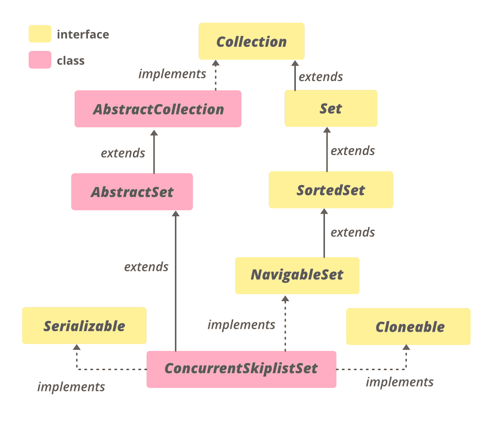

# Java 中的 ConcurrentSkipListSet 示例

> 原文:[https://www . geeksforgeeks . org/concurrentskiplistset-in-Java-with-examples/](https://www.geeksforgeeks.org/concurrentskiplistset-in-java-with-examples/)

Java 中的 **ConcurrentSkipListSet** 类是 [Java 集合框架](https://www.geeksforgeeks.org/collections-in-java-2/)的一部分，实现了**集合接口**和**抽象集类**。它提供了 Java 中[navigatable set 的可扩展并发版本](https://www.geeksforgeeks.org/navigableset-java-examples/)。ConcurrentSkipListSet 的实现基于**concurrentskiplistsmap**。ConcurrentSkipListSet 中的元素默认按照它们的自然顺序进行排序，或者通过在集合创建时提供的[比较器](https://www.geeksforgeeks.org/comparator-interface-java/)进行排序，这取决于所使用的构造函数。

由于它实现了**sorted set<E>****navigatableset<E>**，所以它类似于 [TreeSet](https://www.geeksforgeeks.org/treeset-in-java-with-examples/) ，增加了并发的特性。因为它是线程安全的，所以可以由多个线程同时使用，而 TreeSet 不是线程安全的。

**等级等级:**



**申报:**

```
public class ConcurrentSkipListSet<E>
    extends AbstractSet<E>
        implements NavigableSet<E>, Cloneable, Serializable

Where E is the type of elements maintained by this collection

```

**ConcurrentSkipListSet 上的一些要点:**

*   它实现了**可序列化**、**可克隆**、**可迭代< E >** 、**集合<E>T7】、[导航集< E >](https://www.geeksforgeeks.org/navigableset-java-examples/) 、[集合< E >](https://www.geeksforgeeks.org/set-in-java/) 、[排序集< E >](https://www.geeksforgeeks.org/sortedset-java-examples/) 接口。**
*   它不允许空元素，因为空参数和返回值不能与没有元素可靠地区分开。
*   它的实现为包含、添加和移除操作及其变体提供了平均日志(n)时间成本。
*   它是线程安全的。
*   当需要对集合进行并发修改时，应该优先于实现[集合](https://www.geeksforgeeks.org/set-in-java/)接口。

**施工人员:**

**1。ConcurrentSkipListSet()** :此构造函数用于构造一个空集合。

> ConcurrentSkipListSet <e>set =新 concurrents kiplistset<e>()；</e></e>

**2。ConcurrentSkipListSet(Collection<E>c)**:这个构造函数用来构造一个集合，集合的元素作为参数传递。

> concurrents kiplistset<e>set =新 ConcurrentSkipListSet <e>(集合<e>c)；</e></e></e>

**3。ConcurrentSkipListSet(比较器< E >比较器)**:这个构造函数用于构造一个新的空集合，它根据指定的比较器对其元素进行排序。

> concurrents kiplistset<e>set =新 ConcurrentSkipListSet <e>(比较者<e>比较者)；</e></e></e>

**4。ConcurrentSkipListSet(sorted set)<E>s)**:这个构造函数用来构造一个新的集合，这个集合包含相同的元素，并且使用与指定的排序集合相同的顺序。

> concurrents kiplistset<e>set =新 concurrents kiplistset<e>(sort dset<e>s)；</e></e></e>

**例 1:**

## Java 语言(一种计算机语言，尤用于创建网站)

```
// Java program to demonstrate ConcurrentSkipListSet

import java.util.*;
import java.util.concurrent.ConcurrentSkipListSet;

class ConcurrentSkipListSetLastExample1 {
    public static void main(String[] args)
    {

        // Initializing the set using
        // ConcurrentSkipListSet()
        ConcurrentSkipListSet<Integer> set
            = new ConcurrentSkipListSet<Integer>();

        // Adding elements to this set
        set.add(78);
        set.add(64);
        set.add(12);
        set.add(45);
        set.add(8);

        // Printing the ConcurrentSkipListSet
        System.out.println("ConcurrentSkipListSet: " + set);

        // Initializing the set using
        // ConcurrentSkipListSet(Collection)
        ConcurrentSkipListSet<Integer> set1
            = new ConcurrentSkipListSet<Integer>(set);

        // Printing the ConcurrentSkipListSet1
        System.out.println("ConcurrentSkipListSet1: "
                           + set1);

        // Initializing the set using
        // ConcurrentSkipListSet()
        ConcurrentSkipListSet<String> set2
            = new ConcurrentSkipListSet<>();

        // Adding elements to this set
        set2.add("Apple");
        set2.add("Lemon");
        set2.add("Banana");
        set2.add("Apple");

        // creating an iterator
        Iterator<String> itr = set2.iterator();

        System.out.print("Fruits Set: ");
        while (itr.hasNext()) {
            System.out.print(itr.next() + " ");
        }
    }
}
```

**输出:**

```
ConcurrentSkipListSet: [8, 12, 45, 64, 78]
ConcurrentSkipListSet1: [8, 12, 45, 64, 78]
Fruits Set: Apple Banana Lemon 
```

**例 2:**

## Java 语言(一种计算机语言，尤用于创建网站)

```
// Java program to demonstrate ConcurrentSkipListSet

import java.util.concurrent.ConcurrentSkipListSet;

class ConcurrentSkipListSetLastExample1 {

    public static void main(String[] args)
    {

        // Initializing the set using ConcurrentSkipListSet()
        ConcurrentSkipListSet<Integer>
            set = new ConcurrentSkipListSet<Integer>();

        // Adding elements to this set
        // using add() method
        set.add(78);
        set.add(64);
        set.add(12);
        set.add(45);
        set.add(8);

        // Printing the ConcurrentSkipListSet
        System.out.println("ConcurrentSkipListSet: "
                           + set);

        // Printing the highest element of the set
        // using last() method
        System.out.println("The highest element of the set: "
                           + set.last());

        // Retrieving and removing first element of the set
        System.out.println("The first element of the set: "
                           + set.pollFirst());

        // Checks if 9 is present in the set
        // using contains() method
        if (set.contains(9))
            System.out.println("9 is present in the set.");
        else
            System.out.println("9 is not present in the set.");

        // Printing the size of the set
        // using size() method
        System.out.println("Number of elements in the set = "
                           + set.size());
    }
}
```

**输出:**

```
ConcurrentSkipListSet: [8, 12, 45, 64, 78]
The highest element of the set: 78
The first element of the set: 8
9 is not present in the set.
Number of elements in the set = 4
```

### ConcurrentSkipListSet 的方法

<figure class="table">

| 

方法

 | 

描述

 |
| --- | --- |
| [加(E e)](https://www.geeksforgeeks.org/concurrentskiplistset-add-method-in-java/#:~:text=add()%20method%20is%20an,an%20element%20in%20this%20set.&text=Parameters%3A%20The%20function%20accepts%20a,returns%20a%20True%20boolean%20value.) | 如果指定的元素尚不存在，则将该元素添加到该集合中。 |
| [天花板(东 e)](https://www.geeksforgeeks.org/concurrentskiplistset-ceiling-method-in-java/) | 返回该集合中大于或等于给定元素的最少元素，如果没有这样的元素，则返回 null。 |
| [晴()](https://www.geeksforgeeks.org/concurrentskiplistset-clear-method-in-java/) | 从该集中移除所有元素。 |
| [克隆()](https://www.geeksforgeeks.org/concurrentskiplistset-clone-method-in-java/) | 返回此 ConcurrentSkipListSet 实例的浅拷贝。 |
| [比较器()](https://www.geeksforgeeks.org/concurrentskiplistset-comparator-method-in-java-with-examples/) | 返回用于对该集合中的元素进行排序的比较器，如果该集合使用其元素的自然排序，则返回 null。 |
| [包含(对象 o)](https://www.geeksforgeeks.org/concurrentskiplistset-contains-method-in-java/) | 如果此集合包含指定的元素，则返回 true。 |
| [下降畸胎()](https://www.geeksforgeeks.org/concurrentskiplistset-descendingiterator-method-in-java/) | 以降序返回该集合中元素的迭代器。 |
| [下降集()](https://www.geeksforgeeks.org/concurrentskiplistset-descendingset-method-in-java/) | 返回此集合中包含的元素的逆序视图。 |
| [等于(对象 o)](https://www.geeksforgeeks.org/concurrentskiplistset-equals-method-in-java/) | 将指定的对象与此相等集进行比较。 |
| [第一个()](https://www.geeksforgeeks.org/concurrentskiplistset-first-method-in-java/) | 返回当前集合中的第一个(最低的)元素。 |
| [楼层(东 e)](https://www.geeksforgeeks.org/concurrentskiplistset-floor-method-in-java/) | 返回该集合中小于或等于给定元素的最大元素，如果没有这样的元素，则返回 null。 |
| [耳机(和托儿)](https://www.geeksforgeeks.org/concurrentskiplistset-headset-method-in-java/) | 返回该集合中元素严格小于 toElement 的部分的视图。 |
| [头戴式耳机(E toElement，含布尔型)](https://www.geeksforgeeks.org/concurrentskiplistset-headset-method-in-java/) | 返回该集合中元素小于(或等于，如果包含为真)toElement 的部分的视图。 |
| [更高(E e)](https://www.geeksforgeeks.org/concurrentskiplistset-higher-method-in-java/) | 返回该集合中严格大于给定元素的最小元素，如果没有这样的元素，则返回 null。 |
| [【isempty()](https://www.geeksforgeeks.org/concurrentskiplistset-isempty-method-in-java/) | 以升序返回该集合中元素的迭代器。 |
| [最后()](https://www.geeksforgeeks.org/concurrentskiplistset-last-method-in-java/) | 返回当前集合中的最后一个(最高的)元素。 |
| [下降(E e)](https://www.geeksforgeeks.org/concurrentskiplistset-lower-method-in-java-with-examples/) | 返回该集合中严格小于给定元素的最大元素，如果没有这样的元素，则返回 null。 |
| [pollFirst()](https://www.geeksforgeeks.org/concurrentskiplistset-pollfirst-method-in-java/) | 检索并移除第一个(最低的)元素，如果该集合为空，则返回 null。 |
| [pollLast()](https://www.geeksforgeeks.org/concurrentskiplistset-polllast-method-in-java/) | 检索并移除最后一个(最高的)元素，如果该集合为空，则返回 null。 |
| [移除(物体 o)](https://www.geeksforgeeks.org/concurrentskiplistset-remove-method-in-java/#:~:text=concurrent.,is%20present%20in%20this%20set.&text=Parameters%3A%20The%20function%20accepts%20a,the%20object%20to%20be%20removed.) | 如果存在指定的元素，则从该集中移除该元素。 |
| [移除所有(集合<？> c)](https://www.geeksforgeeks.org/concurrentskiplistset-removeall-method-in-java/) | 从该集合中移除指定集合中包含的所有元素。 |
| [尺寸()](https://www.geeksforgeeks.org/concurrentskiplistset-size-method-in-java/) | 返回该集合中的元素数量。 |
| [分流器()](https://www.geeksforgeeks.org/concurrentskiplistset-spliterator-method-in-java/) | 返回此集合中元素的拆分器。 |
| [子集(E fromElement，布尔型](https://www.geeksforgeeks.org/concurrentskiplistset-subset-method-in-java/)

[包容性的奶酪，以及托勒密元素，布尔型的托勒密】](https://www.geeksforgeeks.org/concurrentskiplistset-subset-method-in-java/) | 返回该集合中元素范围从“从元素”到“到元素”的部分的视图。 |
| [子集(E fromElement，E toElement)](https://www.geeksforgeeks.org/concurrentskiplistset-subset-method-in-java/) | 返回该集合的一部分的视图，该集合的元素范围为从元素(包含)到元素(不包含)。 |
| [尾集(E fromElement)](https://www.geeksforgeeks.org/concurrentskiplistset-tailset-method-in-java-with-examples/) | 返回该集合中元素大于或等于 fromElement 的部分的视图。 |
| [tailSet(E fromElement，布尔型，含)](https://www.geeksforgeeks.org/concurrentskiplistset-tailset-method-in-java-with-examples/) | 返回该集合中元素大于(或等于，如果包含为真)fromElement 的部分的视图。 |

</figure>

### 从 java.util.AbstractSet 类继承的方法

<figure class="table">

| 

方法

 | 

描述

 |
| --- | --- |
| [hashCode()](https://www.geeksforgeeks.org/abstractset-hashcode-method-in-java-with-examples/) | 返回该集合的哈希代码值。 |

</figure>

### 从 java.util.AbstractCollection 类继承的方法

<figure class="table">

| 

方法

 | 

描述

 |
| --- | --- |
| [addAll(收藏<？延伸 E > c)](https://www.geeksforgeeks.org/abstractcollection-addall-method-in-java-with-examples/) | 将指定集合中的所有元素添加到此集合中(可选操作)。 |
| [包含所有(收藏<？> c)](https://www.geeksforgeeks.org/abstractcollection-containsall-method-in-java-with-examples/) | 如果此集合包含指定集合中的所有元素，则返回 true。 |
| [零售(收藏<？> c)](https://www.geeksforgeeks.org/abstractcollection-retainall-method-in-java-with-examples/) | 仅保留此集合中包含在指定集合中的元素(可选操作)。 |
| [toaarray()](https://www.geeksforgeeks.org/abstractcollection-toarray-method-in-java-with-examples/) | 返回包含此集合中所有元素的数组。 |
| [toaarray(t[]a)](https://www.geeksforgeeks.org/abstractcollection-toarray-method-in-java-with-examples/) | 返回包含此集合中所有元素的数组；返回数组的运行时类型是指定数组的运行时类型。 |
| [toString()](https://www.geeksforgeeks.org/abstractcollection-tostring-method-in-java-with-examples/) | 返回此集合的字符串表示形式。 |

</figure>

### 从接口 java.util.Set 继承的方法

<figure class="table">

| 

方法

 | 

描述

 |
| --- | --- |
| [addAll(收藏<？延伸 E > c)](https://www.geeksforgeeks.org/set-addall-method-in-java-with-examples/) | 如果指定集合中的所有元素尚不存在，则将它们添加到该集合中(可选操作)。 |
| [包含所有(收藏<？> c)](https://www.geeksforgeeks.org/set-containsall-method-in-java-with-examples/) | 如果此集合包含指定集合的所有元素，则返回 true。 |
| [hashCode()](https://www.geeksforgeeks.org/set-hashcode-method-in-java-with-examples/) | 返回该集合的哈希代码值。 |
| [零售(收藏<？> c)](https://www.geeksforgeeks.org/set-retainall-method-in-java-with-example/) | 仅保留该集合中包含在指定集合中的元素(可选操作)。 |
| [toaarray()](https://www.geeksforgeeks.org/set-toarray-method-in-java-with-example/) | 返回包含该集合中所有元素的数组。 |
| [toaarray(t[]a)](https://www.geeksforgeeks.org/set-toarray-method-in-java-with-example/) | 返回包含该集合中所有元素的数组；返回数组的运行时类型是指定数组的运行时类型。 |

</figure>

### 从接口 java.util.Collection 继承的方法

<figure class="table">

| 

方法

 | 

描述

 |
| --- | --- |
| 并行流() | 以此集合为源返回一个可能并行的流。 |
| 移除 If(谓词 super E>过滤器) | 移除此集合中满足给定谓词的所有元素。 |
| 流() | 返回以此集合为源的顺序流。 |

</figure>

### 从接口 java.lang.Iterable 继承的方法

<figure class="table">

| 

方法

 | 

描述

 |
| --- | --- |
| [forEach(消费者<？超 T >动作)](https://www.geeksforgeeks.org/iterable-foreach-method-in-java-with-examples/) | 对 Iterable 的每个元素执行给定的操作，直到所有元素都被处理完或者该操作引发异常。 |

</figure>