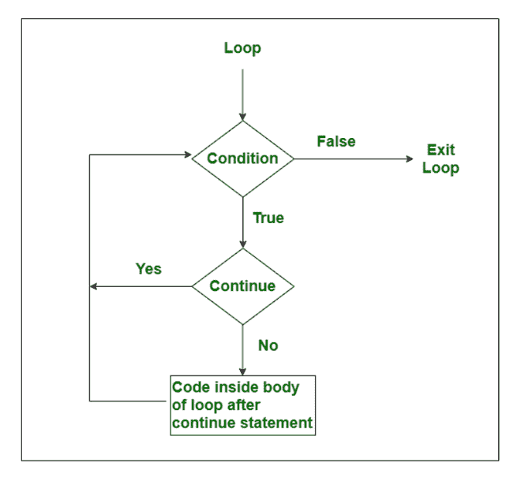

# 用 Java 继续语句

> 原文:[https://www.geeksforgeeks.org/continue-statement-in-java/](https://www.geeksforgeeks.org/continue-statement-in-java/)

假设一个人想要代码按照代码被设计执行的值来执行，但是同样的用户想要强行跳过代码应该按照上面的设计执行但不会按照用户的要求执行的执行。简单来说就是一个根据用户需求的[决策](https://www.geeksforgeeks.org/decision-making-javaif-else-switch-break-continue-jump/)问题。

**真实例子:**


> 假设一个人正爬上 11 级楼梯去他家。他急着爬上去，直接上了 3 个楼梯，然后是 4、5、6、7、8、9，跳到最后一个。在此期间，他错过了 1 号、2 号和 10 号楼梯，完成了回家的目标。他跳过楼梯继续他的旅程。他的选择。
> 
> 在计算机中，它将被跳过的楼梯解释为“继续”。不管是哪种编程语言，错过应该执行的执行的动作都被解释为 continue 语句。

[Continue](https://www.geeksforgeeks.org/decision-making-javaif-else-switch-break-continue-jump/) 语句在循环控制结构内部的编程语言中经常使用。在循环中，**当遇到 continue 语句时，控件直接跳到下一次迭代的循环开始处，而不是执行当前迭代的语句。**当我们想要跳过一个特定的条件并继续剩余的执行时，使用 continue 语句。Java continue 语句用于所有类型的 od 循环，但它通常用于 for、while 和 do-while 循环。

*   在 for 循环的情况下，continue 关键字强制控件立即跳转到 update 语句。
*   而在 while 循环或 do-while 循环的情况下，控制会立即跳转到布尔表达式。

**语法:**继续关键字和分号

```java
continue;
```

**继续语句流程图**



以上[流程图](https://www.geeksforgeeks.org/an-introduction-to-flowcharts/)对于这个关键词的理解最为重要。始终记住条件始终放在菱形框内，语句放在矩形框内。现在跳到实现部分

**情况 1:继续循环内部语句**

在本程序中，演示如何在 for 循环中使用 continue 语句。当“I”的值变为 10 或 12 时，continue 语句发挥其作用并跳过它们的执行，但是对于“I”的其他值，循环将平稳运行。

## Java 语言(一种计算机语言，尤用于创建网站)

```java
// Java Program to illustrate the use of continue statement

// Importing Classes/Files
import java.util.*;
public class GFG {

    // Main driver method
    public static void main(String args[])
    {
        // For loop for iteration
        for (int i = 0; i <= 15; i++) {

            // Check condition for continue
            if (i == 10 || i == 12) {

                // Using continue statement to skip the
                // execution of loop when i==10 or i==12
                continue;
            }
            // Printing elements to show continue statement
            System.out.print(i + " ");
        }
    }
}
```

**输出:**

```java
0 1 2 3 4 5 6 7 8 9 11 13 14 15 
```

**情况 2:循环时继续内部语句**

在上面的程序中，我们给出了一个例子，如何在 While 循环中使用 continue 语句。当 count 的值变成 7 或 15 时，continue 语句发挥其作用并跳过它们的执行，但是对于 count 的其他值，循环将平稳运行。

## Java 语言(一种计算机语言，尤用于创建网站)

```java
// Java Program to illustrate the use of continue statement
// inside the While loop
public class GFG {

    // Main driver method
    public static void main(String args[])
    {
        // Initializing a variable say it count  to a value
        // greater than the value greater among the loop
        // values
        int count = 20;

        // While loop for iteration
        while (count >= 0) {
            if (count == 7 || count == 15) {
                count--;
                // Decrementing variable initialized above

                // Showing continue execution inside loop
                // skipping when count==7 or count==15
                continue;
            }

            // Printing values after continue statement
            System.out.print(count + " ");

            // Decrementing the count variable
            count--;
        }
    }
}
```

**输出:**

```java
20 19 18 17 16 14 13 12 11 10 9 8 6 5 4 3 2 1 0 
```

**情况 3:在 do while 循环中继续语句**

在上面的程序中，我们举了一个例子，如何在 do-While 循环中使用 continue 语句。当 I 的值变为 4 或 18 时，continue 语句发挥其作用并跳过它们的执行，但是对于 I 的其他值，循环将平稳运行。

## Java 语言(一种计算机语言，尤用于创建网站)

```java
// Java Program to illustrate the use of continue statement
// inside the Do-While loop

// Importing generic Classes/Files
import java.util.*;

public class GFG {

    // Main driver method
    public static void main(String[] args)
    {
        // Creating and Initializing a variable
        int i = 0;

        // Do-While loop for iteration
        do {
            if (i == 4 || i == 18) {

                // Incrementing loop variable by 2
                i += 2;

                // Illustrating continue statement skipping
                // the execution  when i==7 or i==15
                continue;
            }

            // Printing to showcase continue affect
            System.out.println(i);

            // Incrementing variable by 2
            i += 2;

            // Condition check
        } while (i <= 35);
    }
}
```

**输出:**

```java
0
2
6
8
10
12
14
16
20
22
24
26
28
30
32
34
```

**情况 4:在内部循环(嵌套循环)中继续语句**

在上面的程序中，我们给出了如何在嵌套循环中使用 continue 语句的例子。当 I 的值变为 3，j 变为 2 时，continue 语句发挥其作用并跳过它们的执行，但是对于 I 和 j 的其他值，循环将平稳运行。

## Java 语言(一种计算机语言，尤用于创建网站)

```java
// Java Program to illustrate the use of continue statement
// inside an inner loop or simply nested loops

// Importing generic Classes/Files
import java.util.*;

public class GFG {

    // Main drive method
    public static void main(String[] args)
    {
        // Outer loop for iteration
        for (int i = 1; i <= 4; i++) {

            // Inner loop for iteration
            for (int j = 1; j <= 3; j++) {
                if (i == 3 && j == 2) {

                    // Continue statement in inner loop to
                    // skip the execution when i==3 and j==2

                    continue;
                }

                // Print elements to showcase keyword affect
                System.out.println(i + " * " + j);
            }
        }
    }
}
```

**输出:**

```java
1 * 1
1 * 2
1 * 3
2 * 1
2 * 2
2 * 3
3 * 1
3 * 3
4 * 1
4 * 2
4 * 3
```