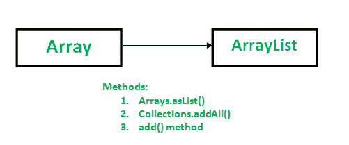

# Java 中数组到数组列表的转换

> 原文:[https://www . geesforgeks . org/Java 中数组到数组列表的转换/](https://www.geeksforgeeks.org/conversion-of-array-to-arraylist-in-java/)

以下方法可用于将数组转换为[数组列表](https://www.geeksforgeeks.org/arraylist-in-java/) :



**方法 1:使用 Arrays.asList()方法**

```java
 Syntax: public static List asList(T... a)
// Returns a fixed-size List as of size of given array. 
// Element Type of List is of same as type of array element type.
// It returns an List containing all of the elements in this 
// array in the same order. 
// T represents generics 
```

请注意，有一个数组参数和列表返回值。

*   返回由指定数组支持的固定大小列表。
*   返回的列表是可序列化的，并实现了随机访问。
*   由于返回的列表是固定大小的，因此我们不能在其中添加更多的元素，但是我们可以使用数组列表类中定义的 set(index，new element)方法用新元素替换现有元素。

## Java 语言(一种计算机语言，尤用于创建网站)

```java
// Java program to demonstrate conversion of
// Array to ArrayList of fixed-size.
import java.util.*;

class GFG
{
    public static void main (String[] args)
    {
        String[] geeks = {"Rahul", "Utkarsh",
                          "Shubham", "Neelam"};

        // Conversion of array to ArrayList
        // using Arrays.asList
        List al = Arrays.asList(geeks);

        System.out.println(al);
    }
}
```

输出:

```java
[Rahul, Utkarsh, Shubham, Neelam]
```

**如果我们在转换后的列表中添加更多元素会怎么样？**
由于返回的列表是固定大小的列表，因此我们无法添加更多元素。尝试添加更多元素将导致不支持操作异常。
考虑以下示例。

## Java 语言(一种计算机语言，尤用于创建网站)

```java
// Java program to demonstrate error
// if we add more element(s) to
// a fixed-size List.
import java.util.*;

class GFG
{
    public static void main (String[] args)
    {

        String[] geeks = {"Rahul", "Utkarsh",
                          "Shubham", "Neelam"};

        // Conversion of array to ArrayList
        // using Arrays.asList
        List al = Arrays.asList(geeks);
        System.out.println(al);

        // Adding some more values to the List.
        al.add("Shashank");
        al.add("Nishant");

        System.out.println(al);
    }
}
```

输出:

```java
[Rahul, Utkarsh, Shubham, Neelam]
```

运行时错误

```java
Exception in thread "main" java.lang.UnsupportedOperationException
    at java.util.AbstractList.add(AbstractList.java:148)
    at java.util.AbstractList.add(AbstractList.java:108)
    at GFG.main(File.java:16)
```

因此，建议创建新的数组列表，并将**ArrayList . aslist(数组引用)**作为参数传递给它(即作为数组列表的构造函数参数)。
考虑以下示例:

## Java 语言(一种计算机语言，尤用于创建网站)

```java
// Java program to demonstrate how to add
// one or more element(s) to returned
// resizable List.
import java.util.*;

class GFG
{
    public static void main (String[] args)
    {
        String[] geeks = {"Rahul", "Utkarsh",
                          "Shubham", "Neelam"};

        List<String> al =
            new ArrayList<String>(Arrays.asList(geeks));
        System.out.println(al);

        // Adding some more values to the List.
        al.add("Shashank");
        al.add("Nishant");

        System.out.println("\nArrayList After adding two" +
                           " more Geeks: ");
        System.out.println(al);
    }
}
```

```java
[Rahul, Utkarsh, Shubham, Neelam]

ArrayList After adding two more Geeks: 
[Rahul, Utkarsh, Shubham, Neelam, Nishant, Shashank]
```

&nbap;

**方法 2:使用 Collections.addAll()方法**

```java
Syntax: public static  boolean addAll(Collection c, T... a)
// Adds all of the specified elements to the specified collection.
// Elements to be added may be specified individually or as an array.
// T is generics
```

注意，有一个集合参数 **c** 要插入元素，数组参数 **a** 包含要插入到 **c** 的元素。
返回类型为布尔类型。如果集合因调用而改变，则返回 true。
如果集合 **c** 不支持 add 方法，则抛出 UnsupportedOperationException 如果元素(或数组的元素)中某个值的某个方面阻止其被添加到集合 **c** 中，则抛出 IllegalArgumentException。
考虑以下示例:

## Java 语言(一种计算机语言，尤用于创建网站)

```java
// Java program to demonstrate how to
// add all elements of array to arrayList.
import java.util.*;

class GFG
{
    public static void main (String[] args)
    {
        String[] geeks = {"Rahul", "Utkarsh",
                         "Shubham", "Neelam"};

        List<String> al = new ArrayList<String>();

        // adding elements of array to arrayList.
        Collections.addAll(al, geeks);

        System.out.println(al);
    }
}
```

输出:

```java
[Rahul, Utkarsh, Shubham, Neelam]
```

**将 null 添加到列表中**
注意:如果指定的集合或指定的数组为 null，那么它会抛出 NullpointerException。

## Java 语言(一种计算机语言，尤用于创建网站)

```java
// Adding null to a list
import java.util.*;

class GFG
{
    public static void main (String[] args)
    {
        String[] geeks = {"Rahul", "Utkarsh",
                         "Shubham", "Neelam"};

        List<String> al = new ArrayList<String>();
        Collections.addAll(null, geeks);

        System.out.println(al);
    }
}
```

**在列表末尾添加空值**

## Java 语言(一种计算机语言，尤用于创建网站)

```java
import java.util.*;

class GFG
{
    public static void main (String[] args)
    {
        String[] geeks = {"Rahul", "Utkarsh",
                          "Shubham", "Neelam"};

        List<String> al = new ArrayList<String>();
        Collections.addAll(al, null);

        System.out.println(al);
    }
}
```

运行时错误

```java
Exception in thread "main" java.lang.NullPointerException
    at java.util.Collections.addAll(Collections.java:5401)
    at GFG.main(File.java:11)
```

**方法三:使用 add()方法使用 Manual 方法转换 Array】**

如果我们不想使用 java 内置方法，我们可以使用这个方法。这是将所有数组元素添加到列表中的手动方法。

```java
Syntax: public boolean add(Object obj)
// Appends the specified element to the end of this list.
// Returns true.
```

## Java 语言(一种计算机语言，尤用于创建网站)

```java
// Java program to convert a ArrayList to
// an array using add() in a loop.
import java.util.*;

class GFG
{
    public static void main (String[] args)
    {
        String[] geeks = {"Rahul", "Utkarsh",
                          "Shubham", "Neelam"};

        List<String> al = new ArrayList<String>();

        // Array to ArrayList Conversion
        for (String geek : geeks)
            al.add(geek);

        System.out.println(al);
    }
}
```

输出:

```java
[Rahul, Utkarsh, Shubham, Neelam]
```

相关文章:[数组列表到数组的转换](https://www.geeksforgeeks.org/arraylist-array-conversion-java-toarray-methods/)
本文由 **Nitsdheerendra** 供稿。如果你喜欢 GeeksforGeeks 并想投稿，你也可以使用[write.geeksforgeeks.org](https://write.geeksforgeeks.org)写一篇文章或者把你的文章邮寄到 review-team@geeksforgeeks.org。看到你的文章出现在极客博客主页上，帮助其他极客。
如果发现有不正确的地方，或者想分享更多关于上述话题的信息，请写评论。