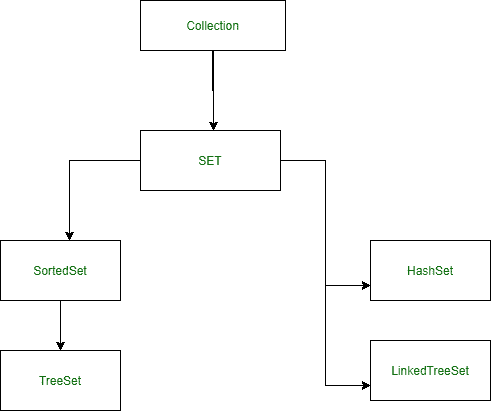

# 将数组转换为 Java 中的 HashSet

> 原文:[https://www . geesforgeks . org/convert-array-to-hashset-in-Java/](https://www.geeksforgeeks.org/convert-array-to-hashset-in-java/)

单一数据结构不能满足程序员的要求，这就是为什么在编程语言中有许多内置的数据结构。

[数组](https://www.geeksforgeeks.org/array-data-structure/)是大多数编程语言中最常用的数据结构。这种数据结构的优点是 O(1)在索引的帮助下访问数组的元素，但最常见的缺点是我们不能在创建后更改数组的大小，并且在数组中删除元素是一个复杂的过程。

[集合](https://www.geeksforgeeks.org/set-in-java/):在 Java 中，表示为单个单元的任何一组单个对象都称为对象的集合。在 Java 中，在 JDK 1.2 中定义了一个名为“集合框架”的独立框架，它包含所有的集合类和接口。集合分为两部分，排序集合和非排序集合各有优缺点。排序集，即 TreeSet 对其唯一的元素进行排序，但是 TreeSet 的时间复杂度是 O(N log N)，但是像 HashSet 和 LinkedSet 这样的未排序集确实会改变元素的顺序，但是 HashSet 和 LinkedSet 之间的区别在于其元素的随机顺序。



**示例:**

```
Input : Array: [1, 2, 3, 4, 5, 6]
Output: Set: [1, 2, 3, 4, 5, 6]

Input : Array: [a, b, c, d]
Output: Set: [a, b, c, d]
```

**方法:蛮力或天真法**

创建一个空集合(如果需要未排序的元素，则创建一个散列集合)迭代数组的元素，并逐一添加到集合中。

**示例:**

## Java 语言(一种计算机语言，尤用于创建网站)

```
// Convert array to HashSet in Java
import java.io.*;
import java.util.Iterator;
// Importing Set libraries
import java.util.Set;
import java.util.HashSet;

class GFG {
    // Function to convert array to set
    static Set<Integer> convert(int[] array)
    {
        // Hash Set Initialisation
        Set<Integer> Set = new HashSet<>();

        // Iteration using enhanced for loop
        for (int element : array) {
            Set.add(element);
        }
        // returning the set
        return Set;
    }

    // Function to print the set
    static void print(Set<Integer> Set)
    {
        // Implement to iterator the Set
        Iterator<Integer> _iterator = Set.iterator();

        // Iterate the elements of Set
        while (_iterator.hasNext()) {
            // print the element of the Set
            System.out.print(_iterator.next() + " ");
        }
    }
    public static void main(String[] args)

    {

        // Array taken for consideration
        int array[] = { 1, 2, 3, 4, 5, 6 };

        // Calling function to convert the array
        Set<Integer> Set = convert(array);

        // print the set
        print(Set);
    }
}
```

**Output**

```
1 2 3 4 5 6
```

**接近 2** :

**使用 Java 8 Stream API:** HashSet 构造函数可以取另一个集合对象来构造包含指定数组元素的新集合。

1.  获取要转换的数组。
2.  将数组转换为流
3.  使用收集器将流转换为集合
4.  使用 Collect()方法收集形成的集合
5.  返回形成的集合。

**示例:**

## Java 语言(一种计算机语言，尤用于创建网站)

```
// Convert Array to HashSet in Java

import java.util.*;
import java.util.stream.*;

class GFG {

    // Generic function to convert array to set
    public static <T> Set<T> convertArrayToSet(T array[])
    {
        // create a set from the Array
        return Arrays.stream(array).collect(
            Collectors.toSet());
    }

    public static void main(String args[])
    {
        // Create an Array
        String array[]
            = { "Geeks", "forGeeks", "A computer Portal" };

        // Print the Array
        System.out.println("Array: "
                           + Arrays.toString(array));

        // convert the Array to Set
        Set<String> set = convertArrayToSet(array);

        // Print the Set
        System.out.println("Set: " + set);
    }
}
```

**Output**

```
Array: [Geeks, forGeeks, A computer Portal]
Set: [A computer Portal, Geeks, forGeeks]
```