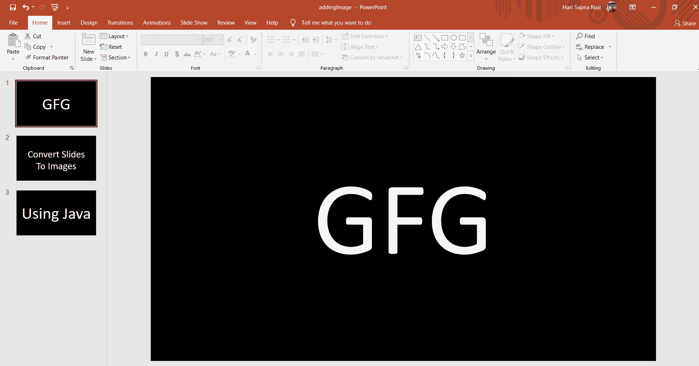

# 使用 Java 将 PPT 的幻灯片转换为图像

> 原文:[https://www . geeksforgeeks . org/使用 java 将 ppt 的幻灯片转换为图像/](https://www.geeksforgeeks.org/converting-the-slides-of-a-ppt-into-images-using-java/)

要将 PowerPoint 幻灯片转换为图像，需要多个包，如 java.awt，因为它包含创建用户界面和绘制图形和图像的所有类 java.io，因为它提供了一组输入流和一组输出流，用于向文件或其他输入和输出源读写数据 Apache POI，因为它用于使用 java 程序创建、修改和显示 Microsoft Office 文件。

**下载阿帕奇 POI**

1.  从[官方网站](https://poi.apache.org/download.html)下载 zip 文件。
2.  从 zip 文件中提取外部 jar 文件。
3.  添加外部 jar 文件。
    对于选择 Java 构建路径- >配置构建路径- >库- >类- >添加外部 Jars
4.  从所需的文件夹中选择 jar 文件
5.  单击应用并关闭。

**从爪哇进口**

1.  *java.awt.Color:* 这个类有改变界面中对象外观所需的颜色。
2.  *java.awt.Dimension* 它包含组件的高度和宽度。
3.  *java.awt.Graphics2D* 它提供了对几何图形、坐标转换、颜色管理和文本布局的控制。
4.  *Java . awt . geom . rectangle2d*它描述了一个由位置(x，y)和尺寸(w x h)定义的矩形。
5.  *Java . awt . image . bufferedimage*用于处理和操纵图像数据。

**从爪哇进口**

1.  *java.io.File:* 它包含了多种处理路径名、删除和重命名文件等方法。
2.  *java.io.FileInputStream:* 用于从文件中读取数据。
3.  *Java . io . File outputstream:*用于将数据写入文件。
4.  *java.io.IOException:* 它是一个异常，在代码中用于在输入和输出操作中引发故障

**从阿帕奇 POI 进口**

1.  *org . Apache . poi . xslf . user model . xmlslideshow:*用于创建读取或写入幻灯片显示的对象。
2.  *org . Apache . poi . xslf . user model . xslfslide:*用于创建和管理演示文稿中的幻灯片。

**实施:**

## Java 语言(一种计算机语言，尤用于创建网站)

```
// Converting the slides of a PPT into Images using Java
import java.util.List;

import java.awt.Color;
import java.awt.Dimension;
import java.awt.Graphics2D;
import java.awt.geom.Rectangle2D;
import java.awt.image.BufferedImage;

import java.io.File;
import java.io.FileInputStream;
import java.io.FileOutputStream;
import java.io.IOException;

import org.apache.poi.xslf.usermodel.XMLSlideShow;
import org.apache.poi.xslf.usermodel.XSLFSlide;

public class PPTToImages {

    public static void main(String args[])
        throws IOException
    {

        // create an empty presentation
        File file = new File("slides.pptx");
        XMLSlideShow ppt
            = new XMLSlideShow(new FileInputStream(file));

        // get the dimension and size of the slide
        Dimension pgsize = ppt.getPageSize();
        List<XSLFSlide> slide = ppt.getSlides();
        BufferedImage img = null;

        System.out.println(slide.size());

        for (int i = 0; i < slide.size(); i++) {
            img = new BufferedImage(
                pgsize.width, pgsize.height,
                BufferedImage.TYPE_INT_RGB);
            Graphics2D graphics = img.createGraphics();

            // clear area
            graphics.setPaint(Color.white);
            graphics.fill(new Rectangle2D.Float(
                0, 0, pgsize.width, pgsize.height));

            // draw the images
            slide.get(i).draw(graphics);
            FileOutputStream out = new FileOutputStream(
                "ppt_image" + i + ".png");
            javax.imageio.ImageIO.write(img, "png", out);
            ppt.write(out);
            out.close();
            System.out.println(i);
        }
        System.out.println("Image successfully created");
    }
}
```

**程序执行前:**



**程序执行后:**

