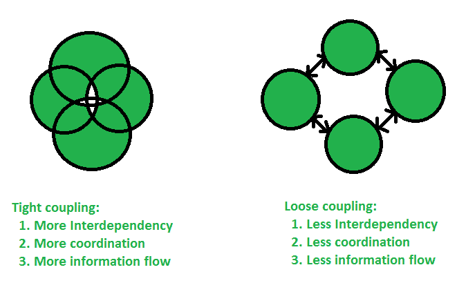

# Java 中的耦合

> 原文:[https://www.geeksforgeeks.org/coupling-in-java/](https://www.geeksforgeeks.org/coupling-in-java/)

在面向对象设计中，耦合指的是一个元素对另一个元素的直接了解程度。换句话说，A 类力的变化与 b 类力的变化有多频繁
**耦合有两种类型:**

1.  **Tight coupling :** In general, Tight coupling means the two classes often change together. In other words, if A knows more than it should about the way in which B was implemented, then A and B are tightly coupled.
    **Example :** If you want to change the skin, you would also have to change the design of your body as well because the two are joined together – they are tightly coupled. The best example of tight coupling is RMI(Remote Method Invocation).

    ```java
    // Java program to illustrate
    // tight coupling concept
    class Subject {
        Topic t = new Topic();
        public void startReading()
        {
            t.understand();
        }
    }
    class Topic {
        public void understand()
        {
            System.out.println("Tight coupling concept");
        }
    }
    ```

    **说明:**在上面的程序中，主题类依赖于主题类。在上面的程序中，主题类与主题类紧密耦合，这意味着如果主题类中的任何变化都需要主题类的变化。例如，如果 Topic 类的 understand()方法更改为 gotit()方法，那么您必须更改 startReading()方法将调用 gotit()方法，而不是调用 understand()方法。

    ```java
    // Java program to illustrate
    // tight coupling concept
    class Volume 
    {
         public static void main(String args[]) 
         {
             Box b = new Box(5,5,5);
             System.out.println(b.volume);
         }
    }
    class Box 
    {
         public int volume;
         Box(int length, int width, int height) 
         {
             this.volume = length * width * height;
         }
    }
    ```

    输出:

    ```java
    125

    ```

    **说明:**在上面的例子中，两个类之间有很强的相互依赖性。如果箱类有任何变化，则反映在类体积的结果中。

2.  **Loose coupling :** In simple words, loose coupling means they are mostly independent. If the only knowledge that class A has about class B, is what class B has exposed through its interface, then class A and class B are said to be loosely coupled. In order to over come from the problems of tight coupling between objects, spring framework uses dependency injection mechanism with the help of POJO/POJI model and through dependency injection its possible to achieve loose coupling.
    **Example :** If you change your shirt, then you are not forced to change your body – when you can do that, then you have loose coupling. When you can’t do that, then you have tight coupling. The examples of Loose coupling are Interface, JMS.

    ```java
    // Java program to illustrate 
    // loose coupling concept
    public interface Topic
    {
        void understand();
    }
    class Topic1 implements Topic {
    public void understand()
        {
            System.out.println("Got it");
        }
    } class Topic2 implements Topic {
    public void understand()
        {
            System.out.println("understand");
        }
    } public class Subject {
    public static void main(String[] args)
        {
            Topic t = new Topic1();
            t.understand();
        }
    }
    ```

    **说明:**在上例中，Topic1 和 Topic2 对象是松散耦合的。这意味着主题是一个接口，我们可以在运行时注入任何实现的类，并且我们可以向最终用户提供服务。

    ```java
    // Java program to illustrate
    // loose coupling concept
    class Volume 
    {
         public static void main(String args[]) 
         {
             Box b = new Box(5,5,5);
             System.out.println(b.getVolume());
         }
    }
    final class Box 
    {
         private int volume;
         Box(int length, int width, int height) 
         {
             this.volume = length * width * height;
         }
         public int getVolume() 
         { 
             return volume; 

         }
    }
    ```

    输出:

    ```java
    125

    ```

    **说明:**在上面的程序中，两个类之间没有依赖关系。如果我们改变盒子类中的任何东西，那么我们就不必改变体积类中的任何东西。

    **紧耦合和松耦合哪个更好？**

    总的来说，紧密耦合在大多数情况下是不好的，因为它降低了代码的灵活性和可重用性，使更改变得更加困难，阻碍了测试能力等。松耦合是更好的选择，因为当您的应用程序需要更改或增长时，松耦合会帮助您。如果您使用松散耦合的体系结构进行设计，那么当需求发生变化时，应用程序中只有少数部分会受到影响。
    **我们来看看紧耦合和松耦合的示意图:**
    

    **紧耦合和松耦合的区别**

    *   紧耦合不擅长测试能力。但是松耦合提高了测试能力。
    *   紧密耦合不提供接口的概念。但是松散耦合帮助我们遵循编程到接口的 GOF 原理，而不是实现。
    *   在紧耦合中，在两个类之间交换代码并不容易。但是在松散耦合中交换其他代码/模块/对象/组件要容易得多。
    *   紧耦合不具备变化能力。但是松耦合是高度可变的。

    本文由 [**比沙尔·库马尔·杜贝**](https://auth.geeksforgeeks.org/profile.php?user=Bishal Dubey) 供稿。如果你喜欢 GeeksforGeeks 并想投稿，你也可以使用[contribute.geeksforgeeks.org](http://www.contribute.geeksforgeeks.org)写一篇文章或者把你的文章邮寄到 contribute@geeksforgeeks.org。看到你的文章出现在极客博客主页上，帮助其他极客。

    如果你发现任何不正确的地方，或者你想分享更多关于上面讨论的话题的信息，请写评论。