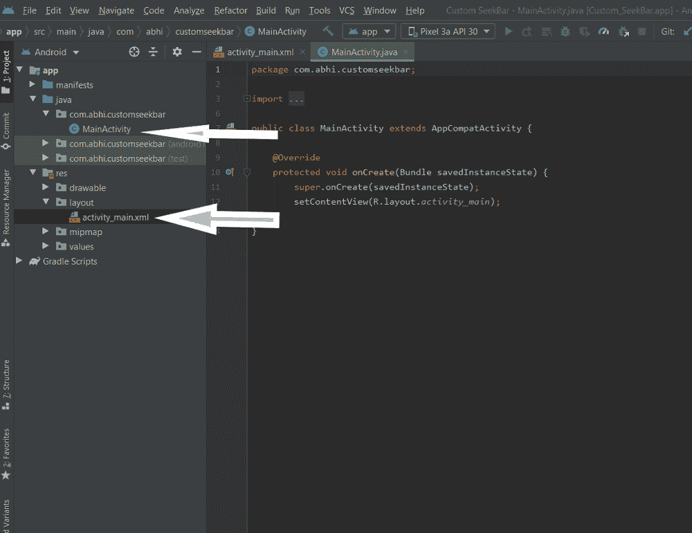
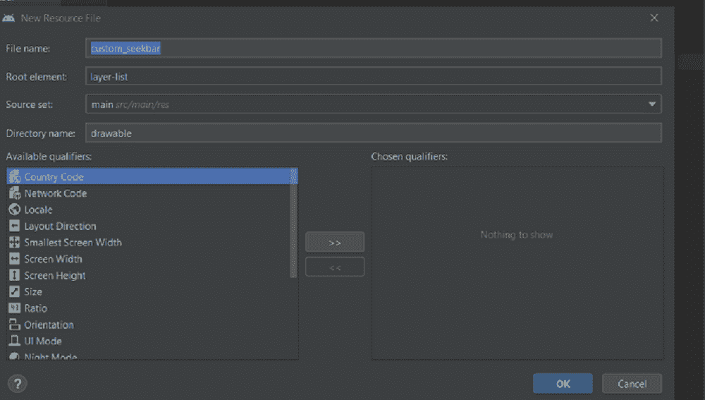
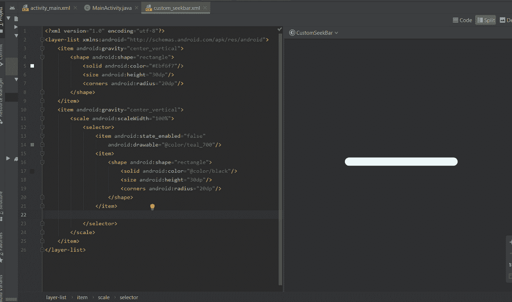
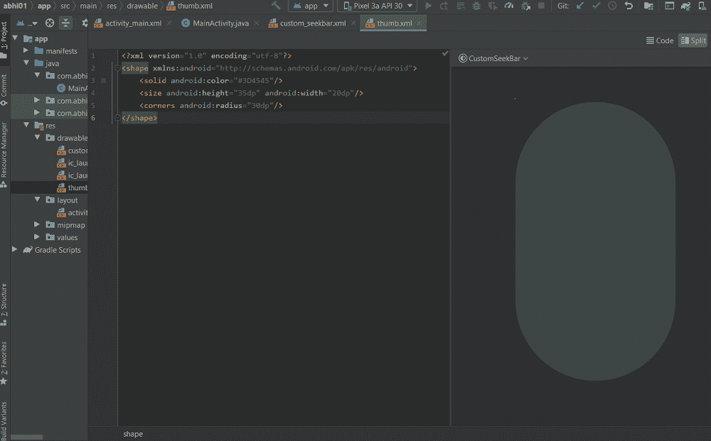
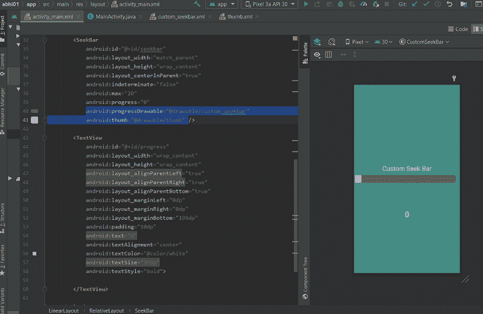
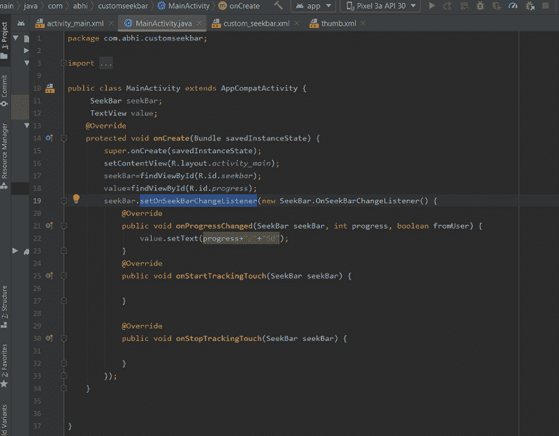

# 在安卓中创建自定义 SeekBar

> 原文:[https://www . geesforgeks . org/creating-custom-seekbar-in-Android/](https://www.geeksforgeeks.org/creating-custom-seekbar-in-android/)

[SeekBar](https://www.geeksforgeeks.org/android-creating-a-seekbar/) 可以理解为安卓中 [ProgressBar](https://www.geeksforgeeks.org/progressbar-in-kotlin/) 的扩展。您只需在 SeekBar 上拖动拇指，并将其向后或向前拖动，然后存储更改后的当前进度值。 **SeekBar** 广泛应用于音频播放器视频播放器等不同应用。可以实现安卓提供的传统 **SeekBar** 。在本文中，我们将看到如何定制 android SeekBar。为了创建一个自定义的搜索栏，首先我们将设计我们的搜索栏，为此我们将在可绘制的布局文件中添加搜索栏。我们也可以使用图片作为拇指，而不是创建一个布局，我们只需要把图片放在可绘制的其余东西将是一样的。

### **分步实施**

**第一步:创建新项目**

要在安卓工作室创建新项目，请参考[如何在安卓工作室创建/启动新项目](https://www.geeksforgeeks.org/android-how-to-create-start-a-new-project-in-android-studio/)。注意选择 **Java** 作为编程语言。

**第二步:**

等待一段时间，构建完成后，您将在 res **- >** 布局中看到一个**MainActivity.java**文件和一个名为 **activity_main.xml.** 的 XML 文件。我们将创建我们的自定义 SeekBar，并在我们的 **activity_main.xml.** 上实现它



**第三步:**

现在右击**可绘制- >新建- >可绘制资源文件**，将文件命名为 **custom_seekbar.xml** 和**T5】指定根元素为**图层-列表- >** 点击确定。将创建一个新文件 **custom_seekbar.xml****



**第四步:**

现在在**图层列表**内的**自定义 _seekbar.xml** 中，添加一个项目并给它一个形状。指定 SeekBar 的颜色、高度和角。此外，添加另一个相同形状和大小的项目，但您可以更改颜色，SeekBar 拇指的左侧部分将是这种颜色。



**第五步:**

现在再次点击**可绘制- >新建- >可绘制资源填充** e，将文件命名为 **thumb.xml** 并将根元素指定为**形状- >** 点击确定。将创建一个新文件 **thumb.xml** 。在这个文件中给出拇指的高度、半径和颜色。这些事情是可以改变的。这完全取决于你想如何设计。



**第六步:**

现在转到 **activity_main.xml** 创建一个布局，并在布局中添加一个 SeekBar。指定 SeekBar 的高度和宽度，以及要使用的最大进度。将进度设置为 0。

```
android:progressDrawable="@drawable/custom_seekbar"
android:thumb="@drawable/thumb" 
android:max="50"
android:progress="0"
```

这将在 **activity_main.xml** 中创建一个定制的 Seekbar。



**第七步:**

现在打开**MainActivity.java**类声明 SeekBar 和 TextView 的对象，在 onCreate 方法内部使用 findViewById()方法初始化这两个对象。在 SeekBar 变更监听器中执行一个保存进度值的事件，并使用该事件在[文本视图](https://www.geeksforgeeks.org/working-with-the-textview-in-android/)中设置进度值。

```
seekBar.setOnSeekBarChangeListener(new SeekBar.OnSeekBarChangeListener() {
            @Override
            // increment or decrement on process changed
            // increase the textsize
            // with the value of progress
            public void onProgressChanged(SeekBar seekBar, int progress, boolean fromUser) {
                value.setText(progress+"/"+"50");

            }..
```



**第 8 步**

构建并运行该应用程序。将拇指放在 Seekbar 上，向前或向后移动它，它将显示过程。

**上述实现的代码如下:**

以下是**MainActivity.java**文件的代码。代码中添加了注释，以更详细地理解代码。

## Java 语言(一种计算机语言，尤用于创建网站)

```
package com.abhi.customseekbar;

import androidx.appcompat.app.AppCompatActivity;

import android.os.Bundle;
import android.view.View;
import android.widget.SeekBar;
import android.widget.TextView;

public class MainActivity extends AppCompatActivity {
     SeekBar seekBar;
     TextView value;
    @Override
    protected void onCreate(Bundle savedInstanceState) {
        super.onCreate(savedInstanceState);
        setContentView(R.layout.activity_main);
        // initialize the seekBar object
        seekBar=findViewById(R.id.seekbar);
        value=findViewById(R.id.progress);
        // calling the seekbar event change listener
        seekBar.setOnSeekBarChangeListener(new SeekBar.OnSeekBarChangeListener() {
            @Override
            // increment or decrement on process changed
            // increase the textsize
            // with the value of progress
            public void onProgressChanged(SeekBar seekBar, int progress, boolean fromUser) {
                value.setText(progress+"/"+"50");            
            }
            @Override
            public void onStartTrackingTouch(SeekBar seekBar) {
                // This method will automatically
                // called when the user touches the SeekBar
            }

            @Override
            public void onStopTrackingTouch(SeekBar seekBar) {
                // This method will automatically
                // called when the user
                // stops touching the SeekBar
            }
        });
    }
}
```

下面是 **activity_main.xml** 文件的代码。

## 可扩展标记语言

```
<?xml version="1.0" encoding="utf-8"?>
<LinearLayout
    xmlns:android="http://schemas.android.com/apk/res/android"
    xmlns:app="http://schemas.android.com/apk/res-auto"
    xmlns:tools="http://schemas.android.com/tools"
    android:layout_width="match_parent"
    android:layout_height="match_parent"
    android:orientation="vertical"
    android:background="#458C85"
    tools:context=".MainActivity">

    <RelativeLayout
        android:id="@+id/Relative_1"
        android:layout_width="match_parent"
        android:layout_height="350dp"
        android:layout_weight="2">

        <TextView
            android:id="@+id/textViewSelectSizeOfArray"
            android:layout_width="273dp"
            android:layout_height="wrap_content"
            android:layout_above="@+id/seekbar"
            android:layout_alignParentStart="true"
            android:layout_alignParentEnd="true"

            android:layout_marginBottom="9dp"
            android:text="Custom Seek Bar"
            android:textAlignment="center"
            android:textColor="@color/white"
            android:textSize="25dp" />

        <SeekBar
            android:id="@+id/seekbar"
            android:layout_width="match_parent"
            android:layout_height="wrap_content"
            android:layout_centerInParent="true"
            android:indeterminate="false"
            android:max="50"
            android:progress="0"
            android:progressDrawable="@drawable/custom_seekbar"
            android:thumb="@drawable/thumb" />

        <TextView
            android:id="@+id/progress"
            android:layout_width="wrap_content"
            android:layout_height="wrap_content"
            android:layout_alignParentLeft="true"
            android:layout_alignParentRight="true"
            android:layout_alignParentBottom="true"
            android:layout_marginLeft="0dp"
            android:layout_marginRight="0dp"
            android:layout_marginBottom="199dp"
            android:padding="10dp"
            android:text="0"
            android:textAlignment="center"
            android:textColor="@color/white"
            android:textSize="30dp"
            android:textStyle="bold">

        </TextView>

    </RelativeLayout>

</LinearLayout>
```

下面是 **custom_seekbar.xml** 文件的代码。

## 可扩展标记语言

```
<?xml version="1.0" encoding="utf-8"?>
<layer-list xmlns:android="http://schemas.android.com/apk/res/android">
    <!-- color, size, shape height of seekbar -->
    <item android:gravity="center_vertical">
        <shape android:shape="rectangle">
            <solid android:color="#605A5C"/>
            <size android:height="30dp"/>
            <corners android:radius="9dp"/>
        </shape>
    </item>
    <!-- color, size, shape height of seekbar when u drag it-->
    <item android:gravity="center_vertical">
        <scale android:scaleWidth="100%">
            <selector>
                <item android:state_enabled="false"
                    android:drawable="@color/purple_200"/>
                <item>
                    <shape android:shape="rectangle">
                        <solid android:color="@color/black"/>
                        <size android:height="30dp"/>
                        <corners android:radius="9dp"/>
                    </shape>
                </item>
            </selector>
        </scale>
    </item>
</layer-list>
```

下面是 **thumb.xml** 文件的代码。

## 可扩展标记语言

```
<?xml version="1.0" encoding="utf-8"?>
<shape xmlns:android="http://schemas.android.com/apk/res/android">
    <solid android:color="@color/purple_200"/>
    <size android:height="30dp" android:width="25dp"/>
    <corners android:radius="5dp"/>
</shape>
```

**输出:**

<video class="wp-video-shortcode" id="video-692747-1" width="640" height="360" preload="metadata" controls=""><source type="video/mp4" src="https://media.geeksforgeeks.org/wp-content/uploads/20211005222118/WhatsApp-Video-2021-10-05-at-22.03.53.mp4?_=1">[https://media.geeksforgeeks.org/wp-content/uploads/20211005222118/WhatsApp-Video-2021-10-05-at-22.03.53.mp4](https://media.geeksforgeeks.org/wp-content/uploads/20211005222118/WhatsApp-Video-2021-10-05-at-22.03.53.mp4)</video>

**项目链接:** [点击此处](https://media.geeksforgeeks.org/wp-content/cdn-uploads/20211006224315/Custom_SeekBar-main.zip)