# 在 IntelliJ IDEA 中创建第一个 Java 应用程序

> 原文:[https://www . geesforgeks . org/creating-first-Java-application-in-intellij-idea/](https://www.geeksforgeeks.org/creating-first-java-application-in-intellij-idea/)

[IntelliJ IDEA](https://www.geeksforgeeks.org/step-by-step-guide-to-install-intellij-idea/) 是一个 Java IDE，是世界上 3 个最大、最受欢迎的 IDE 之一。它有两个版本，即免费开源社区版和付费终极版。IntelliJ IDEA 的一些特性如下:

*   IntelliJ IDEA 的两个版本都支持各种编程语言，如 Java、Scala、Kotlin、Groovy 等。
*   IntelliJ IDEA 中有很多功能可以让编程变得更简单，比如调试、代码完成、代码检查、XML 编辑支持、代码重构、单元测试、TestNG 等。
*   其他一些只在付费的 Ultimate 版本中提供的工具有重复检测、JavaScript 和数据库工具、Perforce 集成等。
*   IntelliJ IDEA 可以在 Linux、macOS 和 Windows 等平台上使用

**程序:**

1.  开始一个项目
2.  在项目中创建一个包，并为创建的包创建相应的类
3.  编写要在文本编辑器中执行的代码
4.  将以上项目打包到 [JAR](https://www.geeksforgeeks.org/jar-files-java/) 中
5.  测试应用程序
6.  执行上面的 JAR 文件

**实施:**

**第一步:**开始一个项目

*   当你第一次打开 IntelliJ 时，你会看到一个欢迎屏幕，有三个选项。在这三个选项中，点击新项目开始。
*   在下一个窗口中，您必须给出项目的名称
    *   *“GeeksForGeeks”*是一个自定义输入，在本文中用来说明。
*   如果您想使用额外的库或任何类型的模板，那么您可以从下拉菜单中选择一个选项来简化您的任务。
*   单击“完成”后，您的 IDE 将为您的项目创建一个虚拟环境。

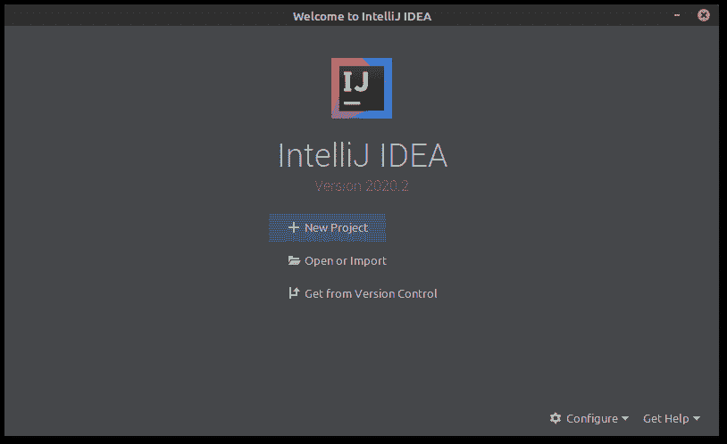

*   将项目命名为“极客”(您可以选择任何名称)，然后单击“完成”。

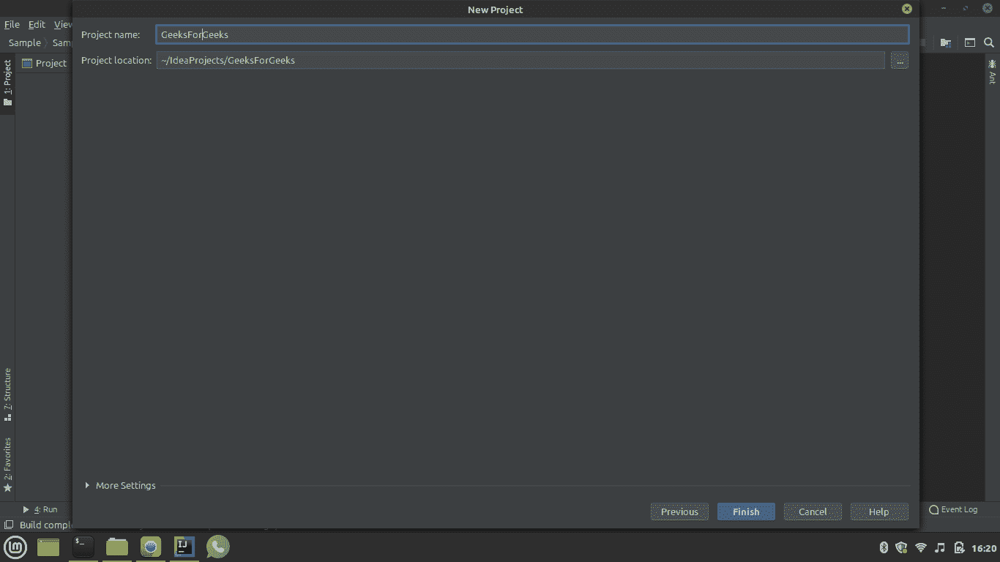

**步骤 2:** 在项目内部创建一个包，并创建与该包对应的类

*   在项目窗口的左侧，选择 **'** *src →新建→ java 类→写“geeksforgeeks . gfg”*
*   它将创建一个名为“*极客博客”*的项目，并创建一个“*极客博客”类。*

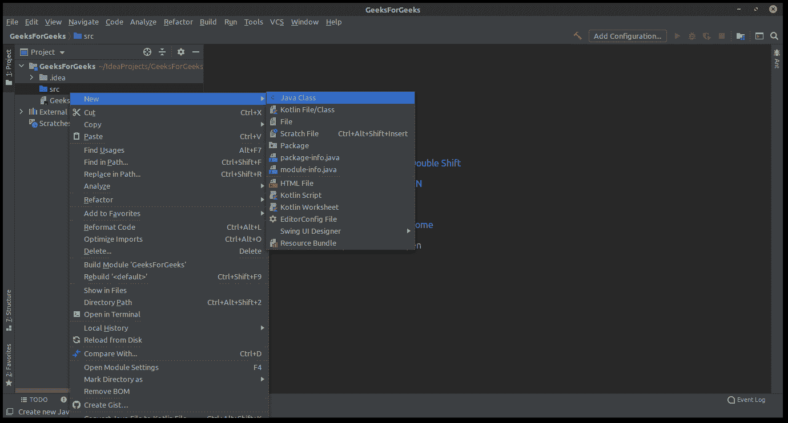

**第三步:**编写要在文本编辑器中执行的代码

> 在文本编辑器中编写一个只应该打印“*的演示程序这是我在 java 中的第一个项目”*程序成功编译运行后。

**例**

## Java 语言(一种计算机语言，尤用于创建网站)

```
// Java demo program to print message on the console

// Importing input output classes
import java.io.*;

// Class
public class Geeksforgeeks {

    // Main driver method
    public static void main(String[] args)
    {
        // Print and display on the console after
        // successful compilation and execution
        System.out.println(
            "This is my first project in java");
    }
}
```

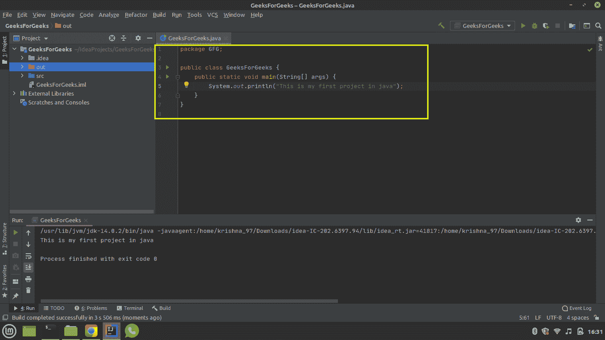

*   写完以上代码后，您可以检查它是否以退出代码“0”结束。

**第四步:**将上述项目打包到 [JAR](https://www.geeksforgeeks.org/jar-files-java/) 中

*   完成*编写部分后，您现在可以将应用程序打包到*一个* JAR 文件中。*
*   *选择*文件→项目结构→工件**

*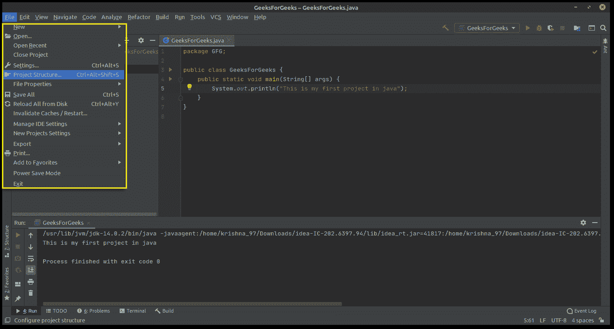*

*   *如下图所示，单击加号(+)。*

*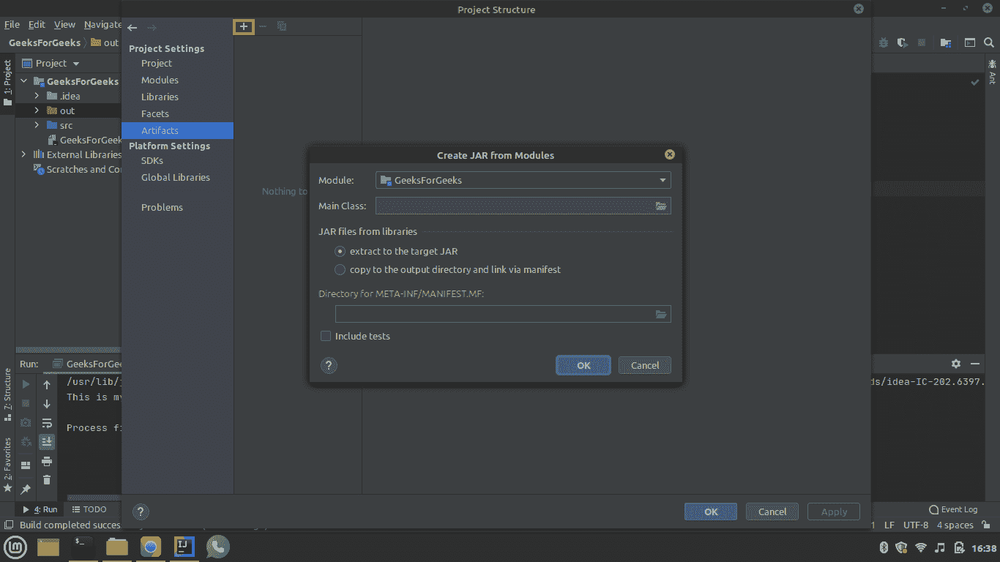*

*   *选择输出目录字段左侧的文件夹图标，并定义。jar 文件。*
*   *现在进入导航栏的*构建，从下拉列表中选择*构建工件*。**

**

***步骤 5-现在测试您的应用程序***

*   *现在，从右侧的字段中选择编辑配置，如下所示，用黄色框突出显示。*

*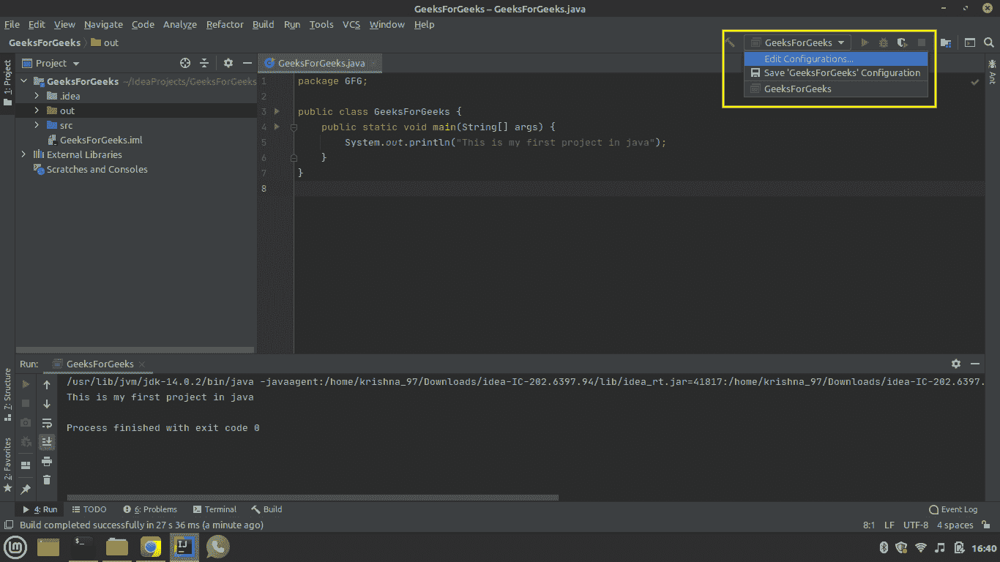*

*   *现在点击加号(+)并从菜单中选择 JAR 应用程序。在名称字段中，写下“ *GeeksForGeeksJar* ”。*
*   *从目录中选择“*极客 forgeeks . jar”*文件。*

*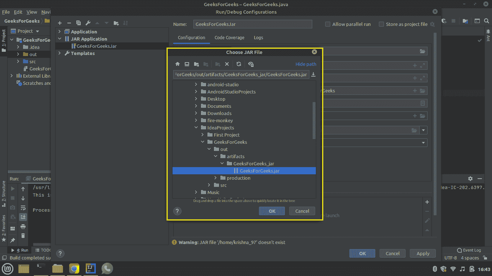*

*   *在 jar 路径字段中，单击文件夹符号并指定。jar 文件。*
*   *单击启动前字段中的加号(+)，然后从给定选项中选择构建工件。*

*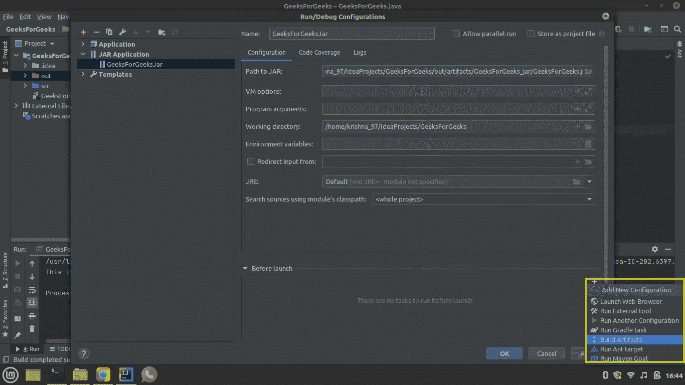*

*   *从菜单中选择 geesforgeks:jar，然后按 OK。*

*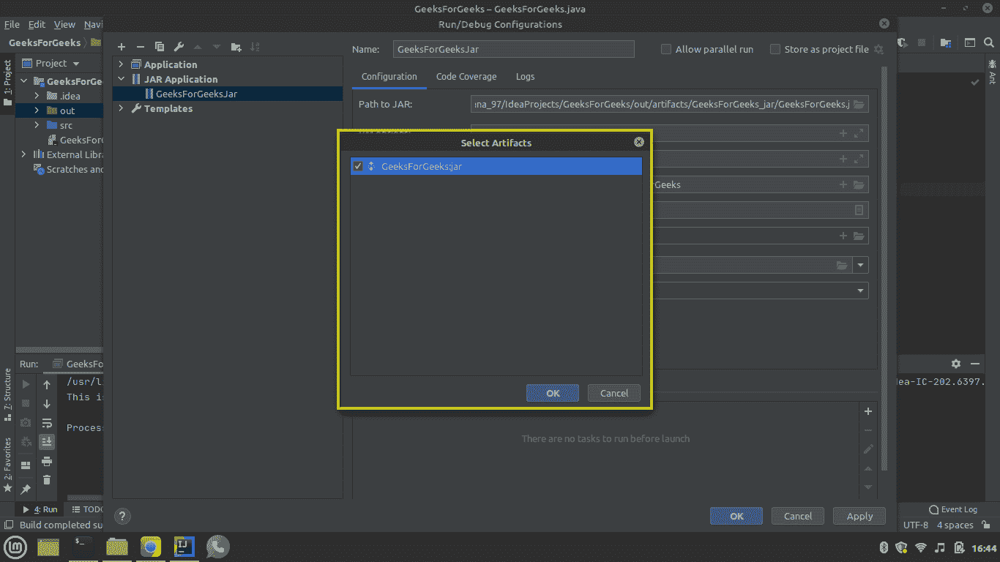*

***步骤 6:** 执行上面的 JAR 文件*

*   *从 IDE 右上角的工具栏中选择 GeeksForGeeks.jar 并运行。*
*   *如果流程成功执行，这意味着您的应用程序被正确打包，并且您已经完成了在 IntelliJ IDEA 中创建第一个 java 应用程序。*

*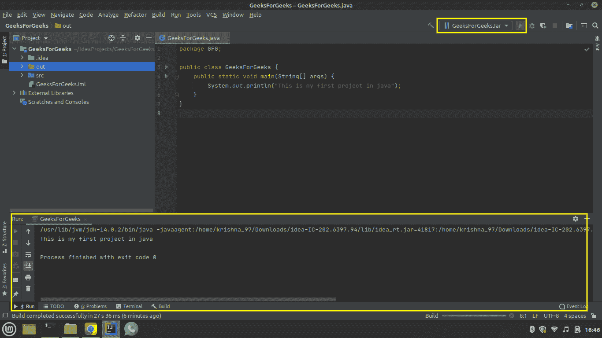*