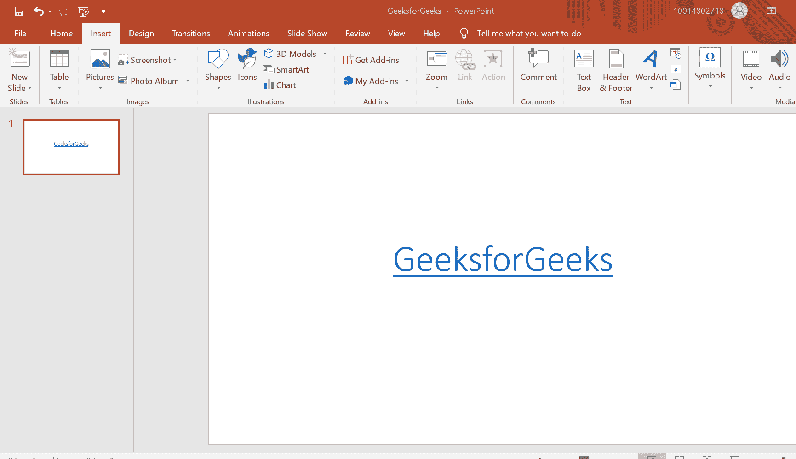

# 使用 Java 在 PPT 中的幻灯片上创建超链接

> 原文:[https://www . geesforgeks . org/creating-hyperlink-in-a-PPT-using-Java/](https://www.geeksforgeeks.org/creating-hyperlink-on-a-slide-in-a-ppt-using-java/)

[Apache POI](https://poi.apache.org/) 是一个功能强大的 API，用户可以使用 Java 程序基于 Microsoft Office 创建、操作和显示各种文件格式。使用兴趣点，应该能够对以下文件格式执行创建、修改和显示/读取操作。例如，Java 不提供使用 Presentation 文件的内置支持，因此我们需要为这项工作寻找开源 API。

它是由 Apache 软件基金会开发和分发的一个开源库，用于使用 Java 程序设计或修改 Microsoft Office 文件。它包含将用户输入数据或文件解码成微软办公文档的类和方法。

**Apache then architecture**

Apache POI 由各种组件组成，这些组件构成了一个架构，以形成一个工作系统:

POIFS(不良混淆实现文件系统)-该组件是所有其他 POI 元素的基本因素。它用于显式读取不同的文件。

*   HSSF(恐怖的电子表格格式)——用于读写微软 Excel 文件的 xls 格式。
*   它用于微软电子表格的 xlsx 文件格式。
*   HPSF(可怕的属性集格式)-它用于提取微软办公文件的属性集。
*   HWPF(恐怖文字处理器格式)——用于读写微软 Word 的文档扩展名文件。
*   XWPF(可扩展标记语言文字处理器格式)-用于读写微软 Word 的 Docx 扩展文件。
*   HSLF(可怕的幻灯片版式格式)——用于阅读、创建和编辑 PowerPoint 演示文稿。
*   HDGF(恐怖图表格式)——它包含微软 Visio 二进制文件的类和方法。
*   HPBF(恐怖发布者格式)-用于读写微软发布者文件。

**依赖关系:**

```
poi.ooxml
```

实施:

## Java 语言(一种计算机语言，尤用于创建网站)

```
// Creating Hyperlink on a slide in a PPT using Java

import java.io.File;
import java.io.FileOutputStream;
import java.io.IOException;

import org.apache.poi.xslf.usermodel.SlideLayout;
import org.apache.poi.xslf.usermodel.XMLSlideShow;
import org.apache.poi.xslf.usermodel.XSLFHyperlink;
import org.apache.poi.xslf.usermodel.XSLFSlide;
import org.apache.poi.xslf.usermodel.XSLFSlideLayout;
import org.apache.poi.xslf.usermodel.XSLFSlideMaster;
import org.apache.poi.xslf.usermodel.XSLFTextRun;
import org.apache.poi.xslf.usermodel.XSLFTextShape;

// Driver code
public class HyperlinkToPPT {
    public static void main(String args[])
        throws IOException
    {

        // create an empty presentation
        XMLSlideShow ppt = new XMLSlideShow();

        // getting the slide master object
        XSLFSlideMaster slideMaster
            = ppt.getSlideMasters()[0];

        // select a layout from specified list
        XSLFSlideLayout slidelayout = slideMaster.getLayout(
            SlideLayout.TITLE_AND_CONTENT);

        // creating a slide with title and content layout
        XSLFSlide slide = ppt.createSlide(slidelayout);

        // selection of title place holder
        XSLFTextShape body = slide.getPlaceholder(1);

        // clear the existing text in the slide
        body.clearText();

        // adding new paragraph
        XSLFTextRun textRun
            = body.addNewTextParagraph().addNewTextRun();

        // setting the text
        textRun.setText("GeeksforGeeks");

        // creating the hyperlink
        XSLFHyperlink link = textRun.createHyperlink();

        // setting the link address
        link.setAddress("https://www.geeksforgeeks.org/");

        // create the file object
        File file = new File("C:/poippt/hyperlink.pptx");
        FileOutputStream out = new FileOutputStream(file);

        // save the changes in a file
        ppt.write(out);
        System.out.println("sucsess!");
        out.close();
    }
}
```

**输出:**

