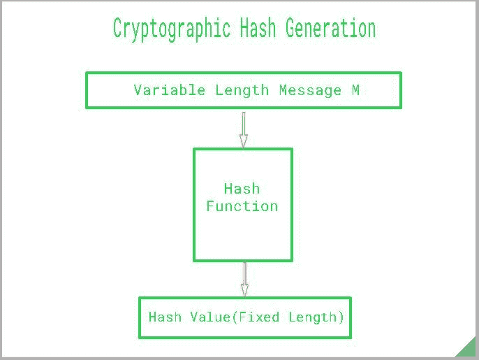
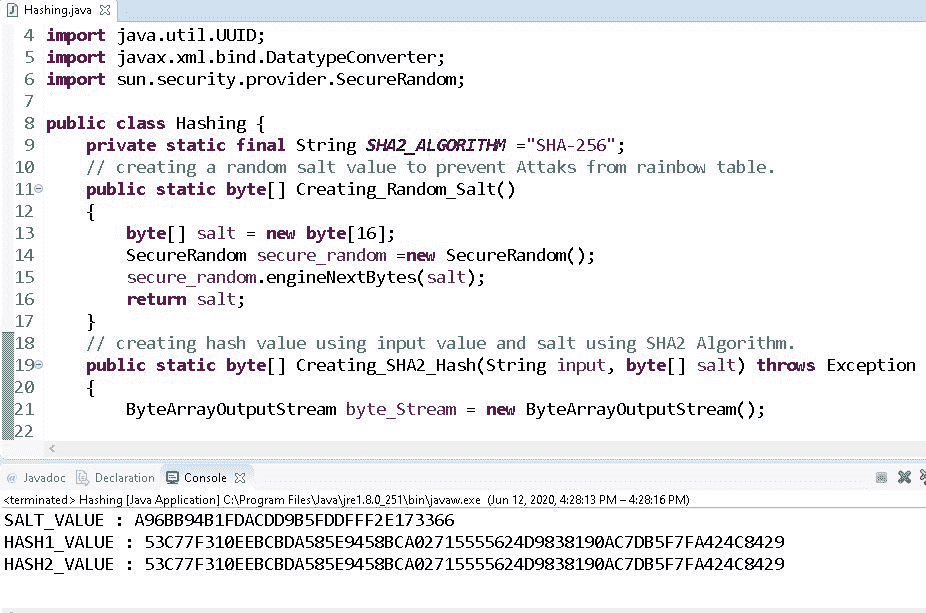

# Java 中的加密哈希函数

> 原文:[https://www . geesforgeks . org/crypto-hash-function-in-Java/](https://www.geeksforgeeks.org/cryptographic-hash-function-in-java/)

**加密哈希**是一个[哈希函数](https://www.geeksforgeeks.org/what-are-hash-functions-and-how-to-choose-a-good-hash-function/)，它接受随机大小的输入并产生固定大小的输出。计算简单，但检索原始数据具有挑战性。它很强大，很难用唯一的输入复制同一个散列，并且是单向函数，因此不可能进行恢复。哈希也有不同的名称，如摘要、[消息摘要](https://www.geeksforgeeks.org/messagedigest-getinstance-method-in-java-with-examples/)、[校验和](https://www.geeksforgeeks.org/implementing-checksum-using-java/)等。



### <u>加密散列函数的属性</u>

理想的加密哈希函数具有以下主要属性:

1.  **确定性:**这意味着相同的消息总是产生相同的散列。
2.  **Quick:** 可以快速计算任何给定消息的哈希值。
3.  **雪崩效应:**这意味着消息中的每一个微小变化都会导致哈希值的重大变化。
4.  **单向函数:**你不能通过逆向加密哈希函数来获取数据。
5.  **抗碰撞:**要找到产生相同哈希值的两条不同消息是不可行的。

### <u>破解哈希</u>

我们经常听到破解哈希这个术语，有几种方法可以做到这一点:

*   找到一个算法来生成两个散列之间的冲突。算法越先进，破解散列就越困难。
*   另一种方法是找到一种算法来识别将产生给定散列的唯一且不同的输入。它类似于碰撞，但我们不是碰撞，而是专注于使用算法找到输入。
*   从加密的角度来看，我们今天仍然使用的一些被认为是“破解”的常见哈希是 MD5(消息摘要算法)和 SHA-1(安全哈希算法 1)。请记住，从技术上讲，这些都是被破坏的哈希，永远不要用于您的安全目的。

### <u>如何创建加密哈希</u>

*   使用 secureandom 类创建随机盐值，secureandom 类生成强随机值。engineNextBytes(byte[] bytes)方法用于生成用户指定数量的随机字节。
*   使用 ByteArrayOutputStream 类将两组字节转换为一组字节，并将其创建为 ByteArray。
*   创建一个消息摘要的实例，该实例传递一个给定输入值的散列值。
*   UUID 用于生成随机数，该随机数被转换为字符串并作为输入传递。
*   可以使用 DatatypeConverter 将返回的对象转换为十六进制二进制格式。

## Java 语言(一种计算机语言，尤用于创建网站)

```
// Java program to demonstrate
// how to create a Hash

package java_cryptography;

import java.io.ByteArrayOutputStream;
import java.security.MessageDigest;
import java.util.UUID;
import javax.xml.bind.DatatypeConverter;
import sun.security.provider.SecureRandom;

public class Hashing {

    // Initializing the final string variable
    private static final String SHA2_ALGORITHM
        = "SHA-256";

    // Creating a random salt value to prevent
    // attacks from the Rainbow table.
    public static byte[] Creating_Random_Salt()
    {
        byte[] salt = new byte[16];
        SecureRandom secure_random
            = new SecureRandom();
        secure_random.engineNextBytes(salt);
        return salt;
    }

    // Creating hash value using input value
    // and salt using the SHA2 Algorithm.
    public static byte[] Creating_SHA2_Hash(
        String input, byte[] salt) throws Exception
    {
        ByteArrayOutputStream byte_Stream
            = new ByteArrayOutputStream();

        byte_Stream.write(salt);
        byte_Stream.write(input.getBytes());
        byte[] valueToHash
            = byte_Stream.toByteArray();
        MessageDigest messageDigest
            = MessageDigest
                  .getInstance(SHA2_ALGORITHM);
        return messageDigest
            .digest(valueToHash);
    }

    public static void main(String args[])
        throws Exception
    {

        // Calling the function Creating_Random_Salt()
        // to generate a random salt value
        byte[] salt = Creating_Random_Salt();
        System.out.println(
            "SALT_VALUE: "
            + DatatypeConverter.printHexBinary(salt));
        String valueToHash
            = UUID.randomUUID().toString();

        // Generating first hash with the salt
        byte[] hash1
            = Creating_SHA2_Hash(valueToHash, salt);

        // Generating second hash with exact salt
        // to check if we get the same hash.
        byte[] hash2
            = Creating_SHA2_Hash(valueToHash, salt);

        // Print first and the second hash value
        System.out.println(
            "HASH1_VALUE: "
            + DatatypeConverter
                  .printHexBinary(hash1));
        System.out.println(
            "HASH2_VALUE: "
            + DatatypeConverter
                  .printHexBinary(hash2));
    }
}
```

**注意:** Salt 是添加到输入数据(密码)中的随机值，用于防御预先计算的哈希攻击，如 Rainbow 表。

**输出:**

> salt _ value:a596 bb 94 B1 fdacdd 9b 5 fddfff 2 e 173366
> hash 1 _ value:53c 77 f 310 eebcbda 585 e 9458 BCA 02715555624d 9838190 AC 7db 7fa 424 c 8429
> hash 2 _ value:53c 77 f 310 eebcbda 585 e 9458 BCA 02715555624d 9838190 AC 7db 5fa 424 c 8429



### <u>如何创建加密哈希密码</u>

正如我们现在看到的如何生成哈希，让我们使用加密来哈希密码。不要使用损坏的哈希算法来哈希密码。Bcrypt 是基于[河豚密码](https://www.geeksforgeeks.org/blowfish-algorithm-with-examples/)的密码哈希函数。

**进场:**

*   将密码传递给位于 Bcrypt 类中的 hashpw 函数，该函数也可以自己生成 salt 并返回一个字符串。
*   使用 checkpw()函数验证密码哈希和密码是否真正匹配。它返回一个布尔值。

**代码:**

## Java 语言(一种计算机语言，尤用于创建网站)

```
// Java program to demonstrate
// how to hash a password

package java_cryptography;

import java.util.Scanner;
import org.springframework
    .security
    .crypto
    .bcrypt
    .BCrypt;

public class Hashing {

    // Creating a private instance
    // of Scanner class
    private static Scanner sc;

    // BCrypt is a password Hashing
    // Function based on Blowfish
    // Algorithm.
    public static String Password_Hash(
        String password)
    {
        return BCrypt.hashpw(
            password, BCrypt.gensalt());
    }

    // Verifying password with the
    // hashed password.
    public static boolean Verify_Password(
        String password,
        String hashed_password)
    {
        return BCrypt.checkpw(
            password, hashed_password);
    }

    public static void main(
        String args[]) throws Exception
    {

        // Scanner class instance connected
        // to the Input Stream(System.in)
        sc = new Scanner(System.in);

        System.out.println(
            "Enter the password: ");

        // Scanner class instance
        // reading the user input
        String p = sc.nextLine();

        // Generate hashed password
        String passwordHash
            = Password_Hash(p);

        // Print Hashed Password
        System.out.println(
            "Hashed-password: "
            + passwordHash);

        // Printing the result of verification
        // of hashed password
        // with original password
        System.out.println(
            "Verification: "
            + Verify_Password(
                  p, passwordHash));
    }
}
```

**输出:**

> **输入:**输入密码:GEEKS FOR GEEKS
> **输出:**哈希-密码:$ 2a $ 10 $ u6mfjykfr 76 nhgfhyyzjjoulei3ey。YxpQY4vKRHpKRCqz7w69RTa
> 验证:真实


### <u>散列使用</u>

*   数字签名。
*   数字指纹。
*   记录敏感数据。
*   保存密码。