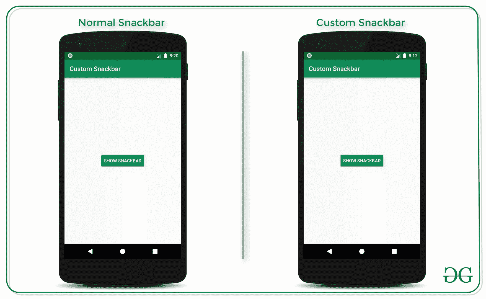
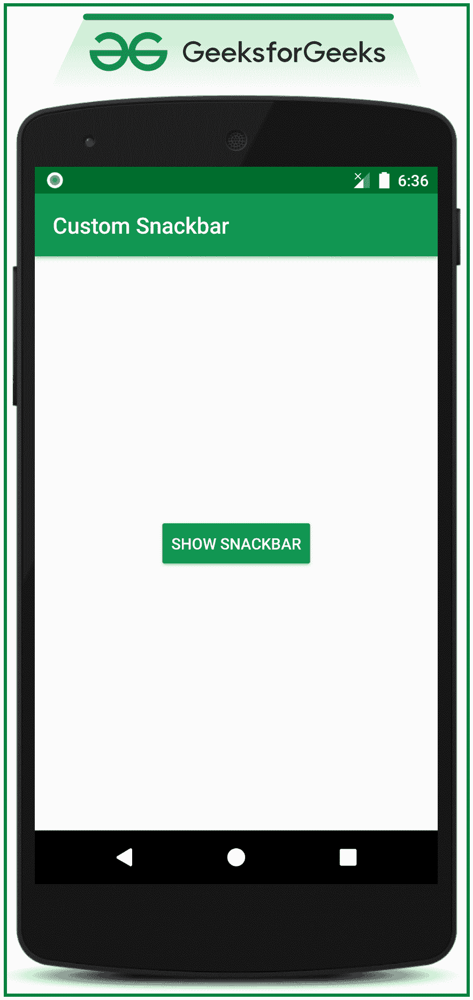

# 安卓中的自定义零食条

> 原文:[https://www.geeksforgeeks.org/custom-snackbars-in-android/](https://www.geeksforgeeks.org/custom-snackbars-in-android/)

[snackbar](https://www.geeksforgeeks.org/how-to-add-a-snackbar-in-android/)在用户体验中起着非常重要的作用。可以包含或不包含要做的动作按钮的小吃店立即显示由于用户交互而发生的消息。因此，在本文中，已经讨论了如何使用自定义布局来实现 SnackBars。请看下图，了解如何将定制 snackbar 与常规(普通)snackbar 区分开来。注意，我们将使用 **Java** 语言来实现这个项目。



## **在安卓系统中实现自定义滚动条的步骤**

**第一步:创建一个空的活动项目**

*   创建一个空的活动安卓工作室项目。并选择 JAVA 作为编程语言。
*   参考[安卓|如何在安卓工作室创建/启动新项目？](https://www.geeksforgeeks.org/android-how-to-create-start-a-new-project-in-android-studio/)了解如何创建一个空的活动安卓工作室项目。

**步骤 2:使用 activity_main.xml 文件**

*   这里的主布局只包括一个按钮，当点击该按钮时，将会显示自定义图标栏。
*   在 **activity_main.xml** 文件中调用以下代码。

## 可扩展标记语言

```
<?xml version="1.0" encoding="utf-8"?>
<RelativeLayout 
    xmlns:android="http://schemas.android.com/apk/res/android"
    xmlns:tools="http://schemas.android.com/tools"
    android:layout_width="match_parent"
    android:layout_height="match_parent"
    tools:context=".MainActivity"
    tools:ignore="HardcodedText">

    <Button
        android:id="@+id/showSnackbarButton"
        android:layout_width="wrap_content"
        android:layout_height="wrap_content"
        android:layout_centerInParent="true"
        android:backgroundTint="@color/colorPrimary"
        android:text="SHOW SNACKBAR"
        android:textColor="@android:color/white" />

</RelativeLayout>
```

### **输出界面:在仿真器上运行**



**步骤 3:为 Snackbar 创建自定义布局**

*   在布局文件夹下，为 SnackBar 创建一个布局，当在**MainActivity.java**文件下构建 SnackBar 时，需要对其进行膨胀。

## 可扩展标记语言

```
<?xml version="1.0" encoding="utf-8"?>
<RelativeLayout 
    xmlns:android="http://schemas.android.com/apk/res/android"
    xmlns:app="http://schemas.android.com/apk/res-auto"
    xmlns:tools="http://schemas.android.com/tools"
    android:layout_width="match_parent"
    android:layout_height="match_parent"
    tools:ignore="HardcodedText">

    <androidx.cardview.widget.CardView
        android:layout_width="match_parent"
        android:layout_height="wrap_content"
        android:layout_margin="8dp"
        android:elevation="4dp"
        app:cardBackgroundColor="@color/colorPrimaryDark"
        app:cardCornerRadius="4dp"
        app:cardPreventCornerOverlap="true"
        app:cardUseCompatPadding="true">

        <RelativeLayout
            android:layout_width="match_parent"
            android:layout_height="match_parent"
            android:padding="8dp">

            <ImageView
                android:id="@+id/imageView"
                android:layout_width="45dp"
                android:layout_height="45dp"
                android:layout_alignParentStart="true"
                android:src="@drawable/image_logo" />

            <TextView
                android:id="@+id/textView1"
                android:layout_width="wrap_content"
                android:layout_height="wrap_content"
                android:layout_marginStart="4dp"
                android:layout_toEndOf="@id/imageView"
                android:text="GeeksforGeeks"
                android:textAlignment="center"
                android:textColor="@android:color/white"
                android:textSize="18sp"
                android:textStyle="bold" />

            <TextView
                android:id="@+id/textView2"
                android:layout_width="wrap_content"
                android:layout_height="wrap_content"
                android:layout_below="@id/textView1"
                android:layout_marginStart="4dp"
                android:layout_toEndOf="@id/imageView"
                android:text="Computer Science Portal"
                android:textColor="@android:color/white"
                android:textSize="14sp" />

            <!--this view separates between button and the message-->
            <View
                android:layout_width="2dp"
                android:layout_height="45dp"
                android:layout_toStartOf="@id/gotoWebsiteButton"
                android:background="@android:color/white" />

            <Button
                android:id="@+id/gotoWebsiteButton"
                style="@style/Widget.MaterialComponents.Button.TextButton"
                android:layout_width="wrap_content"
                android:layout_height="wrap_content"
                android:layout_alignParentEnd="true"
                android:text="GOTO WEBSITE"
                android:textColor="@android:color/white"
                android:textSize="14sp" />

        </RelativeLayout>

    </androidx.cardview.widget.CardView>
</RelativeLayout>
```

**即产生** **以下视图:**


**步骤 4:使用 MainActivity.java 文件**

## Java 语言(一种计算机语言，尤用于创建网站)

```
import androidx.appcompat.app.AppCompatActivity;
import android.graphics.Color;
import android.os.Bundle;
import android.view.View;
import android.widget.Button;
import android.widget.Toast;
import com.google.android.material.snackbar.Snackbar;

public class MainActivity extends AppCompatActivity {

    Button bShowSnackbar;

    @Override
    protected void onCreate(Bundle savedInstanceState) {
        super.onCreate(savedInstanceState);
        setContentView(R.layout.activity_main);

        // register the button with appropriate ID
        bShowSnackbar = findViewById(R.id.showSnackbarButton);

        bShowSnackbar.setOnClickListener(new View.OnClickListener() {
            @Override
            public void onClick(View v) {

                // create an instance of the snackbar
                final Snackbar snackbar = Snackbar.make(v, "", Snackbar.LENGTH_LONG);

                // inflate the custom_snackbar_view created previously
                View customSnackView = getLayoutInflater().inflate(R.layout.custom_snackbar_view, null);

                // set the background of the default snackbar as transparent
                snackbar.getView().setBackgroundColor(Color.TRANSPARENT);

                // now change the layout of the snackbar
                Snackbar.SnackbarLayout snackbarLayout = (Snackbar.SnackbarLayout) snackbar.getView();

                // set padding of the all corners as 0
                snackbarLayout.setPadding(0, 0, 0, 0);

                // register the button from the custom_snackbar_view layout file
                Button bGotoWebsite = customSnackView.findViewById(R.id.gotoWebsiteButton);

                // now handle the same button with onClickListener
                bGotoWebsite.setOnClickListener(new View.OnClickListener() {
                    @Override
                    public void onClick(View v) {
                        Toast.makeText(getApplicationContext(), "Redirecting to Website", Toast.LENGTH_SHORT).show();
                        snackbar.dismiss();
                    }
                });

                // add the custom snack bar layout to snackbar layout
                snackbarLayout.addView(customSnackView, 0);

                snackbar.show();
            }
        });
    }
}
```

### **输出:在仿真器上运行**

<video class="wp-video-shortcode" id="video-520159-1" width="640" height="360" preload="metadata" controls=""><source type="video/mp4" src="https://media.geeksforgeeks.org/wp-content/uploads/20201128201645/GFG_nexus_5.mp4?_=1">[https://media.geeksforgeeks.org/wp-content/uploads/20201128201645/GFG_nexus_5.mp4](https://media.geeksforgeeks.org/wp-content/uploads/20201128201645/GFG_nexus_5.mp4)</video>