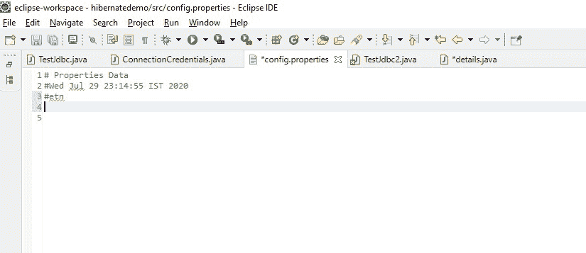
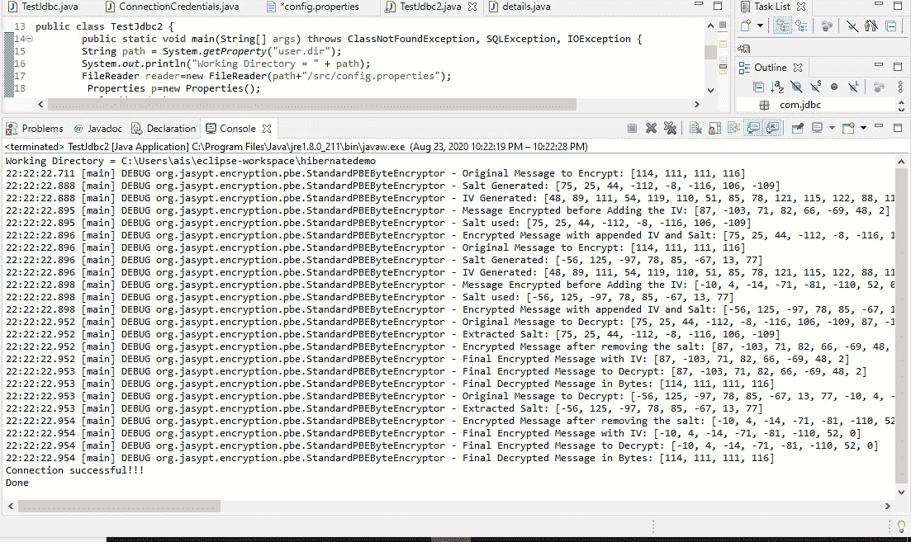

# Java 中的数据库加密

> 原文:[https://www.geeksforgeeks.org/database-encryption-in-java/](https://www.geeksforgeeks.org/database-encryption-in-java/)

基本上，[加密](https://www.geeksforgeeks.org/difference-between-encryption-and-decryption/)是以代码形式或者更具体地说以密码文本形式对用户数据进行处理或转换，以防止未经授权的访问，因此，在我们都在处理存储在数据库中的大型数据集的当今世界，加密非常重要，并且必须保护数据库的凭证，以保护隐私和未经授权的访问。

为了加密我们的数据库凭证，我们将使用 Jaspyt ap **i** 。我们可以从[这里](http://www.jasypt.org/download.html)下载 jaspyt 库。

**Java 简化加密**

Jasypt 是一个 java 库，它允许开发人员用最少的努力将基本的加密功能添加到项目中，而无需借助项目中的一些附加功能来编写任何代码。Jasypt 是高度可配置的。

**为了加密数据库凭证，我们将执行以下任务-**

1.  创建一个 POJO 类。
2.  创建属性文件。
3.  创建一个 Java 类。

**第一步:** [**创建 POJO 类**](https://www.geeksforgeeks.org/pojo-vs-java-beans/)

因此，我们创建了一个名为 Details.java**的普通 java 类，它有实际的用户名和密码，用户名和密码的密钥有特殊和非特殊字符。代码如下-**

## **Java 语言(一种计算机语言，尤用于创建网站)**

```
// Creating a POJO class

package com.jdbc;

public class details {

    // Private fields
    private String key = "@2334dgdfg@#$%dsgdf";
    private String user = "root";
    private String key2 = "@1567sedf#2@";
    private String pass = "root";

    // Getter methods for private fields
    public String getKey() { return key; }
    public String getUser() { return user; }
    public String getKey2() { return key2; }
    public String getPass() { return pass; }
}
```

****步骤 2:** 创建一个空的属性文件**

****

****步骤 3-** 创建一个名为 TestJDBC2.java 的*主连接*类，拥有加密和解密过程所需的所有代码行。我们已经使用了 javax.crypto.Cipher 类，java.security.MessageDigest 抽象类，org . jas ypt . util . text . basictextencryptor*final Class*，它将执行加密和解密过程。**

**所以。首先，我们将使用 details.java 文件中定义的密钥进行用户名和密码的加密和解密过程，并将调用*base ctextencryptor*类的加密和解密方法。**

**现在让我们看看代码-**

## **Java 语言(一种计算机语言，尤用于创建网站)**

```
// Creating a java class

package com.jdbc;

import java.sql.Connection;
import java.io.*;
import java.sql.DriverManager;
import java.sql.SQLException;
import java.util.Properties;
import java.security.MessageDigest;
import javax.crypto.Cipher;

import org.jasypt.util.text.BasicTextEncryptor;

public class TestJdbc2 {
    public static void main(String[] args)
        throws ClassNotFoundException, SQLException,
               IOException
    {

        // Fethches the system property
        String path = System.getProperty("user.dir");
        System.out.println("Working Directory = " + path);

        // Creating a FileReader and specified the
        // name of the file to read from
        FileReader reader = new FileReader(
            path + "/src/config.properties");

        Properties p = new Properties();

        // Reads a property list from the input byte stream
        p.load(reader);
        details dt = new details();
        BasicTextEncryptor bte = new BasicTextEncryptor();

        // Getting key from details class object and
        // set the password for encryption and decryption
        bte.setPassword(dt.getKey());

        // Encrypt the message
        String encryptedid = bte.encrypt(dt.getUser());

        // Set the system property
        p.setProperty("username", encryptedid);
        BasicTextEncryptor bte1 = new BasicTextEncryptor();

        // Setting a password
        bte1.setPassword(dt.getKey2());

        // Encrypt the password
        String encryptedps = bte1.encrypt(dt.getPass());
        p.setProperty("password", encryptedps);

        // Writes the property list in the properties table
        // to the output character stream in a format
        // suitable for using load method
        p.store(
            new FileWriter(path + "/src/config.properties"),
            " Properties Data");

        // Load the driver class into the memory at the
        // runtime
        Class.forName("com.mysql.cj.jdbc.Driver");

        // Establishes the connection and decrypt the
        // encryptedid and encryptedps
        Connection conn = DriverManager.getConnection(
            "jdbc:mysql://localhost:3306/test",
            bte.decrypt(encryptedid),
            bte1.decrypt(encryptedps));
        System.out.println("Connection successful!!!");
        System.out.println("Done");
    }
}
```

**从这段代码中可以清楚地看到加密和解密的过程。执行此代码后，可以在 Config.properties 文件中看到加密的用户名和密码。**

****

**由于 Salt 算法处理可以在控制台进程中清楚地看到。**

**现在，让我们看看配置属性文件**

****

**因为加密的凭证可以在配置中清楚地看到。属性文件和原始数据库凭证位于*details.java*中，但是连接属性正在以加密的形式从属性文件中获取详细信息，并对其进行解密以与数据库服务器通信。**

**因此，现在数据库加密对我们所有使用 Java 的人来说都是一项简单的任务。**