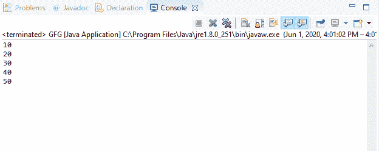
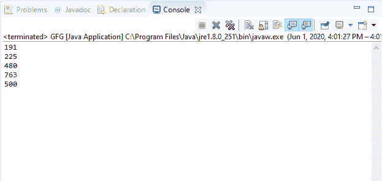

# Java 中的 DataInputStream readShort()方法，带示例

> 原文:[https://www . geesforgeks . org/datainputstream-read short-in-Java-method-with-examples/](https://www.geeksforgeeks.org/datainputstream-readshort-method-in-java-with-examples/)

Java 中 **DataInputStream** 类的 **readShort()** 方法用于读取两个输入字节并返回一个短值。此方法从输入流中读取接下来的两个字节，并将其解释为短类型，然后返回。

**语法:**

```java
public final short readShort()
                   throws IOException

```

**指定者:**此方法由**数据输入**界面的 readShort()方法指定。

**参数:**此方法不接受任何参数。

**返回值:**这个方法返回输入流的下两个字节解释的短值。

**异常:**

*   **eofeexception**–如果输入流在读取两个字节之前结束，它将抛出**eofeexception**。
*   **IOException**–如果流关闭或发生其他输入/输出错误，该方法将抛出 **IOException** 。

下面的程序说明了 IO 包中 DataInputStream 类的 readShort()方法:

**程序 1:** 假设存在文件“demo.txt”。

```java
// Java program to illustrate
// DataInputStream readShort() method
import java.io.*;
public class GFG {
    public static void main(String[] args)
        throws IOException
    {

        // Create short array
        short[] buf = { 10, 20, 30, 40, 50 };

        // Create file output stream
        FileOutputStream outputStream
            = new FileOutputStream("c:\\demo.txt");

        // Create data output stream
        DataOutputStream dataOutputStr
            = new DataOutputStream(outputStream);

        for (short b : buf) {
            // Write short value to
            // the dataOutputStream
            dataOutputStr.writeShort(b);
        }

        dataOutputStr.flush();

        // Create file input stream
        FileInputStream inputStream
            = new FileInputStream("c:\\demo.txt");

        // Create data input stream
        DataInputStream dataInputStr
            = new DataInputStream(inputStream);

        while (dataInputStr.available() > 0) {
            // Print short values
            System.out.println(
                dataInputStr.readShort());
        }
    }
}
```

**Output:**[](https://media.geeksforgeeks.org/wp-content/uploads/20200601160851/data_int-1.png)

**程序 2:** 假设文件“demo.txt”的存在。

```java
// Java program to illustrate
// DataInputStream readShort() method
import java.io.*;
public class GFG {
    public static void main(String[] args)
        throws IOException
    {

        // Create short array
        short[] buf = { 191, 225, 480, 763, 500 };

        // Create file output stream
        FileOutputStream outputStream
            = new FileOutputStream("c:\\demo.txt");

        // Create data output stream
        DataOutputStream dataOutputStr
            = new DataOutputStream(outputStream);

        for (short b : buf) {
            // Write short value to
            // the dataOutputStream
            dataOutputStr.writeShort(b);
        }

        dataOutputStr.flush();

        // Create file input stream
        FileInputStream inputStream
            = new FileInputStream("c:\\demo.txt");

        // Create data input stream
        DataInputStream dataInputStr
            = new DataInputStream(inputStream);

        while (dataInputStr.available() > 0) {
            // Print short values
            System.out.println(
                dataInputStr.readShort());
        }
    }
}
```

**Output:**[](https://media.geeksforgeeks.org/wp-content/uploads/20200601160911/data_int-2.png)

**参考资料:**
[https://docs . Oracle . com/javae/10/docs/API/Java/io/datainputstream . html # read short()](https://docs.oracle.com/javase/10/docs/api/java/io/DataInputStream.html#readShort())