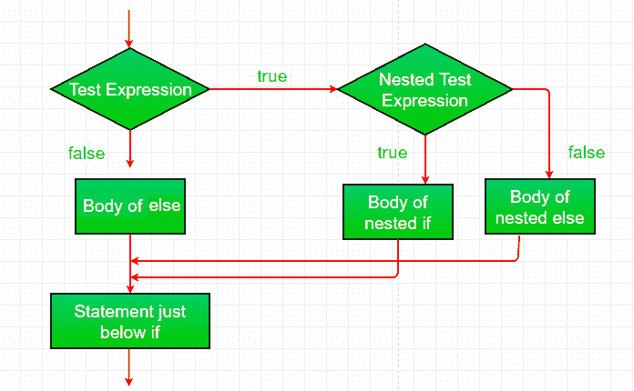
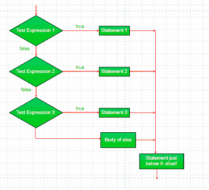
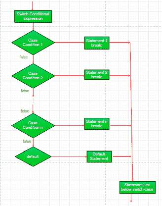
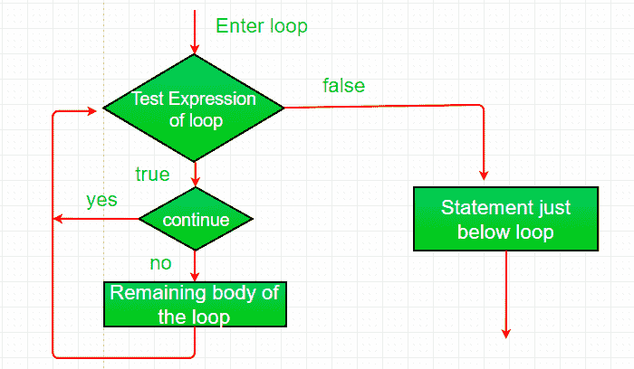

# Java 中的决策(if，if-else，switch，break，continue，jump)

> 原文:[https://www . geesforgeks . org/决策-javaif-else-switch-break-continue-jump/](https://www.geeksforgeeks.org/decision-making-javaif-else-switch-break-continue-jump/)

编程中的决策类似于现实生活中的决策。在编程中，我们也面临一些情况，当满足某些条件时，我们希望执行某个代码块。
一种编程语言根据一定的条件，使用控制语句来控制程序的执行流程。这些用于使执行流程前进，并根据程序状态的变化进行转移。
**爪哇的选择声明:**

*   [如果](#if)
*   [如果-否则](#if-else)
*   [嵌套-如果](#nested-if)
*   [if-else-if](#if-else-if)
*   [开关盒](#switch-case)
*   [jump](#jump) – break, continue, return

    这些语句允许您根据仅在运行时已知的条件来控制程序的执行流程。

*   **[if](https://www.geeksforgeeks.org/java-if-statement-with-examples/)**: if statement is the most simple decision making statement. It is used to decide whether a certain statement or block of statements will be executed or not i.e if a certain condition is true then a block of statement is executed otherwise not.
    **Syntax**:

    ```java
    if(condition) 
    {
       // Statements to execute if
       // condition is true
    }

    ```

    这里，评估后的**条件**不是真就是假。如果语句接受布尔值——如果值为真，则它将执行其下的语句块。
    如果我们没有在 **if(条件)**之后提供花括号“{”和“}”，那么默认情况下 If 语句将认为紧接的 one 语句在其块内。例如，

    ```java
    if(condition)
       statement1;
       statement2;

    // Here if the condition is true, if block 
    // will consider only statement1 to be inside 
    // its block.
    ```

    流程图:
    
    例:

    ```java
    // Java program to illustrate If statement
    class IfDemo
    {
        public static void main(String args[])
        {
            int i = 10;

            if (i > 15)
                System.out.println("10 is less than 15");

            // This statement will be executed
            // as if considers one statement by default
            System.out.println("I am Not in if");
        }
    }
    ```

    输出:

    ```java
    I am Not in if

    ```

*   **[if-else](https://www.geeksforgeeks.org/java-if-else-statement-with-examples/)**: The if statement alone tells us that if a condition is true it will execute a block of statements and if the condition is false it won’t. But what if we want to do something else if the condition is false. Here comes the else statement. We can use the else statement with if statement to execute a block of code when the condition is false.
    **Syntax**:

    ```java
    if (condition)
    {
        // Executes this block if
        // condition is true
    }
    else
    {
        // Executes this block if
        // condition is false
    }

    ```

    
    例:

    ```java
    // Java program to illustrate if-else statement
    class IfElseDemo
    {
        public static void main(String args[])
        {
            int i = 10;

            if (i < 15)
                System.out.println("i is smaller than 15");
            else
                System.out.println("i is greater than 15");
        }
    }
    ```

    输出:

    ```java
    i is smaller than 15
    ```

*   A nested if is an if statement that is the target of another if or else. Nested if statements means an if statement inside an if statement. Yes, java allows us to nest if statements within if statements. i.e, we can place an if statement inside another if statement.
    Syntax:

    ```java
    if (condition1) 
    {
       // Executes when condition1 is true
       if (condition2) 
       {
          // Executes when condition2 is true
       }
    }

    ```

    
    例:

    ```java
    // Java program to illustrate nested-if statement
    class NestedIfDemo
    {
        public static void main(String args[])
        {
            int i = 10;

            if (i == 10)
            {
                // First if statement
                if (i < 15)
                    System.out.println("i is smaller than 15");

                // Nested - if statement
                // Will only be executed if statement above
                // it is true
                if (i < 12)
                    System.out.println("i is smaller than 12 too");
                else
                    System.out.println("i is greater than 15");
            }
        }
    }
    ```

    输出:

    ```java
    i is smaller than 15
    i is smaller than 12 too

    ```

*   **[if-else-if 阶梯:](https://www.geeksforgeeks.org/java-if-else-if-ladder-with-examples/)** 在这里，用户可以在多个选项中进行选择。if 语句从上到下执行。一旦控制 if 的条件之一为真，就执行与该 if 关联的语句，并绕过阶梯的其余部分。如果这些条件都不成立，那么将执行最后的 else 语句。

```java
if (condition)
    statement;
else if (condition)
    statement;
.
.
else
    statement;

```


例:

```java
// Java program to illustrate if-else-if ladder
class ifelseifDemo
{
    public static void main(String args[])
    {
        int i = 20;

        if (i == 10)
            System.out.println("i is 10");
        else if (i == 15)
            System.out.println("i is 15");
        else if (i == 20)
            System.out.println("i is 20");
        else
            System.out.println("i is not present");
    }
}
```

输出:

```java
i is 20

```

*   **[switch-case](https://www.geeksforgeeks.org/switch-statement-in-java/)** The switch statement is a multiway branch statement. It provides an easy way to dispatch execution to different parts of code based on the value of the expression.
    Syntax:

    ```java
    switch (expression)
    {
      case value1:
        statement1;
        break;
      case value2:
        statement2;
        break;
      .
      .
      case valueN:
        statementN;
        break;
      default:
        statementDefault;
    }
    ```

    *   表达式的类型可以是 byte、short、int char 或枚举。从 JDK7 开始，*表达式*也可以是 String 类型。
    *   不允许使用重复的大小写值。
    *   默认语句是可选的。
    *   break 语句在开关内部用于终止语句序列。
    *   break 语句是可选的。如果省略，执行将继续到下一个案例。

    
    例:

    ```java
    // Java program to illustrate switch-case
    class SwitchCaseDemo
    {
        public static void main(String args[])
        {
            int i = 9;
            switch (i)
            {
            case 0:
                System.out.println("i is zero.");
                break;
            case 1:
                System.out.println("i is one.");
                break;
            case 2:
                System.out.println("i is two.");
                break;
            default:
                System.out.println("i is greater than 2.");
            }
        }
    }
    ```

    输出:

    ```java
    i is greater than 2.

    ```

    *   Java 支持三跳语句:**破，继续**和**返回**。这三个语句将控制权转移到程序的其他部分。
    1.  **[Break:](https://www.geeksforgeeks.org/break-statement-in-java/)** In Java, break is majorly used for:
        *   在 switch 语句中终止一个序列(如上所述)。
        *   退出循环。
        *   用作 goto 的“文明”形式。

        **使用中断退出循环**

        使用 break，我们可以绕过条件表达式和循环体中的任何剩余代码，强制立即终止循环。
        注意:Break 在一组嵌套循环中使用时，只会从最里面的循环中断开。
        
        例:

        ```java
        // Java program to illustrate using
        // break to exit a loop
        class BreakLoopDemo
        {
            public static void main(String args[])
            {
                // Initially loop is set to run from 0-9
                for (int i = 0; i < 10; i++)
                {
                    // terminate loop when i is 5.
                    if (i == 5)
                        break;

                    System.out.println("i: " + i);
                }
                System.out.println("Loop complete.");
            }
        }
        ```

        输出:

        ```java
        i: 0
        i: 1
        i: 2
        i: 3
        i: 4
        Loop complete.

        ```

        **使用 break 作为 Goto 的一种形式**

        Java 没有 goto 语句，因为它提供了一种以任意和非结构化方式进行分支的方法。Java 使用标签。标签用于标识代码块。
        语法:

        ```java
        label:
        {
          statement1;
          statement2;
          statement3;
          .
          .
        }
        ```

        现在，break 语句可以用于跳出目标块。
        注意:您不能打断任何没有为封闭块定义的标签。
        语法:

        ```java
        break label;
        ```

        示例:

        ```java
        // Java program to illustrate using break with goto
        class BreakLabelDemo
        {
            public static void main(String args[])
            {
                boolean t = true;

                // label first
                first:
                {
                    // Illegal statement here as label second is not
                    // introduced yet break second;
                    second:
                    {
                        third:
                        {
                            // Before break
                            System.out.println("Before the break statement");

                            // break will take the control out of
                            // second label
                            if (t)
                                break second;
                            System.out.println("This won't execute.");
                        }
                        System.out.println("This won't execute.");
                    }

                    // First block
                    System.out.println("This is after second block.");
                }
            }
        }
        ```

        输出:

        ```java
        Before the break.
        This is after second block.

        ```

    2.  **Continue:** Sometimes it is useful to force an early iteration of a loop. That is, you might want to continue running the loop but stop processing the remainder of the code in its body for this particular iteration. This is, in effect, a goto just past the body of the loop, to the loop’s end. The continue statement performs such an action.
        
        Example:

        ```java
        // Java program to illustrate using
        // continue in an if statement
        class ContinueDemo
        {
            public static void main(String args[])
            {
                for (int i = 0; i < 10; i++)
                {
                    // If the number is even
                    // skip and continue
                    if (i%2 == 0)
                        continue;

                    // If number is odd, print it
                    System.out.print(i + " ");
                }
            }
        }
        ```

        输出:

        ```java
        1 3 5 7 9 

        ```

    3.  **[Return:](https://www.geeksforgeeks.org/return-keyword-java/)**The return statement is used to explicitly return from a method. That is, it causes a program control to transfer back to the caller of the method.
        Example:

        ```java
        // Java program to illustrate using return
        class Return
        {
            public static void main(String args[])
            {
                boolean t = true;
                System.out.println("Before the return.");

                if (t)
                    return;

                // Compiler will bypass every statement 
                // after return
                System.out.println("This won't execute.");
            }
        }
        ```

        **输出:**

        ```java
        Before the return.

        ```

本文由 **[Anuj Chauhan](https://www.facebook.com/anuj0503)** 和 Harsh Aggarwal 投稿。如果你喜欢 GeeksforGeeks 并想投稿，你也可以使用[contribute.geeksforgeeks.org](http://www.contribute.geeksforgeeks.org)写一篇文章或者把你的文章邮寄到 contribute@geeksforgeeks.org。看到你的文章出现在极客博客主页上，帮助其他极客。

如果你发现任何不正确的地方，或者你想分享更多关于上面讨论的话题的信息，请写评论。